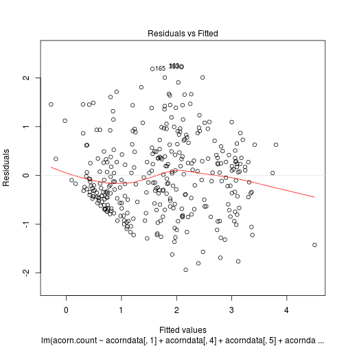
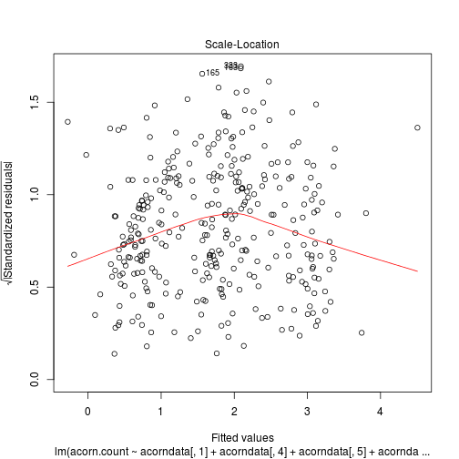
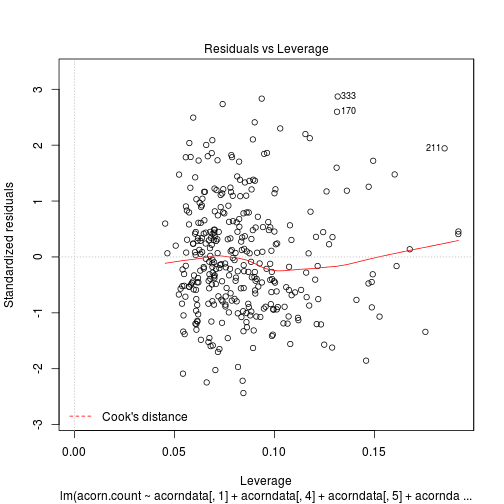

Acorn data analysis
========================================================

* Author [John Stanton-Geddes](www.johnstantongeddes.org), <john.stantongeddes.research@gmail.com>
* 2013-05-13

Data file from the paper "Walter D. Koenig and Johannes M. H. Knops. 2013. Large-scale spatial synchrony and cross-synchrony in acorn production by two California oaks. Ecology. 94:83–93. http://dx.doi.org/10.1890/12-0940.1" downloaded from [Ecological Archives](http://esapubs.org/archive/ecol/E094/009/)

Using this file as a typical ecological data set with a response (acorn count) collected from multiple sites over multiple years with many potential predictors. Will send out to colleagues and ask to analyze. Our question is if most people use stepwise model selection, or AIC. 

Deleted the final two columns ("Combined environmental variable...") and changed "Mean (log-trans) acorn count (acorns per 30 s)" to "acorn count" for simplicity in explaning data file.

----------------------------------------------------------

Load and examine data


```r
library(MASS)

acorndata <- read.table("acorn_data_stats.csv", header = TRUE, sep = "\t")
head(acorndata)
```

```
##   SITE.NAME LATITUDE LONGITUDE YEAR      SPECIES acorn.count
## 1  HASTINGS    36.39     121.5 1994 Q. douglasii       2.110
## 2  HASTINGS    36.39     121.5 1995 Q. douglasii       0.594
## 3  HASTINGS    36.39     121.5 1996 Q. douglasii       3.178
## 4  HASTINGS    36.39     121.5 1997 Q. douglasii       2.262
## 5  HASTINGS    36.39     121.5 1998 Q. douglasii       1.170
## 6  HASTINGS    36.39     121.5 1999 Q. douglasii       2.705
##   Mean.max..April.temp..oC.x.100. Mean.max..March.temp..oC.x.100.
## 1                            1944                            1848
## 2                            1733                            1432
## 3                            2057                            1696
## 4                            2089                            2029
## 5                            1584                            1515
## 6                            1644                            1386
##   March.rain..cm.x.1000. April.rain..cm.x.1000.
## 1                   2767                   7735
## 2                  43047                   4368
## 3                   5690                   5114
## 4                    801                    851
## 5                  14284                   9102
## 6                  12967                   7235
##   March.rain.lagged.1.yr..cm.x.1000. April.rain.lagged.1.year..cm.x.1000.
## 1                               7519                                 1134
## 2                               2767                                 7735
## 3                              43047                                 4368
## 4                               5690                                 5114
## 5                                801                                  851
## 6                              14284                                 9102
##   Mean.max.summer.temp..oC.x.100.
## 1                            2909
## 2                            2743
## 3                            3045
## 4                            2963
## 5                            2620
## 6                            2757
##   Mean.max.summer.temp.lagged.1.yr..oC.x.100. Winter.rainfall..cm.x.1000.
## 1                                        2807                       45916
## 2                                        2909                       84442
## 3                                        2743                       57597
## 4                                        3045                       68965
## 5                                        2963                      120141
## 6                                        2620                       45258
##   Winter.rainfall.lagged.1.yr..cm.x.1000. Mean.min.winter.temp..oC.x.100.
## 1                                  105601                          -261.0
## 2                                   45916                            21.5
## 3                                   84442                           157.8
## 4                                   57597                           146.2
## 5                                   68965                           185.8
## 6                                  120141                           -15.0
##   Mean.max.autumn.temp..oC.x.100.
## 1                            2414
## 2                            2146
## 3                            2641
## 4                            2338
## 5                            2395
## 6                            2168
##   Mean.max.March.temp.lagged.1.yr..oC.x.100.
## 1                                       1778
## 2                                       1848
## 3                                       1432
## 4                                       1696
## 5                                       2029
## 6                                       1515
##   Mean.max.April.temp.lagged.1.yr..oC.x.100.
## 1                                       1873
## 2                                       1944
## 3                                       1733
## 4                                       2057
## 5                                       2089
## 6                                       1584
```

```r
str(acorndata)
```

```
## 'data.frame':	333 obs. of  20 variables:
##  $ SITE.NAME                                  : Factor w/ 12 levels "DYE CREEK","HASTINGS",..: 2 2 2 2 2 2 2 2 2 2 ...
##  $ LATITUDE                                   : num  36.4 36.4 36.4 36.4 36.4 ...
##  $ LONGITUDE                                  : num  122 122 122 122 122 ...
##  $ YEAR                                       : int  1994 1995 1996 1997 1998 1999 2000 2001 2002 2003 ...
##  $ SPECIES                                    : Factor w/ 2 levels "Q. douglasii",..: 1 1 1 1 1 1 1 1 1 1 ...
##  $ acorn.count                                : num  2.11 0.594 3.178 2.262 1.17 ...
##  $ Mean.max..April.temp..oC.x.100.            : int  1944 1733 2057 2089 1584 1644 2054 1682 1900 1544 ...
##  $ Mean.max..March.temp..oC.x.100.            : int  1848 1432 1696 2029 1515 1386 1636 1758 1605 1757 ...
##  $ March.rain..cm.x.1000.                     : int  2767 43047 5690 801 14284 12967 7021 8924 7590 4988 ...
##  $ April.rain..cm.x.1000.                     : int  7735 4368 5114 851 9102 7235 4911 6212 1530 9415 ...
##  $ March.rain.lagged.1.yr..cm.x.1000.         : int  7519 2767 43047 5690 801 14284 12967 7021 8924 7590 ...
##  $ April.rain.lagged.1.year..cm.x.1000.       : int  1134 7735 4368 5114 851 9102 7235 4911 6212 1530 ...
##  $ Mean.max.summer.temp..oC.x.100.            : int  2909 2743 3045 2963 2620 2757 2909 3034 2902 2939 ...
##  $ Mean.max.summer.temp.lagged.1.yr..oC.x.100.: int  2807 2909 2743 3045 2963 2620 2757 2909 3034 2902 ...
##  $ Winter.rainfall..cm.x.1000.                : int  45916 84442 57597 68965 120141 45258 61791 40506 48221 54879 ...
##  $ Winter.rainfall.lagged.1.yr..cm.x.1000.    : int  105601 45916 84442 57597 68965 120141 45258 61791 40506 48221 ...
##  $ Mean.min.winter.temp..oC.x.100.            : num  -261 21.5 157.8 146.2 185.8 ...
##  $ Mean.max.autumn.temp..oC.x.100.            : int  2414 2146 2641 2338 2395 2168 2552 2145 2429 2392 ...
##  $ Mean.max.March.temp.lagged.1.yr..oC.x.100. : int  1778 1848 1432 1696 2029 1515 1386 1636 1758 1605 ...
##  $ Mean.max.April.temp.lagged.1.yr..oC.x.100. : int  1873 1944 1733 2057 2089 1584 1644 2054 1682 1900 ...
```


Check distribution of acorn.count


```r
hist(acorndata$acorn.count)
```

 


Mode at 0 and flat to 3 

Fit multiple regression model with all predictors. 


```r
mlm1 <- lm(acorn.count ~ acorndata[, 1] + acorndata[, 4] + acorndata[, 5] + 
    acorndata[, 7] + acorndata[, 8] + acorndata[, 9] + acorndata[, 10] + acorndata[, 
    11] + acorndata[, 12] + acorndata[, 13] + acorndata[, 14] + acorndata[, 
    15] + acorndata[, 16] + acorndata[, 17] + acorndata[, 18] + acorndata[, 
    19] + acorndata[, 20], data = acorndata)

# Model checking
plot(mlm1)  # no large deviations from LM assumptions
```

    

```r

summary(mlm1)
```

```
## 
## Call:
## lm(formula = acorn.count ~ acorndata[, 1] + acorndata[, 4] + 
##     acorndata[, 5] + acorndata[, 7] + acorndata[, 8] + acorndata[, 
##     9] + acorndata[, 10] + acorndata[, 11] + acorndata[, 12] + 
##     acorndata[, 13] + acorndata[, 14] + acorndata[, 15] + acorndata[, 
##     16] + acorndata[, 17] + acorndata[, 18] + acorndata[, 19] + 
##     acorndata[, 20], data = acorndata)
## 
## Residuals:
##     Min      1Q  Median      3Q     Max 
## -1.9354 -0.5642 -0.0963  0.4692  2.2401 
## 
## Coefficients:
##                             Estimate Std. Error t value Pr(>|t|)
## (Intercept)                 2.29e+01   2.54e+01    0.90  0.36844
## acorndata[, 1]HASTINGS     -3.57e-01   3.37e-01   -1.06  0.28994
## acorndata[, 1]HOPLAND       1.45e-01   3.32e-01    0.44  0.66197
## acorndata[, 1]JASPER RIDGE -1.09e+00   3.79e-01   -2.87  0.00441
## acorndata[, 1]KAWEAH OAKS  -1.25e+00   3.38e-01   -3.71  0.00025
## acorndata[, 1]KAWEAH RIVER -6.07e-01   4.29e-01   -1.42  0.15742
## acorndata[, 1]LIEBRE MTN   -3.39e-02   2.97e-01   -0.11  0.90937
## acorndata[, 1]POZO         -8.44e-01   2.74e-01   -3.08  0.00224
## acorndata[, 1]SAN JOAQUIN  -3.91e-01   2.79e-01   -1.40  0.16113
## acorndata[, 1]SEDGWICK     -6.25e-01   3.30e-01   -1.89  0.05940
## acorndata[, 1]SIERRA FOOT   5.18e-02   2.17e-01    0.24  0.81144
## acorndata[, 1]TOWER HOUSE  -1.70e-01   3.81e-01   -0.44  0.65673
## acorndata[, 4]             -9.87e-03   1.27e-02   -0.78  0.43717
## acorndata[, 5]Q. lobata     5.83e-02   1.02e-01    0.57  0.56837
## acorndata[, 7]              2.35e-03   4.41e-04    5.32    2e-07
## acorndata[, 8]             -9.78e-04   3.09e-04   -3.17  0.00170
## acorndata[, 9]             -2.76e-05   7.27e-06   -3.79  0.00018
## acorndata[, 10]            -3.74e-06   1.50e-05   -0.25  0.80310
## acorndata[, 11]             5.46e-07   8.29e-06    0.07  0.94750
## acorndata[, 12]             5.55e-05   1.69e-05    3.28  0.00115
## acorndata[, 13]            -2.45e-04   5.42e-04   -0.45  0.65182
## acorndata[, 14]            -1.47e-03   5.75e-04   -2.55  0.01117
## acorndata[, 15]            -9.30e-06   3.50e-06   -2.66  0.00831
## acorndata[, 16]             5.11e-06   2.99e-06    1.71  0.08827
## acorndata[, 17]            -1.41e-03   5.50e-04   -2.56  0.01082
## acorndata[, 18]             1.18e-03   4.87e-04    2.42  0.01614
## acorndata[, 19]            -7.01e-04   2.97e-04   -2.36  0.01905
## acorndata[, 20]             1.12e-04   4.07e-04    0.28  0.78260
## 
## Residual standard error: 0.83 on 305 degrees of freedom
## Multiple R-squared: 0.567,	Adjusted R-squared: 0.528 
## F-statistic: 14.8 on 27 and 305 DF,  p-value: <2e-16
```

```r
aov(mlm1)
```

```
## Call:
##    aov(formula = mlm1)
## 
## Terms:
##                 acorndata[, 1] acorndata[, 4] acorndata[, 5]
## Sum of Squares           25.05           3.32           0.41
## Deg. of Freedom             11              1              1
##                 acorndata[, 7] acorndata[, 8] acorndata[, 9]
## Sum of Squares          105.43           0.95          25.20
## Deg. of Freedom              1              1              1
##                 acorndata[, 10] acorndata[, 11] acorndata[, 12]
## Sum of Squares             0.44           39.88           31.30
## Deg. of Freedom               1               1               1
##                 acorndata[, 13] acorndata[, 14] acorndata[, 15]
## Sum of Squares             0.02           12.61           15.20
## Deg. of Freedom               1               1               1
##                 acorndata[, 16] acorndata[, 17] acorndata[, 18]
## Sum of Squares             3.64            2.65            5.08
## Deg. of Freedom               1               1               1
##                 acorndata[, 19] acorndata[, 20] Residuals
## Sum of Squares             3.94            0.05    210.34
## Deg. of Freedom               1               1       305
## 
## Residual standard error: 0.8304 
## Estimated effects may be unbalanced
```


### Model simplification by likelihood ratio test

Retain site [,1], year [,4] and species [,5] columns as designed components of experiment. Test significance of environmental predictors by stepwise deletion.


```r
mlm2 <- update(mlm1, . ~ . - acorndata[, 11])
anova(mlm2, mlm1)  # No significant difference, drop term
```

```
## Analysis of Variance Table
## 
## Model 1: acorn.count ~ acorndata[, 1] + acorndata[, 4] + acorndata[, 5] + 
##     acorndata[, 7] + acorndata[, 8] + acorndata[, 9] + acorndata[, 
##     10] + acorndata[, 12] + acorndata[, 13] + acorndata[, 14] + 
##     acorndata[, 15] + acorndata[, 16] + acorndata[, 17] + acorndata[, 
##     18] + acorndata[, 19] + acorndata[, 20]
## Model 2: acorn.count ~ acorndata[, 1] + acorndata[, 4] + acorndata[, 5] + 
##     acorndata[, 7] + acorndata[, 8] + acorndata[, 9] + acorndata[, 
##     10] + acorndata[, 11] + acorndata[, 12] + acorndata[, 13] + 
##     acorndata[, 14] + acorndata[, 15] + acorndata[, 16] + acorndata[, 
##     17] + acorndata[, 18] + acorndata[, 19] + acorndata[, 20]
##   Res.Df RSS Df Sum of Sq  F Pr(>F)
## 1    306 210                       
## 2    305 210  1   0.00299  0   0.95
```

```r
summary(mlm2)
```

```
## 
## Call:
## lm(formula = acorn.count ~ acorndata[, 1] + acorndata[, 4] + 
##     acorndata[, 5] + acorndata[, 7] + acorndata[, 8] + acorndata[, 
##     9] + acorndata[, 10] + acorndata[, 12] + acorndata[, 13] + 
##     acorndata[, 14] + acorndata[, 15] + acorndata[, 16] + acorndata[, 
##     17] + acorndata[, 18] + acorndata[, 19] + acorndata[, 20], 
##     data = acorndata)
## 
## Residuals:
##    Min     1Q Median     3Q    Max 
## -1.933 -0.564 -0.094  0.471  2.240 
## 
## Coefficients:
##                             Estimate Std. Error t value Pr(>|t|)
## (Intercept)                 2.33e+01   2.47e+01    0.94  0.34654
## acorndata[, 1]HASTINGS     -3.52e-01   3.29e-01   -1.07  0.28517
## acorndata[, 1]HOPLAND       1.48e-01   3.28e-01    0.45  0.65094
## acorndata[, 1]JASPER RIDGE -1.09e+00   3.76e-01   -2.88  0.00419
## acorndata[, 1]KAWEAH OAKS  -1.25e+00   3.37e-01   -3.72  0.00024
## acorndata[, 1]KAWEAH RIVER -6.04e-01   4.25e-01   -1.42  0.15597
## acorndata[, 1]LIEBRE MTN   -3.25e-02   2.96e-01   -0.11  0.91273
## acorndata[, 1]POZO         -8.40e-01   2.67e-01   -3.14  0.00183
## acorndata[, 1]SAN JOAQUIN  -3.92e-01   2.78e-01   -1.41  0.15950
## acorndata[, 1]SEDGWICK     -6.23e-01   3.28e-01   -1.90  0.05880
## acorndata[, 1]SIERRA FOOT   5.35e-02   2.15e-01    0.25  0.80404
## acorndata[, 1]TOWER HOUSE  -1.67e-01   3.78e-01   -0.44  0.65966
## acorndata[, 4]             -1.01e-02   1.23e-02   -0.82  0.41330
## acorndata[, 5]Q. lobata     5.83e-02   1.02e-01    0.57  0.56779
## acorndata[, 7]              2.35e-03   4.38e-04    5.37  1.6e-07
## acorndata[, 8]             -9.82e-04   3.04e-04   -3.23  0.00140
## acorndata[, 9]             -2.76e-05   7.23e-06   -3.82  0.00016
## acorndata[, 10]            -3.56e-06   1.47e-05   -0.24  0.80901
## acorndata[, 12]             5.58e-05   1.62e-05    3.43  0.00068
## acorndata[, 13]            -2.38e-04   5.32e-04   -0.45  0.65450
## acorndata[, 14]            -1.47e-03   5.72e-04   -2.57  0.01052
## acorndata[, 15]            -9.32e-06   3.48e-06   -2.68  0.00786
## acorndata[, 16]             5.16e-06   2.88e-06    1.79  0.07462
## acorndata[, 17]            -1.40e-03   5.35e-04   -2.62  0.00923
## acorndata[, 18]             1.18e-03   4.82e-04    2.45  0.01465
## acorndata[, 19]            -7.06e-04   2.83e-04   -2.49  0.01316
## acorndata[, 20]             1.14e-04   4.05e-04    0.28  0.77861
## 
## Residual standard error: 0.829 on 306 degrees of freedom
## Multiple R-squared: 0.567,	Adjusted R-squared: 0.53 
## F-statistic: 15.4 on 26 and 306 DF,  p-value: <2e-16
```

```r

mlm3 <- update(mlm2, . ~ . - acorndata[, 20])
anova(mlm3, mlm2)  # No significant difference, drop term
```

```
## Analysis of Variance Table
## 
## Model 1: acorn.count ~ acorndata[, 1] + acorndata[, 4] + acorndata[, 5] + 
##     acorndata[, 7] + acorndata[, 8] + acorndata[, 9] + acorndata[, 
##     10] + acorndata[, 12] + acorndata[, 13] + acorndata[, 14] + 
##     acorndata[, 15] + acorndata[, 16] + acorndata[, 17] + acorndata[, 
##     18] + acorndata[, 19]
## Model 2: acorn.count ~ acorndata[, 1] + acorndata[, 4] + acorndata[, 5] + 
##     acorndata[, 7] + acorndata[, 8] + acorndata[, 9] + acorndata[, 
##     10] + acorndata[, 12] + acorndata[, 13] + acorndata[, 14] + 
##     acorndata[, 15] + acorndata[, 16] + acorndata[, 17] + acorndata[, 
##     18] + acorndata[, 19] + acorndata[, 20]
##   Res.Df RSS Df Sum of Sq    F Pr(>F)
## 1    307 210                         
## 2    306 210  1    0.0544 0.08   0.78
```

```r
summary(mlm3)
```

```
## 
## Call:
## lm(formula = acorn.count ~ acorndata[, 1] + acorndata[, 4] + 
##     acorndata[, 5] + acorndata[, 7] + acorndata[, 8] + acorndata[, 
##     9] + acorndata[, 10] + acorndata[, 12] + acorndata[, 13] + 
##     acorndata[, 14] + acorndata[, 15] + acorndata[, 16] + acorndata[, 
##     17] + acorndata[, 18] + acorndata[, 19], data = acorndata)
## 
## Residuals:
##     Min      1Q  Median      3Q     Max 
## -1.9201 -0.5649 -0.0982  0.4717  2.2370 
## 
## Coefficients:
##                             Estimate Std. Error t value Pr(>|t|)
## (Intercept)                 2.37e+01   2.46e+01    0.96  0.33646
## acorndata[, 1]HASTINGS     -3.41e-01   3.26e-01   -1.04  0.29687
## acorndata[, 1]HOPLAND       1.46e-01   3.27e-01    0.45  0.65494
## acorndata[, 1]JASPER RIDGE -1.04e+00   3.39e-01   -3.07  0.00235
## acorndata[, 1]KAWEAH OAKS  -1.23e+00   3.27e-01   -3.76  0.00020
## acorndata[, 1]KAWEAH RIVER -5.99e-01   4.24e-01   -1.41  0.15832
## acorndata[, 1]LIEBRE MTN   -3.78e-02   2.95e-01   -0.13  0.89820
## acorndata[, 1]POZO         -8.25e-01   2.61e-01   -3.16  0.00174
## acorndata[, 1]SAN JOAQUIN  -3.87e-01   2.77e-01   -1.40  0.16315
## acorndata[, 1]SEDGWICK     -5.78e-01   2.86e-01   -2.02  0.04416
## acorndata[, 1]SIERRA FOOT   5.36e-02   2.15e-01    0.25  0.80320
## acorndata[, 1]TOWER HOUSE  -1.64e-01   3.77e-01   -0.44  0.66316
## acorndata[, 4]             -1.03e-02   1.23e-02   -0.84  0.40114
## acorndata[, 5]Q. lobata     5.75e-02   1.02e-01    0.57  0.57238
## acorndata[, 7]              2.32e-03   4.27e-04    5.44  1.1e-07
## acorndata[, 8]             -9.62e-04   2.96e-04   -3.25  0.00127
## acorndata[, 9]             -2.73e-05   7.14e-06   -3.83  0.00016
## acorndata[, 10]            -3.66e-06   1.47e-05   -0.25  0.80311
## acorndata[, 12]             5.34e-05   1.39e-05    3.85  0.00014
## acorndata[, 13]            -1.87e-04   4.99e-04   -0.38  0.70789
## acorndata[, 14]            -1.42e-03   5.40e-04   -2.63  0.00901
## acorndata[, 15]            -9.27e-06   3.47e-06   -2.67  0.00801
## acorndata[, 16]             5.32e-06   2.82e-06    1.89  0.05960
## acorndata[, 17]            -1.38e-03   5.28e-04   -2.61  0.00947
## acorndata[, 18]             1.15e-03   4.63e-04    2.47  0.01387
## acorndata[, 19]            -6.82e-04   2.69e-04   -2.53  0.01178
## 
## Residual standard error: 0.828 on 307 degrees of freedom
## Multiple R-squared: 0.567,	Adjusted R-squared: 0.531 
## F-statistic: 16.1 on 25 and 307 DF,  p-value: <2e-16
```

```r

mlm4 <- update(mlm3, . ~ . - acorndata[, 10])
anova(mlm4, mlm3)  # No significant difference, drop term
```

```
## Analysis of Variance Table
## 
## Model 1: acorn.count ~ acorndata[, 1] + acorndata[, 4] + acorndata[, 5] + 
##     acorndata[, 7] + acorndata[, 8] + acorndata[, 9] + acorndata[, 
##     12] + acorndata[, 13] + acorndata[, 14] + acorndata[, 15] + 
##     acorndata[, 16] + acorndata[, 17] + acorndata[, 18] + acorndata[, 
##     19]
## Model 2: acorn.count ~ acorndata[, 1] + acorndata[, 4] + acorndata[, 5] + 
##     acorndata[, 7] + acorndata[, 8] + acorndata[, 9] + acorndata[, 
##     10] + acorndata[, 12] + acorndata[, 13] + acorndata[, 14] + 
##     acorndata[, 15] + acorndata[, 16] + acorndata[, 17] + acorndata[, 
##     18] + acorndata[, 19]
##   Res.Df RSS Df Sum of Sq    F Pr(>F)
## 1    308 210                         
## 2    307 210  1    0.0427 0.06    0.8
```

```r
summary(mlm4)
```

```
## 
## Call:
## lm(formula = acorn.count ~ acorndata[, 1] + acorndata[, 4] + 
##     acorndata[, 5] + acorndata[, 7] + acorndata[, 8] + acorndata[, 
##     9] + acorndata[, 12] + acorndata[, 13] + acorndata[, 14] + 
##     acorndata[, 15] + acorndata[, 16] + acorndata[, 17] + acorndata[, 
##     18] + acorndata[, 19], data = acorndata)
## 
## Residuals:
##    Min     1Q Median     3Q    Max 
## -1.915 -0.565 -0.103  0.465  2.262 
## 
## Coefficients:
##                             Estimate Std. Error t value Pr(>|t|)
## (Intercept)                 2.35e+01   2.46e+01    0.95  0.34077
## acorndata[, 1]HASTINGS     -3.34e-01   3.24e-01   -1.03  0.30392
## acorndata[, 1]HOPLAND       1.54e-01   3.25e-01    0.47  0.63522
## acorndata[, 1]JASPER RIDGE -1.06e+00   3.30e-01   -3.21  0.00146
## acorndata[, 1]KAWEAH OAKS  -1.24e+00   3.25e-01   -3.82  0.00016
## acorndata[, 1]KAWEAH RIVER -6.00e-01   4.23e-01   -1.42  0.15737
## acorndata[, 1]LIEBRE MTN   -2.64e-02   2.91e-01   -0.09  0.92782
## acorndata[, 1]POZO         -8.19e-01   2.60e-01   -3.15  0.00177
## acorndata[, 1]SAN JOAQUIN  -3.84e-01   2.76e-01   -1.39  0.16548
## acorndata[, 1]SEDGWICK     -5.84e-01   2.84e-01   -2.06  0.04060
## acorndata[, 1]SIERRA FOOT   5.31e-02   2.15e-01    0.25  0.80484
## acorndata[, 1]TOWER HOUSE  -1.71e-01   3.76e-01   -0.46  0.64886
## acorndata[, 4]             -1.01e-02   1.22e-02   -0.83  0.40685
## acorndata[, 5]Q. lobata     5.75e-02   1.02e-01    0.57  0.57159
## acorndata[, 7]              2.39e-03   3.34e-04    7.15  6.2e-12
## acorndata[, 8]             -9.61e-04   2.95e-04   -3.25  0.00127
## acorndata[, 9]             -2.76e-05   7.07e-06   -3.90  0.00012
## acorndata[, 12]             5.40e-05   1.37e-05    3.94  0.00010
## acorndata[, 13]            -2.31e-04   4.66e-04   -0.50  0.62055
## acorndata[, 14]            -1.41e-03   5.38e-04   -2.62  0.00920
## acorndata[, 15]            -9.52e-06   3.32e-06   -2.86  0.00446
## acorndata[, 16]             5.29e-06   2.81e-06    1.88  0.06042
## acorndata[, 17]            -1.38e-03   5.27e-04   -2.61  0.00938
## acorndata[, 18]             1.10e-03   4.29e-04    2.57  0.01053
## acorndata[, 19]            -6.66e-04   2.61e-04   -2.55  0.01127
## 
## Residual standard error: 0.827 on 308 degrees of freedom
## Multiple R-squared: 0.567,	Adjusted R-squared: 0.533 
## F-statistic: 16.8 on 24 and 308 DF,  p-value: <2e-16
```

```r

mlm5 <- update(mlm4, . ~ . - acorndata[, 13])
anova(mlm5, mlm4)  # No significant difference, drop term
```

```
## Analysis of Variance Table
## 
## Model 1: acorn.count ~ acorndata[, 1] + acorndata[, 4] + acorndata[, 5] + 
##     acorndata[, 7] + acorndata[, 8] + acorndata[, 9] + acorndata[, 
##     12] + acorndata[, 14] + acorndata[, 15] + acorndata[, 16] + 
##     acorndata[, 17] + acorndata[, 18] + acorndata[, 19]
## Model 2: acorn.count ~ acorndata[, 1] + acorndata[, 4] + acorndata[, 5] + 
##     acorndata[, 7] + acorndata[, 8] + acorndata[, 9] + acorndata[, 
##     12] + acorndata[, 13] + acorndata[, 14] + acorndata[, 15] + 
##     acorndata[, 16] + acorndata[, 17] + acorndata[, 18] + acorndata[, 
##     19]
##   Res.Df RSS Df Sum of Sq    F Pr(>F)
## 1    309 211                         
## 2    308 210  1     0.168 0.25   0.62
```

```r
summary(mlm5)
```

```
## 
## Call:
## lm(formula = acorn.count ~ acorndata[, 1] + acorndata[, 4] + 
##     acorndata[, 5] + acorndata[, 7] + acorndata[, 8] + acorndata[, 
##     9] + acorndata[, 12] + acorndata[, 14] + acorndata[, 15] + 
##     acorndata[, 16] + acorndata[, 17] + acorndata[, 18] + acorndata[, 
##     19], data = acorndata)
## 
## Residuals:
##     Min      1Q  Median      3Q     Max 
## -1.8612 -0.5734 -0.0924  0.4641  2.2664 
## 
## Coefficients:
##                             Estimate Std. Error t value Pr(>|t|)
## (Intercept)                 2.06e+01   2.39e+01    0.86  0.38847
## acorndata[, 1]HASTINGS     -2.91e-01   3.12e-01   -0.93  0.35204
## acorndata[, 1]HOPLAND       1.84e-01   3.19e-01    0.58  0.56388
## acorndata[, 1]JASPER RIDGE -9.98e-01   3.05e-01   -3.27  0.00120
## acorndata[, 1]KAWEAH OAKS  -1.24e+00   3.24e-01   -3.84  0.00015
## acorndata[, 1]KAWEAH RIVER -5.67e-01   4.17e-01   -1.36  0.17511
## acorndata[, 1]LIEBRE MTN    6.35e-03   2.83e-01    0.02  0.98212
## acorndata[, 1]POZO         -7.90e-01   2.52e-01   -3.13  0.00193
## acorndata[, 1]SAN JOAQUIN  -3.94e-01   2.75e-01   -1.43  0.15326
## acorndata[, 1]SEDGWICK     -5.45e-01   2.73e-01   -2.00  0.04640
## acorndata[, 1]SIERRA FOOT   5.55e-02   2.14e-01    0.26  0.79598
## acorndata[, 1]TOWER HOUSE  -1.83e-01   3.75e-01   -0.49  0.62567
## acorndata[, 4]             -8.88e-03   1.19e-02   -0.74  0.45736
## acorndata[, 5]Q. lobata     5.58e-02   1.01e-01    0.55  0.58246
## acorndata[, 7]              2.35e-03   3.23e-04    7.28  2.9e-12
## acorndata[, 8]             -9.50e-04   2.94e-04   -3.23  0.00137
## acorndata[, 9]             -2.71e-05   7.01e-06   -3.87  0.00013
## acorndata[, 12]             5.42e-05   1.37e-05    3.97  9.1e-05
## acorndata[, 14]            -1.51e-03   4.96e-04   -3.05  0.00247
## acorndata[, 15]            -9.10e-06   3.21e-06   -2.84  0.00487
## acorndata[, 16]             5.14e-06   2.79e-06    1.84  0.06615
## acorndata[, 17]            -1.36e-03   5.25e-04   -2.58  0.01021
## acorndata[, 18]             1.07e-03   4.22e-04    2.53  0.01193
## acorndata[, 19]            -6.61e-04   2.61e-04   -2.53  0.01176
## 
## Residual standard error: 0.826 on 309 degrees of freedom
## Multiple R-squared: 0.566,	Adjusted R-squared: 0.534 
## F-statistic: 17.5 on 23 and 309 DF,  p-value: <2e-16
```

```r

mlm6 <- update(mlm5, . ~ . - acorndata[, 16])
anova(mlm6, mlm5)  # Marginally significant (p=0.06), drop term
```

```
## Analysis of Variance Table
## 
## Model 1: acorn.count ~ acorndata[, 1] + acorndata[, 4] + acorndata[, 5] + 
##     acorndata[, 7] + acorndata[, 8] + acorndata[, 9] + acorndata[, 
##     12] + acorndata[, 14] + acorndata[, 15] + acorndata[, 17] + 
##     acorndata[, 18] + acorndata[, 19]
## Model 2: acorn.count ~ acorndata[, 1] + acorndata[, 4] + acorndata[, 5] + 
##     acorndata[, 7] + acorndata[, 8] + acorndata[, 9] + acorndata[, 
##     12] + acorndata[, 14] + acorndata[, 15] + acorndata[, 16] + 
##     acorndata[, 17] + acorndata[, 18] + acorndata[, 19]
##   Res.Df RSS Df Sum of Sq   F Pr(>F)
## 1    310 213                        
## 2    309 211  1      2.32 3.4  0.066
```

```r
summary(mlm6)
```

```
## 
## Call:
## lm(formula = acorn.count ~ acorndata[, 1] + acorndata[, 4] + 
##     acorndata[, 5] + acorndata[, 7] + acorndata[, 8] + acorndata[, 
##     9] + acorndata[, 12] + acorndata[, 14] + acorndata[, 15] + 
##     acorndata[, 17] + acorndata[, 18] + acorndata[, 19], data = acorndata)
## 
## Residuals:
##     Min      1Q  Median      3Q     Max 
## -1.8757 -0.5626 -0.0865  0.4498  2.3031 
## 
## Coefficients:
##                             Estimate Std. Error t value Pr(>|t|)
## (Intercept)                 3.51e+01   2.26e+01    1.55  0.12162
## acorndata[, 1]HASTINGS     -4.26e-01   3.05e-01   -1.40  0.16330
## acorndata[, 1]HOPLAND       2.21e-01   3.20e-01    0.69  0.48980
## acorndata[, 1]JASPER RIDGE -1.13e+00   2.98e-01   -3.78  0.00019
## acorndata[, 1]KAWEAH OAKS  -1.33e+00   3.22e-01   -4.13  4.6e-05
## acorndata[, 1]KAWEAH RIVER -7.89e-01   4.01e-01   -1.97  0.05003
## acorndata[, 1]LIEBRE MTN   -2.13e-01   2.58e-01   -0.83  0.40934
## acorndata[, 1]POZO         -9.48e-01   2.38e-01   -3.98  8.6e-05
## acorndata[, 1]SAN JOAQUIN  -4.45e-01   2.75e-01   -1.62  0.10632
## acorndata[, 1]SEDGWICK     -6.33e-01   2.69e-01   -2.35  0.01946
## acorndata[, 1]SIERRA FOOT   5.00e-02   2.15e-01    0.23  0.81645
## acorndata[, 1]TOWER HOUSE   5.17e-03   3.62e-01    0.01  0.98861
## acorndata[, 4]             -1.56e-02   1.14e-02   -1.36  0.17355
## acorndata[, 5]Q. lobata     5.65e-02   1.02e-01    0.55  0.57961
## acorndata[, 7]              2.26e-03   3.21e-04    7.06  1.1e-11
## acorndata[, 8]             -9.61e-04   2.95e-04   -3.25  0.00127
## acorndata[, 9]             -2.96e-05   6.91e-06   -4.29  2.4e-05
## acorndata[, 12]             5.84e-05   1.35e-05    4.32  2.1e-05
## acorndata[, 14]            -1.79e-03   4.75e-04   -3.76  0.00020
## acorndata[, 15]            -8.48e-06   3.20e-06   -2.65  0.00855
## acorndata[, 17]            -1.60e-03   5.10e-04   -3.13  0.00190
## acorndata[, 18]             1.17e-03   4.20e-04    2.79  0.00556
## acorndata[, 19]            -6.46e-04   2.62e-04   -2.47  0.01409
## 
## Residual standard error: 0.829 on 310 degrees of freedom
## Multiple R-squared: 0.561,	Adjusted R-squared: 0.53 
## F-statistic:   18 on 22 and 310 DF,  p-value: <2e-16
```

```r

mlm7 <- update(mlm6, . ~ . - acorndata[, 19])
anova(mlm7, mlm6)  # Significant difference, retain term
```

```
## Analysis of Variance Table
## 
## Model 1: acorn.count ~ acorndata[, 1] + acorndata[, 4] + acorndata[, 5] + 
##     acorndata[, 7] + acorndata[, 8] + acorndata[, 9] + acorndata[, 
##     12] + acorndata[, 14] + acorndata[, 15] + acorndata[, 17] + 
##     acorndata[, 18]
## Model 2: acorn.count ~ acorndata[, 1] + acorndata[, 4] + acorndata[, 5] + 
##     acorndata[, 7] + acorndata[, 8] + acorndata[, 9] + acorndata[, 
##     12] + acorndata[, 14] + acorndata[, 15] + acorndata[, 17] + 
##     acorndata[, 18] + acorndata[, 19]
##   Res.Df RSS Df Sum of Sq   F Pr(>F)
## 1    311 217                        
## 2    310 213  1      4.19 6.1  0.014
```

```r
summary(mlm7)
```

```
## 
## Call:
## lm(formula = acorn.count ~ acorndata[, 1] + acorndata[, 4] + 
##     acorndata[, 5] + acorndata[, 7] + acorndata[, 8] + acorndata[, 
##     9] + acorndata[, 12] + acorndata[, 14] + acorndata[, 15] + 
##     acorndata[, 17] + acorndata[, 18], data = acorndata)
## 
## Residuals:
##    Min     1Q Median     3Q    Max 
## -1.864 -0.551 -0.110  0.511  2.344 
## 
## Coefficients:
##                             Estimate Std. Error t value Pr(>|t|)
## (Intercept)                 3.86e+01   2.28e+01    1.69  0.09116
## acorndata[, 1]HASTINGS     -3.29e-01   3.05e-01   -1.08  0.28139
## acorndata[, 1]HOPLAND       3.28e-01   3.19e-01    1.03  0.30524
## acorndata[, 1]JASPER RIDGE -1.26e+00   2.95e-01   -4.28  2.5e-05
## acorndata[, 1]KAWEAH OAKS  -1.46e+00   3.20e-01   -4.55  7.8e-06
## acorndata[, 1]KAWEAH RIVER -5.71e-01   3.95e-01   -1.45  0.14855
## acorndata[, 1]LIEBRE MTN   -1.25e-01   2.58e-01   -0.49  0.62765
## acorndata[, 1]POZO         -8.81e-01   2.39e-01   -3.69  0.00026
## acorndata[, 1]SAN JOAQUIN  -4.60e-01   2.77e-01   -1.66  0.09775
## acorndata[, 1]SEDGWICK     -8.34e-01   2.59e-01   -3.22  0.00142
## acorndata[, 1]SIERRA FOOT   3.60e-02   2.17e-01    0.17  0.86809
## acorndata[, 1]TOWER HOUSE   2.36e-01   3.52e-01    0.67  0.50329
## acorndata[, 4]             -1.76e-02   1.15e-02   -1.53  0.12657
## acorndata[, 5]Q. lobata     5.89e-02   1.03e-01    0.57  0.56666
## acorndata[, 7]              2.06e-03   3.12e-04    6.59  1.9e-10
## acorndata[, 8]             -1.02e-03   2.96e-04   -3.46  0.00062
## acorndata[, 9]             -3.32e-05   6.81e-06   -4.87  1.8e-06
## acorndata[, 12]             7.84e-05   1.09e-05    7.17  5.6e-12
## acorndata[, 14]            -2.04e-03   4.67e-04   -4.36  1.7e-05
## acorndata[, 15]            -1.13e-05   3.01e-06   -3.75  0.00021
## acorndata[, 17]            -1.41e-03   5.08e-04   -2.77  0.00592
## acorndata[, 18]             1.46e-03   4.07e-04    3.59  0.00038
## 
## Residual standard error: 0.836 on 311 degrees of freedom
## Multiple R-squared: 0.553,	Adjusted R-squared: 0.523 
## F-statistic: 18.3 on 21 and 311 DF,  p-value: <2e-16
```


Remaining predictors will be significant; retain predictor columns 7,8,9,12,14,15,17,18,19.

### Model simplification by AIC

Repeat analysis using stepAIC


```r
mlmAIC <- stepAIC(mlm1, scope = list(lower = ~acorndata[, 1] + acorndata[, 4] + 
    acorndata[, 5]))
```

```
## Start:  AIC=-96.99
## acorn.count ~ acorndata[, 1] + acorndata[, 4] + acorndata[, 5] + 
##     acorndata[, 7] + acorndata[, 8] + acorndata[, 9] + acorndata[, 
##     10] + acorndata[, 11] + acorndata[, 12] + acorndata[, 13] + 
##     acorndata[, 14] + acorndata[, 15] + acorndata[, 16] + acorndata[, 
##     17] + acorndata[, 18] + acorndata[, 19] + acorndata[, 20]
## 
##                   Df Sum of Sq RSS   AIC
## - acorndata[, 11]  1      0.00 210 -99.0
## - acorndata[, 10]  1      0.04 210 -98.9
## - acorndata[, 20]  1      0.05 210 -98.9
## - acorndata[, 13]  1      0.14 210 -98.8
## <none>                         210 -97.0
## - acorndata[, 16]  1      2.02 212 -95.8
## - acorndata[, 19]  1      3.83 214 -93.0
## - acorndata[, 18]  1      4.04 214 -92.7
## - acorndata[, 14]  1      4.49 215 -91.9
## - acorndata[, 17]  1      4.53 215 -91.9
## - acorndata[, 15]  1      4.87 215 -91.4
## - acorndata[, 8]   1      6.92 217 -88.2
## - acorndata[, 12]  1      7.43 218 -87.4
## - acorndata[, 9]   1      9.93 220 -83.6
## - acorndata[, 7]   1     19.55 230 -69.4
## 
## Step:  AIC=-98.98
## acorn.count ~ acorndata[, 1] + acorndata[, 4] + acorndata[, 5] + 
##     acorndata[, 7] + acorndata[, 8] + acorndata[, 9] + acorndata[, 
##     10] + acorndata[, 12] + acorndata[, 13] + acorndata[, 14] + 
##     acorndata[, 15] + acorndata[, 16] + acorndata[, 17] + acorndata[, 
##     18] + acorndata[, 19] + acorndata[, 20]
## 
##                   Df Sum of Sq RSS    AIC
## - acorndata[, 10]  1      0.04 210 -100.9
## - acorndata[, 20]  1      0.05 210 -100.9
## - acorndata[, 13]  1      0.14 210 -100.8
## <none>                         210  -99.0
## - acorndata[, 16]  1      2.20 212  -97.5
## - acorndata[, 18]  1      4.14 214  -94.5
## - acorndata[, 19]  1      4.28 215  -94.3
## - acorndata[, 14]  1      4.56 215  -93.8
## - acorndata[, 17]  1      4.72 215  -93.6
## - acorndata[, 15]  1      4.92 215  -93.3
## - acorndata[, 8]   1      7.15 218  -89.9
## - acorndata[, 12]  1      8.10 218  -88.4
## - acorndata[, 9]   1     10.03 220  -85.5
## - acorndata[, 7]   1     19.79 230  -71.0
## 
## Step:  AIC=-100.9
## acorn.count ~ acorndata[, 1] + acorndata[, 4] + acorndata[, 5] + 
##     acorndata[, 7] + acorndata[, 8] + acorndata[, 9] + acorndata[, 
##     12] + acorndata[, 13] + acorndata[, 14] + acorndata[, 15] + 
##     acorndata[, 16] + acorndata[, 17] + acorndata[, 18] + acorndata[, 
##     19] + acorndata[, 20]
## 
##                   Df Sum of Sq RSS    AIC
## - acorndata[, 20]  1       0.1 210 -102.8
## - acorndata[, 13]  1       0.2 211 -102.6
## <none>                         210 -100.9
## - acorndata[, 16]  1       2.2 213  -99.5
## - acorndata[, 19]  1       4.3 215  -96.2
## - acorndata[, 18]  1       4.4 215  -96.0
## - acorndata[, 14]  1       4.5 215  -95.8
## - acorndata[, 17]  1       4.7 215  -95.5
## - acorndata[, 15]  1       5.6 216  -94.1
## - acorndata[, 8]   1       7.1 218  -91.8
## - acorndata[, 12]  1       8.5 219  -89.8
## - acorndata[, 9]   1      10.4 221  -86.9
## - acorndata[, 7]   1      33.4 244  -53.9
## 
## Step:  AIC=-102.8
## acorn.count ~ acorndata[, 1] + acorndata[, 4] + acorndata[, 5] + 
##     acorndata[, 7] + acorndata[, 8] + acorndata[, 9] + acorndata[, 
##     12] + acorndata[, 13] + acorndata[, 14] + acorndata[, 15] + 
##     acorndata[, 16] + acorndata[, 17] + acorndata[, 18] + acorndata[, 
##     19]
## 
##                   Df Sum of Sq RSS    AIC
## - acorndata[, 13]  1       0.2 211 -104.6
## <none>                         210 -102.8
## - acorndata[, 16]  1       2.4 213 -101.0
## - acorndata[, 19]  1       4.4 215  -97.9
## - acorndata[, 18]  1       4.5 215  -97.7
## - acorndata[, 17]  1       4.7 215  -97.5
## - acorndata[, 14]  1       4.7 215  -97.5
## - acorndata[, 15]  1       5.6 216  -96.1
## - acorndata[, 8]   1       7.2 218  -93.6
## - acorndata[, 9]   1      10.4 221  -88.8
## - acorndata[, 12]  1      10.6 221  -88.4
## - acorndata[, 7]   1      35.0 245  -53.6
## 
## Step:  AIC=-104.6
## acorn.count ~ acorndata[, 1] + acorndata[, 4] + acorndata[, 5] + 
##     acorndata[, 7] + acorndata[, 8] + acorndata[, 9] + acorndata[, 
##     12] + acorndata[, 14] + acorndata[, 15] + acorndata[, 16] + 
##     acorndata[, 17] + acorndata[, 18] + acorndata[, 19]
## 
##                   Df Sum of Sq RSS    AIC
## <none>                         211 -104.6
## - acorndata[, 16]  1       2.3 213 -102.9
## - acorndata[, 18]  1       4.4 215  -99.7
## - acorndata[, 19]  1       4.4 215  -99.7
## - acorndata[, 17]  1       4.6 215  -99.4
## - acorndata[, 15]  1       5.5 216  -98.0
## - acorndata[, 14]  1       6.3 217  -96.7
## - acorndata[, 8]   1       7.1 218  -95.5
## - acorndata[, 9]   1      10.2 221  -90.8
## - acorndata[, 12]  1      10.7 221  -90.0
## - acorndata[, 7]   1      36.1 247  -53.9
```


Retains same terms as stepwise model simplification and additionally column 16. Interestingly, this contradicts the conclusion of Murtaugh that AIC is more conservative. Note however, that column 16 was marginally significant (p=0.06) in the likelihood ratio test.  
