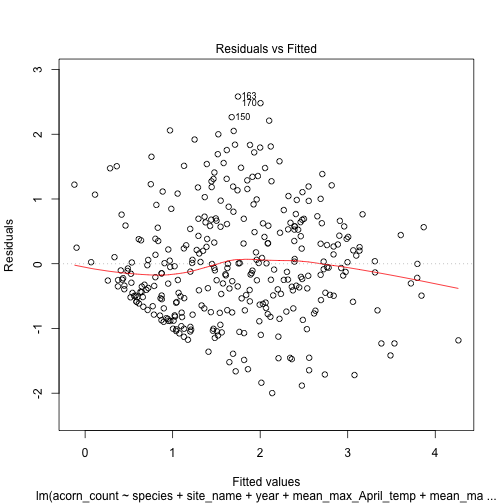
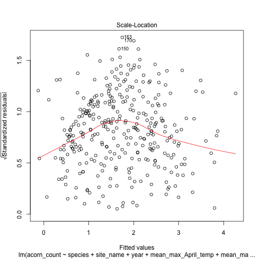
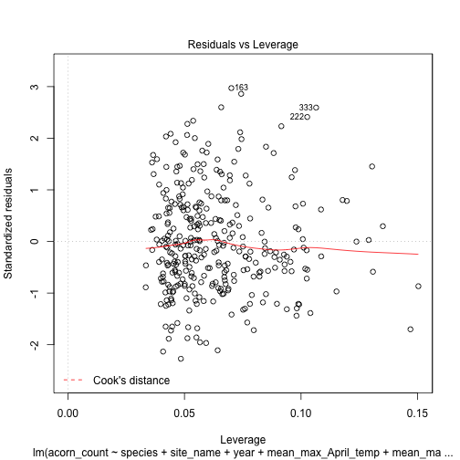

Example analysis of "stats_data.csv" for survey of statistical methods
========================================================

**Author:** [John Stanton-Geddes](www.johnstantongeddes.org), <john.stantongeddes.research@gmail.com>

**Created:** 2013-05-13

Data is a subset of data file from the paper "Walter D. Koenig and Johannes M. H. Knops. 2013. Large-scale spatial synchrony and cross-synchrony in statsdata production by two California oaks. Ecology. 94:83–93. http://dx.doi.org/10.1890/12-0940.1" downloaded from [Ecological Archives](http://esapubs.org/archive/ecol/E094/009/). Seven of the original 13 environmental variables were selected based on an analysis of the full data set (statsdata_analysis.Rmd) to reduce complexity of model fitting for participants. Some of the columns were renamed for convenience of analysis in R.

Response is acorn_count (per 30 seconds of counting, log transformed) collected from multiple sites over multiple years with many potential predictors. 

We in no way intend this as a criticism or an endorsement of the analysis performed by Koenig and Knops. We quite liked their paper, but simply selected this data set as it was freely available from *Ecological Archives* and fit our requirements of a single response and a number of potentially-important and associated predictors.

----------------------------------------------------------

Load and examine data


```r
library(MASS)
library(nlme)
library(lme4)
```

```
## Loading required package: Matrix
```

```
## Loading required package: lattice
```

```
## Attaching package: 'lme4'
```

```
## The following object is masked from 'package:nlme':
## 
## lmList, VarCorr
```

```
## The following object is masked from 'package:stats':
## 
## AIC, BIC
```

```r
library(MuMIn)
library(ggplot2)
library(car)
```

```
## Loading required package: nnet
```

```r
library(psych)
```

```
## Attaching package: 'psych'
```

```
## The following object is masked from 'package:car':
## 
## logit
```

```
## The following object is masked from 'package:ggplot2':
## 
## %+%
```

```r
library(SciViews)

statsdata <- read.csv("stats_data.csv", header = TRUE, sep = ",")
head(statsdata)
```

```
##   site_name year      species acorn_count mean_max_April_temp
## 1  HASTINGS 1994 Q. douglasii       2.110                1944
## 2  HASTINGS 1995 Q. douglasii       0.594                1733
## 3  HASTINGS 1996 Q. douglasii       3.178                2057
## 4  HASTINGS 1997 Q. douglasii       2.262                2089
## 5  HASTINGS 1998 Q. douglasii       1.170                1584
## 6  HASTINGS 1999 Q. douglasii       2.705                1644
##   mean_max_March_temp March_rain April_rain March_rain_lagged1
## 1                1848       2767       7735               7519
## 2                1432      43047       4368               2767
## 3                1696       5690       5114              43047
## 4                2029        801        851               5690
## 5                1515      14284       9102                801
## 6                1386      12967       7235              14284
##   April_rain_lagged1 mean_max_summer_temp
## 1               1134                 2909
## 2               7735                 2743
## 3               4368                 3045
## 4               5114                 2963
## 5                851                 2620
## 6               9102                 2757
```

```r
str(statsdata)
```

```
## 'data.frame':	333 obs. of  11 variables:
##  $ site_name           : Factor w/ 12 levels "DYE CREEK","HASTINGS",..: 2 2 2 2 2 2 2 2 2 2 ...
##  $ year                : int  1994 1995 1996 1997 1998 1999 2000 2001 2002 2003 ...
##  $ species             : Factor w/ 2 levels "Q. douglasii",..: 1 1 1 1 1 1 1 1 1 1 ...
##  $ acorn_count         : num  2.11 0.594 3.178 2.262 1.17 ...
##  $ mean_max_April_temp : int  1944 1733 2057 2089 1584 1644 2054 1682 1900 1544 ...
##  $ mean_max_March_temp : int  1848 1432 1696 2029 1515 1386 1636 1758 1605 1757 ...
##  $ March_rain          : int  2767 43047 5690 801 14284 12967 7021 8924 7590 4988 ...
##  $ April_rain          : int  7735 4368 5114 851 9102 7235 4911 6212 1530 9415 ...
##  $ March_rain_lagged1  : int  7519 2767 43047 5690 801 14284 12967 7021 8924 7590 ...
##  $ April_rain_lagged1  : int  1134 7735 4368 5114 851 9102 7235 4911 6212 1530 ...
##  $ mean_max_summer_temp: int  2909 2743 3045 2963 2620 2757 2909 3034 2902 2939 ...
```


Check distribution of acorn_count


```r
hist(statsdata$acorn_count)  # Mode at 0 and flat to 3
```

 


## Graphical exploration ##

```r
# panel.cor function from the help of pairs function
panel.cor <- function(x, y, digits = 2, prefix = "", cex.cor, ...) {
    usr <- par("usr")
    on.exit(par(usr))
    par(usr = c(0, 1, 0, 1))
    r <- abs(cor(x, y))
    txt <- format(c(r, 0.123456789), digits = digits)[1]
    txt <- paste(prefix, txt, sep = "")
    if (missing(cex.cor)) 
        cex.cor <- 0.8/strwidth(txt)
    text(0.5, 0.5, txt, cex = cex.cor * r)
}
pairs(statsdata[, 4:11], lower.panel = panel.cor, upper.panel = panel.smooth)
```

 

```r

# Create pairs with histograms on diagonal
pairs(statsdata[, 4:11], lower.panel = panel.cor, upper.panel = panel.smooth, 
    diag.panel = panel.density, cex = 0.25)
```

```
## Warning: non-matched further arguments are disregarded
```

```
## Warning: non-matched further arguments are disregarded
```

```
## Warning: non-matched further arguments are disregarded
```

```
## Warning: non-matched further arguments are disregarded
```

```
## Warning: non-matched further arguments are disregarded
```

```
## Warning: non-matched further arguments are disregarded
```

```
## Warning: non-matched further arguments are disregarded
```

```
## Warning: non-matched further arguments are disregarded
```

 

```r

# car package scatterplotMatrix
scatterplotMatrix(statsdata[, 4:11])
```

 

```r

# psych package pairs
pairs.panels(statsdata[, 4:11], smooth = TRUE)
```

 


## 


## Model selection by step-wise deletion ##

Fit mixed-effects model with site and year as random effects and all environmental predictors as fixed. 


```r
lmer1 <- lmer(acorn_count ~ mean_max_April_temp + mean_max_March_temp + March_rain + 
    April_rain + March_rain_lagged1 + April_rain_lagged1 + mean_max_summer_temp + 
    species + (1 | site_name) + (1 | year), data = statsdata)
summary(lmer1)
```

```
## Linear mixed model fit by REML 
## Formula: acorn_count ~ mean_max_April_temp + mean_max_March_temp + March_rain +      April_rain + March_rain_lagged1 + April_rain_lagged1 + mean_max_summer_temp +      species + (1 | site_name) + (1 | year) 
##    Data: statsdata 
##  AIC  BIC logLik deviance REMLdev
##  996 1042   -486      843     972
## Random effects:
##  Groups    Name        Variance Std.Dev.
##  year      (Intercept) 0.383    0.619   
##  site_name (Intercept) 0.130    0.360   
##  Residual              0.620    0.788   
## Number of obs: 333, groups: year, 18; site_name, 12
## 
## Fixed effects:
##                       Estimate Std. Error t value
## (Intercept)           1.73e-01   1.15e+00    0.15
## mean_max_April_temp   2.53e-04   5.57e-04    0.45
## mean_max_March_temp   2.20e-04   4.81e-04    0.46
## March_rain           -9.63e-06   9.48e-06   -1.02
## April_rain           -4.17e-05   1.64e-05   -2.55
## March_rain_lagged1    1.89e-05   9.72e-06    1.94
## April_rain_lagged1    6.25e-05   1.55e-05    4.02
## mean_max_summer_temp  1.41e-04   4.91e-04    0.29
## speciesQ. lobata      2.46e-02   9.44e-02    0.26
## 
## Correlation of Fixed Effects:
##             (Intr) mn__A_ mn__M_ Mrch_r Aprl_r Mrc__1 Apr__1 mn_m__
## mn_mx_Aprl_  0.107                                                 
## mn_mx_Mrch_ -0.104 -0.608                                          
## March_rain  -0.204 -0.216  0.361                                   
## April_rain  -0.072  0.306 -0.077 -0.294                            
## Mrch_rn_lg1 -0.050 -0.056  0.074  0.141 -0.260                     
## Aprl_rn_lg1 -0.073  0.128 -0.080 -0.195  0.171 -0.383              
## mn_mx_smmr_ -0.761 -0.490 -0.053  0.075 -0.168  0.009 -0.031       
## specisQ.lbt  0.028 -0.012 -0.018 -0.028 -0.021 -0.018 -0.006 -0.028
```

```r
anova(lmer1)
```

```
## Analysis of Variance Table
##                      Df Sum Sq Mean Sq F value
## mean_max_April_temp   1   2.77    2.77    4.46
## mean_max_March_temp   1   0.57    0.57    0.92
## March_rain            1   0.90    0.90    1.46
## April_rain            1   3.87    3.87    6.24
## March_rain_lagged1    1   8.87    8.87   14.30
## April_rain_lagged1    1  10.11   10.11   16.30
## mean_max_summer_temp  1   0.05    0.05    0.09
## species               1   0.04    0.04    0.07
```

```r

lmer2 <- lmer(acorn_count ~ mean_max_April_temp + mean_max_March_temp + March_rain + 
    April_rain + March_rain_lagged1 + April_rain_lagged1 + species + (1 | site_name) + 
    (1 | year), data = statsdata)
summary(lmer2)
```

```
## Linear mixed model fit by REML 
## Formula: acorn_count ~ mean_max_April_temp + mean_max_March_temp + March_rain +      April_rain + March_rain_lagged1 + April_rain_lagged1 + species +      (1 | site_name) + (1 | year) 
##    Data: statsdata 
##  AIC  BIC logLik deviance REMLdev
##  981 1023   -479      843     959
## Random effects:
##  Groups    Name        Variance Std.Dev.
##  year      (Intercept) 0.378    0.615   
##  site_name (Intercept) 0.113    0.336   
##  Residual              0.621    0.788   
## Number of obs: 333, groups: year, 18; site_name, 12
## 
## Fixed effects:
##                      Estimate Std. Error t value
## (Intercept)          5.33e-01   7.31e-01    0.73
## mean_max_April_temp  2.94e-04   4.81e-04    0.61
## mean_max_March_temp  2.09e-04   4.77e-04    0.44
## March_rain          -1.00e-05   9.42e-06   -1.06
## April_rain          -4.13e-05   1.60e-05   -2.58
## March_rain_lagged1   1.90e-05   9.70e-06    1.96
## April_rain_lagged1   6.28e-05   1.54e-05    4.06
## speciesQ. lobata     2.31e-02   9.42e-02    0.25
## 
## Correlation of Fixed Effects:
##             (Intr) mn__A_ mn__M_ Mrch_r Aprl_r Mrc__1 Apr__1
## mn_mx_Aprl_ -0.465                                          
## mn_mx_Mrch_ -0.218 -0.737                                   
## March_rain  -0.227 -0.207  0.364                            
## April_rain  -0.310  0.258 -0.088 -0.292                     
## Mrch_rn_lg1 -0.067 -0.058  0.074  0.137 -0.265              
## Aprl_rn_lg1 -0.149  0.130 -0.081 -0.198  0.161 -0.388       
## specisQ.lbt  0.014 -0.031 -0.021 -0.028 -0.028 -0.019 -0.008
```

```r
anova(lmer2, lmer1)
```

```
## Data: statsdata
## Models:
## lmer2: acorn_count ~ mean_max_April_temp + mean_max_March_temp + March_rain + 
## lmer2:     April_rain + March_rain_lagged1 + April_rain_lagged1 + species + 
## lmer2:     (1 | site_name) + (1 | year)
## lmer1: acorn_count ~ mean_max_April_temp + mean_max_March_temp + March_rain + 
## lmer1:     April_rain + March_rain_lagged1 + April_rain_lagged1 + mean_max_summer_temp + 
## lmer1:     species + (1 | site_name) + (1 | year)
##       Df AIC BIC logLik Chisq Chi Df Pr(>Chisq)
## lmer2 11 865 907   -421                        
## lmer1 12 867 913   -421     0      1          1
```

```r
# Drop mean_max_summer_temp
anova(lmer2)
```

```
## Analysis of Variance Table
##                     Df Sum Sq Mean Sq F value
## mean_max_April_temp  1   2.39    2.39    3.84
## mean_max_March_temp  1   0.52    0.52    0.83
## March_rain           1   0.89    0.89    1.44
## April_rain           1   3.79    3.79    6.10
## March_rain_lagged1   1   9.19    9.19   14.80
## April_rain_lagged1   1  10.26   10.26   16.53
## species              1   0.04    0.04    0.06
```

```r

lmer3 <- lmer(acorn_count ~ mean_max_April_temp + March_rain + April_rain + 
    March_rain_lagged1 + April_rain_lagged1 + species + (1 | site_name) + (1 | 
    year), data = statsdata)
summary(lmer3)
```

```
## Linear mixed model fit by REML 
## Formula: acorn_count ~ mean_max_April_temp + March_rain + April_rain +      March_rain_lagged1 + April_rain_lagged1 + species + (1 |      site_name) + (1 | year) 
##    Data: statsdata 
##  AIC  BIC logLik deviance REMLdev
##  966 1004   -473      843     946
## Random effects:
##  Groups    Name        Variance Std.Dev.
##  year      (Intercept) 0.349    0.591   
##  site_name (Intercept) 0.108    0.329   
##  Residual              0.622    0.789   
## Number of obs: 333, groups: year, 18; site_name, 12
## 
## Fixed effects:
##                      Estimate Std. Error t value
## (Intercept)          6.13e-01   7.05e-01    0.87
## mean_max_April_temp  4.45e-04   3.22e-04    1.38
## March_rain          -1.20e-05   8.70e-06   -1.37
## April_rain          -4.06e-05   1.59e-05   -2.55
## March_rain_lagged1   1.92e-05   9.61e-06    1.99
## April_rain_lagged1   6.35e-05   1.53e-05    4.15
## speciesQ. lobata     2.30e-02   9.42e-02    0.24
## 
## Correlation of Fixed Effects:
##             (Intr) mn__A_ Mrch_r Aprl_r Mrc__1 Apr__1
## mn_mx_Aprl_ -0.949                                   
## March_rain  -0.166  0.101                            
## April_rain  -0.342  0.291 -0.282                     
## Mrch_rn_lg1 -0.048 -0.009  0.120 -0.264              
## Aprl_rn_lg1 -0.169  0.101 -0.183  0.156 -0.389       
## specisQ.lbt  0.010 -0.070 -0.022 -0.031 -0.017 -0.010
```

```r
anova(lmer3, lmer2)
```

```
## Data: statsdata
## Models:
## lmer3: acorn_count ~ mean_max_April_temp + March_rain + April_rain + 
## lmer3:     March_rain_lagged1 + April_rain_lagged1 + species + (1 | 
## lmer3:     site_name) + (1 | year)
## lmer2: acorn_count ~ mean_max_April_temp + mean_max_March_temp + March_rain + 
## lmer2:     April_rain + March_rain_lagged1 + April_rain_lagged1 + species + 
## lmer2:     (1 | site_name) + (1 | year)
##       Df AIC BIC logLik Chisq Chi Df Pr(>Chisq)
## lmer3 10 863 901   -421                        
## lmer2 11 865 907   -421  0.03      1       0.87
```

```r
# Drop mean_max_March_temp
anova(lmer3)
```

```
## Analysis of Variance Table
##                     Df Sum Sq Mean Sq F value
## mean_max_April_temp  1   2.50    2.50    4.02
## March_rain           1   1.39    1.39    2.24
## April_rain           1   3.63    3.63    5.82
## March_rain_lagged1   1   9.57    9.57   15.37
## April_rain_lagged1   1  10.73   10.73   17.24
## species              1   0.04    0.04    0.06
```

```r

lmer4 <- lmer(acorn_count ~ mean_max_April_temp + April_rain + March_rain_lagged1 + 
    April_rain_lagged1 + species + (1 | site_name) + (1 | year), data = statsdata)
summary(lmer4)
```

```
## Linear mixed model fit by REML 
## Formula: acorn_count ~ mean_max_April_temp + April_rain + March_rain_lagged1 +      April_rain_lagged1 + species + (1 | site_name) + (1 | year) 
##    Data: statsdata 
##  AIC BIC logLik deviance REMLdev
##  944 978   -463      845     926
## Random effects:
##  Groups    Name        Variance Std.Dev.
##  year      (Intercept) 0.404    0.636   
##  site_name (Intercept) 0.104    0.322   
##  Residual              0.620    0.788   
## Number of obs: 333, groups: year, 18; site_name, 12
## 
## Fixed effects:
##                      Estimate Std. Error t value
## (Intercept)          5.44e-01   6.98e-01    0.78
## mean_max_April_temp  4.47e-04   3.21e-04    1.40
## April_rain          -4.70e-05   1.53e-05   -3.07
## March_rain_lagged1   1.98e-05   9.65e-06    2.06
## April_rain_lagged1   5.96e-05   1.51e-05    3.94
## speciesQ. lobata     2.00e-02   9.39e-02    0.21
## 
## Correlation of Fixed Effects:
##             (Intr) mn__A_ Aprl_r Mrc__1 Apr__1
## mn_mx_Aprl_ -0.948                            
## April_rain  -0.400  0.325                     
## Mrch_rn_lg1 -0.040 -0.010 -0.240              
## Aprl_rn_lg1 -0.208  0.127  0.100 -0.373       
## specisQ.lbt  0.009 -0.070 -0.039 -0.016 -0.015
```

```r
anova(lmer4, lmer3)
```

```
## Data: statsdata
## Models:
## lmer4: acorn_count ~ mean_max_April_temp + April_rain + March_rain_lagged1 + 
## lmer4:     April_rain_lagged1 + species + (1 | site_name) + (1 | year)
## lmer3: acorn_count ~ mean_max_April_temp + March_rain + April_rain + 
## lmer3:     March_rain_lagged1 + April_rain_lagged1 + species + (1 | 
## lmer3:     site_name) + (1 | year)
##       Df AIC BIC logLik Chisq Chi Df Pr(>Chisq)
## lmer4  9 863 897   -422                        
## lmer3 10 863 901   -421  1.89      1       0.17
```

```r
# Drop March_rain
anova(lmer4)
```

```
## Analysis of Variance Table
##                     Df Sum Sq Mean Sq F value
## mean_max_April_temp  1   1.95    1.95    3.15
## April_rain           1   4.52    4.52    7.30
## March_rain_lagged1   1   9.00    9.00   14.52
## April_rain_lagged1   1   9.64    9.64   15.54
## species              1   0.03    0.03    0.05
```

```r

lmer5 <- lmer(acorn_count ~ April_rain + March_rain_lagged1 + April_rain_lagged1 + 
    species + (1 | site_name) + (1 | year), data = statsdata)
summary(lmer5)
```

```
## Linear mixed model fit by REML 
## Formula: acorn_count ~ April_rain + March_rain_lagged1 + April_rain_lagged1 +      species + (1 | site_name) + (1 | year) 
##    Data: statsdata 
##  AIC BIC logLik deviance REMLdev
##  929 959   -456      846     913
## Random effects:
##  Groups    Name        Variance Std.Dev.
##  year      (Intercept) 0.4519   0.672   
##  site_name (Intercept) 0.0574   0.240   
##  Residual              0.6262   0.791   
## Number of obs: 333, groups: year, 18; site_name, 12
## 
## Fixed effects:
##                     Estimate Std. Error t value
## (Intercept)         1.47e+00   2.14e-01    6.88
## April_rain         -5.28e-05   1.42e-05   -3.73
## March_rain_lagged1  1.93e-05   9.71e-06    1.99
## April_rain_lagged1  5.75e-05   1.47e-05    3.91
## speciesQ. lobata    1.63e-02   9.28e-02    0.18
## 
## Correlation of Fixed Effects:
##             (Intr) Aprl_r Mrc__1 Apr__1
## April_rain  -0.267                     
## Mrch_rn_lg1 -0.150 -0.273              
## Aprl_rn_lg1 -0.240 -0.002 -0.399       
## specisQ.lbt -0.181 -0.021 -0.023 -0.008
```

```r
anova(lmer5, lmer4)
```

```
## Data: statsdata
## Models:
## lmer5: acorn_count ~ April_rain + March_rain_lagged1 + April_rain_lagged1 + 
## lmer5:     species + (1 | site_name) + (1 | year)
## lmer4: acorn_count ~ mean_max_April_temp + April_rain + March_rain_lagged1 + 
## lmer4:     April_rain_lagged1 + species + (1 | site_name) + (1 | year)
##       Df AIC BIC logLik Chisq Chi Df Pr(>Chisq)
## lmer5  8 862 892   -423                        
## lmer4  9 863 897   -422  0.82      1       0.36
```

```r
# Drop mean_max_April_temp
anova(lmer5)
```

```
## Analysis of Variance Table
##                    Df Sum Sq Mean Sq F value
## April_rain          1   4.49    4.49    7.17
## March_rain_lagged1  1   9.42    9.42   15.05
## April_rain_lagged1  1   9.58    9.58   15.29
## species             1   0.02    0.02    0.03
```

```r

lmer6 <- lmer(acorn_count ~ March_rain_lagged1 + April_rain_lagged1 + species + 
    (1 | site_name) + (1 | year), data = statsdata)
summary(lmer6)
```

```
## Linear mixed model fit by REML 
## Formula: acorn_count ~ March_rain_lagged1 + April_rain_lagged1 + species +      (1 | site_name) + (1 | year) 
##    Data: statsdata 
##  AIC BIC logLik deviance REMLdev
##  919 946   -453      859     905
## Random effects:
##  Groups    Name        Variance Std.Dev.
##  year      (Intercept) 0.5716   0.756   
##  site_name (Intercept) 0.0647   0.254   
##  Residual              0.6423   0.801   
## Number of obs: 333, groups: year, 18; site_name, 12
## 
## Fixed effects:
##                    Estimate Std. Error t value
## (Intercept)        1.27e+00   2.25e-01    5.63
## March_rain_lagged1 8.45e-06   9.63e-06    0.88
## April_rain_lagged1 5.75e-05   1.51e-05    3.80
## speciesQ. lobata   1.17e-02   9.42e-02    0.12
## 
## Correlation of Fixed Effects:
##             (Intr) Mrc__1 Apr__1
## Mrch_rn_lg1 -0.231              
## Aprl_rn_lg1 -0.238 -0.408       
## specisQ.lbt -0.181 -0.030 -0.007
```

```r
anova(lmer6, lmer5)
```

```
## Data: statsdata
## Models:
## lmer6: acorn_count ~ March_rain_lagged1 + April_rain_lagged1 + species + 
## lmer6:     (1 | site_name) + (1 | year)
## lmer5: acorn_count ~ April_rain + March_rain_lagged1 + April_rain_lagged1 + 
## lmer5:     species + (1 | site_name) + (1 | year)
##       Df AIC BIC logLik Chisq Chi Df Pr(>Chisq)
## lmer6  7 873 900   -430                        
## lmer5  8 862 892   -423  13.7      1    0.00022
```

```r
# Retain April_rain

lmer7 <- lmer(acorn_count ~ April_rain + April_rain_lagged1 + species + (1 | 
    site_name) + (1 | year), data = statsdata)
summary(lmer7)
```

```
## Linear mixed model fit by REML 
## Formula: acorn_count ~ April_rain + April_rain_lagged1 + species + (1 |      site_name) + (1 | year) 
##    Data: statsdata 
##  AIC BIC logLik deviance REMLdev
##  909 936   -447      849     895
## Random effects:
##  Groups    Name        Variance Std.Dev.
##  year      (Intercept) 0.5484   0.741   
##  site_name (Intercept) 0.0582   0.241   
##  Residual              0.6253   0.791   
## Number of obs: 333, groups: year, 18; site_name, 12
## 
## Fixed effects:
##                     Estimate Std. Error t value
## (Intercept)         1.54e+00   2.25e-01    6.86
## April_rain         -4.49e-05   1.38e-05   -3.26
## April_rain_lagged1  6.85e-05   1.36e-05    5.02
## speciesQ. lobata    2.10e-02   9.28e-02    0.23
## 
## Correlation of Fixed Effects:
##             (Intr) Aprl_r Apr__1
## April_rain  -0.307              
## Aprl_rn_lg1 -0.313 -0.133       
## specisQ.lbt -0.176 -0.029 -0.019
```

```r
anova(lmer7, lmer5)
```

```
## Data: statsdata
## Models:
## lmer7: acorn_count ~ April_rain + April_rain_lagged1 + species + (1 | 
## lmer7:     site_name) + (1 | year)
## lmer5: acorn_count ~ April_rain + March_rain_lagged1 + April_rain_lagged1 + 
## lmer5:     species + (1 | site_name) + (1 | year)
##       Df AIC BIC logLik Chisq Chi Df Pr(>Chisq)
## lmer7  7 863 890   -425                        
## lmer5  8 862 892   -423  3.88      1      0.049
```

```r
# Marginally retain March_rain_lagged1 at alpha=0.05, but not after
# multiple testing

lmer8 <- lmer(acorn_count ~ April_rain + April_rain_lagged1 + species + (1 | 
    site_name) + (1 | year), data = statsdata)
summary(lmer8)
```

```
## Linear mixed model fit by REML 
## Formula: acorn_count ~ April_rain + April_rain_lagged1 + species + (1 |      site_name) + (1 | year) 
##    Data: statsdata 
##  AIC BIC logLik deviance REMLdev
##  909 936   -447      849     895
## Random effects:
##  Groups    Name        Variance Std.Dev.
##  year      (Intercept) 0.5484   0.741   
##  site_name (Intercept) 0.0582   0.241   
##  Residual              0.6253   0.791   
## Number of obs: 333, groups: year, 18; site_name, 12
## 
## Fixed effects:
##                     Estimate Std. Error t value
## (Intercept)         1.54e+00   2.25e-01    6.86
## April_rain         -4.49e-05   1.38e-05   -3.26
## April_rain_lagged1  6.85e-05   1.36e-05    5.02
## speciesQ. lobata    2.10e-02   9.28e-02    0.23
## 
## Correlation of Fixed Effects:
##             (Intr) Aprl_r Apr__1
## April_rain  -0.307              
## Aprl_rn_lg1 -0.313 -0.133       
## specisQ.lbt -0.176 -0.029 -0.019
```

```r
anova(lmer8, lmer5)
```

```
## Data: statsdata
## Models:
## lmer8: acorn_count ~ April_rain + April_rain_lagged1 + species + (1 | 
## lmer8:     site_name) + (1 | year)
## lmer5: acorn_count ~ April_rain + March_rain_lagged1 + April_rain_lagged1 + 
## lmer5:     species + (1 | site_name) + (1 | year)
##       Df AIC BIC logLik Chisq Chi Df Pr(>Chisq)
## lmer8  7 863 890   -425                        
## lmer5  8 862 892   -423  3.88      1      0.049
```

```r
# Marginally retain April_rain_lagged1 at alpha=0.05, but not after
# multiple testing

# Check correlations among these variables
pairs(statsdata[, c(4, 8:10)])
```

 


Final model retains April_rain. March_rain_lagged1 and April_rain_lagged1 are marginally significant at alpha=0.05 but would not be retained if correcting for multiple testing.


## Model selection by AIC ##

Use dredge function in the [MuMIn](http://cran.r-project.org/web/packages/MuMIn/MuMIn.pdf) package that performs automated model selection testing all possible combinations of models. Model averaging of the 'best' models. 


```r
best.subsets <- dredge(lmer1, rank = "AIC", trace = TRUE, fixed = ~n)
```

```
## Warning: comparing models fitted by REML
```

```
## Warning: not all terms in 'fixed' exist in 'global.model'
```

```
## 1 : lmer(formula = acorn_count ~ (1 | site_name) + (1 | year), data = statsdata)
## 2 : lmer(formula = acorn_count ~ April_rain + (1 | site_name) + (1 | 
##     year), data = statsdata)
## 3 : lmer(formula = acorn_count ~ April_rain_lagged1 + (1 | site_name) + 
##     (1 | year), data = statsdata)
## 4 : lmer(formula = acorn_count ~ April_rain + April_rain_lagged1 + 
##     (1 | site_name) + (1 | year), data = statsdata)
## 5 : lmer(formula = acorn_count ~ March_rain + (1 | site_name) + (1 | 
##     year), data = statsdata)
## 6 : lmer(formula = acorn_count ~ April_rain + March_rain + (1 | site_name) + 
##     (1 | year), data = statsdata)
## 7 : lmer(formula = acorn_count ~ April_rain_lagged1 + March_rain + 
##     (1 | site_name) + (1 | year), data = statsdata)
## 8 : lmer(formula = acorn_count ~ April_rain + April_rain_lagged1 + 
##     March_rain + (1 | site_name) + (1 | year), data = statsdata)
## 9 : lmer(formula = acorn_count ~ March_rain_lagged1 + (1 | site_name) + 
##     (1 | year), data = statsdata)
## 10 : lmer(formula = acorn_count ~ April_rain + March_rain_lagged1 + 
##     (1 | site_name) + (1 | year), data = statsdata)
## 11 : lmer(formula = acorn_count ~ April_rain_lagged1 + March_rain_lagged1 + 
##     (1 | site_name) + (1 | year), data = statsdata)
## 12 : lmer(formula = acorn_count ~ April_rain + April_rain_lagged1 + 
##     March_rain_lagged1 + (1 | site_name) + (1 | year), data = statsdata)
## 13 : lmer(formula = acorn_count ~ March_rain + March_rain_lagged1 + 
##     (1 | site_name) + (1 | year), data = statsdata)
## 14 : lmer(formula = acorn_count ~ April_rain + March_rain + March_rain_lagged1 + 
##     (1 | site_name) + (1 | year), data = statsdata)
## 15 : lmer(formula = acorn_count ~ April_rain_lagged1 + March_rain + 
##     March_rain_lagged1 + (1 | site_name) + (1 | year), data = statsdata)
## 16 : lmer(formula = acorn_count ~ April_rain + April_rain_lagged1 + 
##     March_rain + March_rain_lagged1 + (1 | site_name) + (1 | 
##     year), data = statsdata)
## 17 : lmer(formula = acorn_count ~ mean_max_April_temp + (1 | site_name) + 
##     (1 | year), data = statsdata)
## 18 : lmer(formula = acorn_count ~ April_rain + mean_max_April_temp + 
##     (1 | site_name) + (1 | year), data = statsdata)
## 19 : lmer(formula = acorn_count ~ April_rain_lagged1 + mean_max_April_temp + 
##     (1 | site_name) + (1 | year), data = statsdata)
## 20 : lmer(formula = acorn_count ~ April_rain + April_rain_lagged1 + 
##     mean_max_April_temp + (1 | site_name) + (1 | year), data = statsdata)
## 21 : lmer(formula = acorn_count ~ March_rain + mean_max_April_temp + 
##     (1 | site_name) + (1 | year), data = statsdata)
## 22 : lmer(formula = acorn_count ~ April_rain + March_rain + mean_max_April_temp + 
##     (1 | site_name) + (1 | year), data = statsdata)
## 23 : lmer(formula = acorn_count ~ April_rain_lagged1 + March_rain + 
##     mean_max_April_temp + (1 | site_name) + (1 | year), data = statsdata)
## 24 : lmer(formula = acorn_count ~ April_rain + April_rain_lagged1 + 
##     March_rain + mean_max_April_temp + (1 | site_name) + (1 | 
##     year), data = statsdata)
## 25 : lmer(formula = acorn_count ~ March_rain_lagged1 + mean_max_April_temp + 
##     (1 | site_name) + (1 | year), data = statsdata)
## 26 : lmer(formula = acorn_count ~ April_rain + March_rain_lagged1 + 
##     mean_max_April_temp + (1 | site_name) + (1 | year), data = statsdata)
## 27 : lmer(formula = acorn_count ~ April_rain_lagged1 + March_rain_lagged1 + 
##     mean_max_April_temp + (1 | site_name) + (1 | year), data = statsdata)
## 28 : lmer(formula = acorn_count ~ April_rain + April_rain_lagged1 + 
##     March_rain_lagged1 + mean_max_April_temp + (1 | site_name) + 
##     (1 | year), data = statsdata)
## 29 : lmer(formula = acorn_count ~ March_rain + March_rain_lagged1 + 
##     mean_max_April_temp + (1 | site_name) + (1 | year), data = statsdata)
## 30 : lmer(formula = acorn_count ~ April_rain + March_rain + March_rain_lagged1 + 
##     mean_max_April_temp + (1 | site_name) + (1 | year), data = statsdata)
## 31 : lmer(formula = acorn_count ~ April_rain_lagged1 + March_rain + 
##     March_rain_lagged1 + mean_max_April_temp + (1 | site_name) + 
##     (1 | year), data = statsdata)
## 32 : lmer(formula = acorn_count ~ April_rain + April_rain_lagged1 + 
##     March_rain + March_rain_lagged1 + mean_max_April_temp + (1 | 
##     site_name) + (1 | year), data = statsdata)
## 33 : lmer(formula = acorn_count ~ mean_max_March_temp + (1 | site_name) + 
##     (1 | year), data = statsdata)
## 34 : lmer(formula = acorn_count ~ April_rain + mean_max_March_temp + 
##     (1 | site_name) + (1 | year), data = statsdata)
## 35 : lmer(formula = acorn_count ~ April_rain_lagged1 + mean_max_March_temp + 
##     (1 | site_name) + (1 | year), data = statsdata)
## 36 : lmer(formula = acorn_count ~ April_rain + April_rain_lagged1 + 
##     mean_max_March_temp + (1 | site_name) + (1 | year), data = statsdata)
## 37 : lmer(formula = acorn_count ~ March_rain + mean_max_March_temp + 
##     (1 | site_name) + (1 | year), data = statsdata)
## 38 : lmer(formula = acorn_count ~ April_rain + March_rain + mean_max_March_temp + 
##     (1 | site_name) + (1 | year), data = statsdata)
## 39 : lmer(formula = acorn_count ~ April_rain_lagged1 + March_rain + 
##     mean_max_March_temp + (1 | site_name) + (1 | year), data = statsdata)
## 40 : lmer(formula = acorn_count ~ April_rain + April_rain_lagged1 + 
##     March_rain + mean_max_March_temp + (1 | site_name) + (1 | 
##     year), data = statsdata)
## 41 : lmer(formula = acorn_count ~ March_rain_lagged1 + mean_max_March_temp + 
##     (1 | site_name) + (1 | year), data = statsdata)
## 42 : lmer(formula = acorn_count ~ April_rain + March_rain_lagged1 + 
##     mean_max_March_temp + (1 | site_name) + (1 | year), data = statsdata)
## 43 : lmer(formula = acorn_count ~ April_rain_lagged1 + March_rain_lagged1 + 
##     mean_max_March_temp + (1 | site_name) + (1 | year), data = statsdata)
## 44 : lmer(formula = acorn_count ~ April_rain + April_rain_lagged1 + 
##     March_rain_lagged1 + mean_max_March_temp + (1 | site_name) + 
##     (1 | year), data = statsdata)
## 45 : lmer(formula = acorn_count ~ March_rain + March_rain_lagged1 + 
##     mean_max_March_temp + (1 | site_name) + (1 | year), data = statsdata)
## 46 : lmer(formula = acorn_count ~ April_rain + March_rain + March_rain_lagged1 + 
##     mean_max_March_temp + (1 | site_name) + (1 | year), data = statsdata)
## 47 : lmer(formula = acorn_count ~ April_rain_lagged1 + March_rain + 
##     March_rain_lagged1 + mean_max_March_temp + (1 | site_name) + 
##     (1 | year), data = statsdata)
## 48 : lmer(formula = acorn_count ~ April_rain + April_rain_lagged1 + 
##     March_rain + March_rain_lagged1 + mean_max_March_temp + (1 | 
##     site_name) + (1 | year), data = statsdata)
## 49 : lmer(formula = acorn_count ~ mean_max_April_temp + mean_max_March_temp + 
##     (1 | site_name) + (1 | year), data = statsdata)
## 50 : lmer(formula = acorn_count ~ April_rain + mean_max_April_temp + 
##     mean_max_March_temp + (1 | site_name) + (1 | year), data = statsdata)
## 51 : lmer(formula = acorn_count ~ April_rain_lagged1 + mean_max_April_temp + 
##     mean_max_March_temp + (1 | site_name) + (1 | year), data = statsdata)
## 52 : lmer(formula = acorn_count ~ April_rain + April_rain_lagged1 + 
##     mean_max_April_temp + mean_max_March_temp + (1 | site_name) + 
##     (1 | year), data = statsdata)
## 53 : lmer(formula = acorn_count ~ March_rain + mean_max_April_temp + 
##     mean_max_March_temp + (1 | site_name) + (1 | year), data = statsdata)
## 54 : lmer(formula = acorn_count ~ April_rain + March_rain + mean_max_April_temp + 
##     mean_max_March_temp + (1 | site_name) + (1 | year), data = statsdata)
## 55 : lmer(formula = acorn_count ~ April_rain_lagged1 + March_rain + 
##     mean_max_April_temp + mean_max_March_temp + (1 | site_name) + 
##     (1 | year), data = statsdata)
## 56 : lmer(formula = acorn_count ~ April_rain + April_rain_lagged1 + 
##     March_rain + mean_max_April_temp + mean_max_March_temp + 
##     (1 | site_name) + (1 | year), data = statsdata)
## 57 : lmer(formula = acorn_count ~ March_rain_lagged1 + mean_max_April_temp + 
##     mean_max_March_temp + (1 | site_name) + (1 | year), data = statsdata)
## 58 : lmer(formula = acorn_count ~ April_rain + March_rain_lagged1 + 
##     mean_max_April_temp + mean_max_March_temp + (1 | site_name) + 
##     (1 | year), data = statsdata)
## 59 : lmer(formula = acorn_count ~ April_rain_lagged1 + March_rain_lagged1 + 
##     mean_max_April_temp + mean_max_March_temp + (1 | site_name) + 
##     (1 | year), data = statsdata)
## 60 : lmer(formula = acorn_count ~ April_rain + April_rain_lagged1 + 
##     March_rain_lagged1 + mean_max_April_temp + mean_max_March_temp + 
##     (1 | site_name) + (1 | year), data = statsdata)
## 61 : lmer(formula = acorn_count ~ March_rain + March_rain_lagged1 + 
##     mean_max_April_temp + mean_max_March_temp + (1 | site_name) + 
##     (1 | year), data = statsdata)
## 62 : lmer(formula = acorn_count ~ April_rain + March_rain + March_rain_lagged1 + 
##     mean_max_April_temp + mean_max_March_temp + (1 | site_name) + 
##     (1 | year), data = statsdata)
## 63 : lmer(formula = acorn_count ~ April_rain_lagged1 + March_rain + 
##     March_rain_lagged1 + mean_max_April_temp + mean_max_March_temp + 
##     (1 | site_name) + (1 | year), data = statsdata)
## 64 : lmer(formula = acorn_count ~ April_rain + April_rain_lagged1 + 
##     March_rain + March_rain_lagged1 + mean_max_April_temp + mean_max_March_temp + 
##     (1 | site_name) + (1 | year), data = statsdata)
## 65 : lmer(formula = acorn_count ~ mean_max_summer_temp + (1 | site_name) + 
##     (1 | year), data = statsdata)
## 66 : lmer(formula = acorn_count ~ April_rain + mean_max_summer_temp + 
##     (1 | site_name) + (1 | year), data = statsdata)
## 67 : lmer(formula = acorn_count ~ April_rain_lagged1 + mean_max_summer_temp + 
##     (1 | site_name) + (1 | year), data = statsdata)
## 68 : lmer(formula = acorn_count ~ April_rain + April_rain_lagged1 + 
##     mean_max_summer_temp + (1 | site_name) + (1 | year), data = statsdata)
## 69 : lmer(formula = acorn_count ~ March_rain + mean_max_summer_temp + 
##     (1 | site_name) + (1 | year), data = statsdata)
## 70 : lmer(formula = acorn_count ~ April_rain + March_rain + mean_max_summer_temp + 
##     (1 | site_name) + (1 | year), data = statsdata)
## 71 : lmer(formula = acorn_count ~ April_rain_lagged1 + March_rain + 
##     mean_max_summer_temp + (1 | site_name) + (1 | year), data = statsdata)
## 72 : lmer(formula = acorn_count ~ April_rain + April_rain_lagged1 + 
##     March_rain + mean_max_summer_temp + (1 | site_name) + (1 | 
##     year), data = statsdata)
## 73 : lmer(formula = acorn_count ~ March_rain_lagged1 + mean_max_summer_temp + 
##     (1 | site_name) + (1 | year), data = statsdata)
## 74 : lmer(formula = acorn_count ~ April_rain + March_rain_lagged1 + 
##     mean_max_summer_temp + (1 | site_name) + (1 | year), data = statsdata)
## 75 : lmer(formula = acorn_count ~ April_rain_lagged1 + March_rain_lagged1 + 
##     mean_max_summer_temp + (1 | site_name) + (1 | year), data = statsdata)
## 76 : lmer(formula = acorn_count ~ April_rain + April_rain_lagged1 + 
##     March_rain_lagged1 + mean_max_summer_temp + (1 | site_name) + 
##     (1 | year), data = statsdata)
## 77 : lmer(formula = acorn_count ~ March_rain + March_rain_lagged1 + 
##     mean_max_summer_temp + (1 | site_name) + (1 | year), data = statsdata)
## 78 : lmer(formula = acorn_count ~ April_rain + March_rain + March_rain_lagged1 + 
##     mean_max_summer_temp + (1 | site_name) + (1 | year), data = statsdata)
## 79 : lmer(formula = acorn_count ~ April_rain_lagged1 + March_rain + 
##     March_rain_lagged1 + mean_max_summer_temp + (1 | site_name) + 
##     (1 | year), data = statsdata)
## 80 : lmer(formula = acorn_count ~ April_rain + April_rain_lagged1 + 
##     March_rain + March_rain_lagged1 + mean_max_summer_temp + 
##     (1 | site_name) + (1 | year), data = statsdata)
## 81 : lmer(formula = acorn_count ~ mean_max_April_temp + mean_max_summer_temp + 
##     (1 | site_name) + (1 | year), data = statsdata)
## 82 : lmer(formula = acorn_count ~ April_rain + mean_max_April_temp + 
##     mean_max_summer_temp + (1 | site_name) + (1 | year), data = statsdata)
## 83 : lmer(formula = acorn_count ~ April_rain_lagged1 + mean_max_April_temp + 
##     mean_max_summer_temp + (1 | site_name) + (1 | year), data = statsdata)
## 84 : lmer(formula = acorn_count ~ April_rain + April_rain_lagged1 + 
##     mean_max_April_temp + mean_max_summer_temp + (1 | site_name) + 
##     (1 | year), data = statsdata)
## 85 : lmer(formula = acorn_count ~ March_rain + mean_max_April_temp + 
##     mean_max_summer_temp + (1 | site_name) + (1 | year), data = statsdata)
## 86 : lmer(formula = acorn_count ~ April_rain + March_rain + mean_max_April_temp + 
##     mean_max_summer_temp + (1 | site_name) + (1 | year), data = statsdata)
## 87 : lmer(formula = acorn_count ~ April_rain_lagged1 + March_rain + 
##     mean_max_April_temp + mean_max_summer_temp + (1 | site_name) + 
##     (1 | year), data = statsdata)
## 88 : lmer(formula = acorn_count ~ April_rain + April_rain_lagged1 + 
##     March_rain + mean_max_April_temp + mean_max_summer_temp + 
##     (1 | site_name) + (1 | year), data = statsdata)
## 89 : lmer(formula = acorn_count ~ March_rain_lagged1 + mean_max_April_temp + 
##     mean_max_summer_temp + (1 | site_name) + (1 | year), data = statsdata)
## 90 : lmer(formula = acorn_count ~ April_rain + March_rain_lagged1 + 
##     mean_max_April_temp + mean_max_summer_temp + (1 | site_name) + 
##     (1 | year), data = statsdata)
## 91 : lmer(formula = acorn_count ~ April_rain_lagged1 + March_rain_lagged1 + 
##     mean_max_April_temp + mean_max_summer_temp + (1 | site_name) + 
##     (1 | year), data = statsdata)
## 92 : lmer(formula = acorn_count ~ April_rain + April_rain_lagged1 + 
##     March_rain_lagged1 + mean_max_April_temp + mean_max_summer_temp + 
##     (1 | site_name) + (1 | year), data = statsdata)
## 93 : lmer(formula = acorn_count ~ March_rain + March_rain_lagged1 + 
##     mean_max_April_temp + mean_max_summer_temp + (1 | site_name) + 
##     (1 | year), data = statsdata)
## 94 : lmer(formula = acorn_count ~ April_rain + March_rain + March_rain_lagged1 + 
##     mean_max_April_temp + mean_max_summer_temp + (1 | site_name) + 
##     (1 | year), data = statsdata)
## 95 : lmer(formula = acorn_count ~ April_rain_lagged1 + March_rain + 
##     March_rain_lagged1 + mean_max_April_temp + mean_max_summer_temp + 
##     (1 | site_name) + (1 | year), data = statsdata)
## 96 : lmer(formula = acorn_count ~ April_rain + April_rain_lagged1 + 
##     March_rain + March_rain_lagged1 + mean_max_April_temp + mean_max_summer_temp + 
##     (1 | site_name) + (1 | year), data = statsdata)
## 97 : lmer(formula = acorn_count ~ mean_max_March_temp + mean_max_summer_temp + 
##     (1 | site_name) + (1 | year), data = statsdata)
## 98 : lmer(formula = acorn_count ~ April_rain + mean_max_March_temp + 
##     mean_max_summer_temp + (1 | site_name) + (1 | year), data = statsdata)
## 99 : lmer(formula = acorn_count ~ April_rain_lagged1 + mean_max_March_temp + 
##     mean_max_summer_temp + (1 | site_name) + (1 | year), data = statsdata)
## 100 : lmer(formula = acorn_count ~ April_rain + April_rain_lagged1 + 
##     mean_max_March_temp + mean_max_summer_temp + (1 | site_name) + 
##     (1 | year), data = statsdata)
## 101 : lmer(formula = acorn_count ~ March_rain + mean_max_March_temp + 
##     mean_max_summer_temp + (1 | site_name) + (1 | year), data = statsdata)
## 102 : lmer(formula = acorn_count ~ April_rain + March_rain + mean_max_March_temp + 
##     mean_max_summer_temp + (1 | site_name) + (1 | year), data = statsdata)
## 103 : lmer(formula = acorn_count ~ April_rain_lagged1 + March_rain + 
##     mean_max_March_temp + mean_max_summer_temp + (1 | site_name) + 
##     (1 | year), data = statsdata)
## 104 : lmer(formula = acorn_count ~ April_rain + April_rain_lagged1 + 
##     March_rain + mean_max_March_temp + mean_max_summer_temp + 
##     (1 | site_name) + (1 | year), data = statsdata)
## 105 : lmer(formula = acorn_count ~ March_rain_lagged1 + mean_max_March_temp + 
##     mean_max_summer_temp + (1 | site_name) + (1 | year), data = statsdata)
## 106 : lmer(formula = acorn_count ~ April_rain + March_rain_lagged1 + 
##     mean_max_March_temp + mean_max_summer_temp + (1 | site_name) + 
##     (1 | year), data = statsdata)
## 107 : lmer(formula = acorn_count ~ April_rain_lagged1 + March_rain_lagged1 + 
##     mean_max_March_temp + mean_max_summer_temp + (1 | site_name) + 
##     (1 | year), data = statsdata)
## 108 : lmer(formula = acorn_count ~ April_rain + April_rain_lagged1 + 
##     March_rain_lagged1 + mean_max_March_temp + mean_max_summer_temp + 
##     (1 | site_name) + (1 | year), data = statsdata)
## 109 : lmer(formula = acorn_count ~ March_rain + March_rain_lagged1 + 
##     mean_max_March_temp + mean_max_summer_temp + (1 | site_name) + 
##     (1 | year), data = statsdata)
## 110 : lmer(formula = acorn_count ~ April_rain + March_rain + March_rain_lagged1 + 
##     mean_max_March_temp + mean_max_summer_temp + (1 | site_name) + 
##     (1 | year), data = statsdata)
## 111 : lmer(formula = acorn_count ~ April_rain_lagged1 + March_rain + 
##     March_rain_lagged1 + mean_max_March_temp + mean_max_summer_temp + 
##     (1 | site_name) + (1 | year), data = statsdata)
## 112 : lmer(formula = acorn_count ~ April_rain + April_rain_lagged1 + 
##     March_rain + March_rain_lagged1 + mean_max_March_temp + mean_max_summer_temp + 
##     (1 | site_name) + (1 | year), data = statsdata)
## 113 : lmer(formula = acorn_count ~ mean_max_April_temp + mean_max_March_temp + 
##     mean_max_summer_temp + (1 | site_name) + (1 | year), data = statsdata)
## 114 : lmer(formula = acorn_count ~ April_rain + mean_max_April_temp + 
##     mean_max_March_temp + mean_max_summer_temp + (1 | site_name) + 
##     (1 | year), data = statsdata)
## 115 : lmer(formula = acorn_count ~ April_rain_lagged1 + mean_max_April_temp + 
##     mean_max_March_temp + mean_max_summer_temp + (1 | site_name) + 
##     (1 | year), data = statsdata)
## 116 : lmer(formula = acorn_count ~ April_rain + April_rain_lagged1 + 
##     mean_max_April_temp + mean_max_March_temp + mean_max_summer_temp + 
##     (1 | site_name) + (1 | year), data = statsdata)
## 117 : lmer(formula = acorn_count ~ March_rain + mean_max_April_temp + 
##     mean_max_March_temp + mean_max_summer_temp + (1 | site_name) + 
##     (1 | year), data = statsdata)
## 118 : lmer(formula = acorn_count ~ April_rain + March_rain + mean_max_April_temp + 
##     mean_max_March_temp + mean_max_summer_temp + (1 | site_name) + 
##     (1 | year), data = statsdata)
## 119 : lmer(formula = acorn_count ~ April_rain_lagged1 + March_rain + 
##     mean_max_April_temp + mean_max_March_temp + mean_max_summer_temp + 
##     (1 | site_name) + (1 | year), data = statsdata)
## 120 : lmer(formula = acorn_count ~ April_rain + April_rain_lagged1 + 
##     March_rain + mean_max_April_temp + mean_max_March_temp + 
##     mean_max_summer_temp + (1 | site_name) + (1 | year), data = statsdata)
## 121 : lmer(formula = acorn_count ~ March_rain_lagged1 + mean_max_April_temp + 
##     mean_max_March_temp + mean_max_summer_temp + (1 | site_name) + 
##     (1 | year), data = statsdata)
## 122 : lmer(formula = acorn_count ~ April_rain + March_rain_lagged1 + 
##     mean_max_April_temp + mean_max_March_temp + mean_max_summer_temp + 
##     (1 | site_name) + (1 | year), data = statsdata)
## 123 : lmer(formula = acorn_count ~ April_rain_lagged1 + March_rain_lagged1 + 
##     mean_max_April_temp + mean_max_March_temp + mean_max_summer_temp + 
##     (1 | site_name) + (1 | year), data = statsdata)
## 124 : lmer(formula = acorn_count ~ April_rain + April_rain_lagged1 + 
##     March_rain_lagged1 + mean_max_April_temp + mean_max_March_temp + 
##     mean_max_summer_temp + (1 | site_name) + (1 | year), data = statsdata)
## 125 : lmer(formula = acorn_count ~ March_rain + March_rain_lagged1 + 
##     mean_max_April_temp + mean_max_March_temp + mean_max_summer_temp + 
##     (1 | site_name) + (1 | year), data = statsdata)
## 126 : lmer(formula = acorn_count ~ April_rain + March_rain + March_rain_lagged1 + 
##     mean_max_April_temp + mean_max_March_temp + mean_max_summer_temp + 
##     (1 | site_name) + (1 | year), data = statsdata)
## 127 : lmer(formula = acorn_count ~ April_rain_lagged1 + March_rain + 
##     March_rain_lagged1 + mean_max_April_temp + mean_max_March_temp + 
##     mean_max_summer_temp + (1 | site_name) + (1 | year), data = statsdata)
## 128 : lmer(formula = acorn_count ~ April_rain + April_rain_lagged1 + 
##     March_rain + March_rain_lagged1 + mean_max_April_temp + mean_max_March_temp + 
##     mean_max_summer_temp + (1 | site_name) + (1 | year), data = statsdata)
## 129 : lmer(formula = acorn_count ~ species + (1 | site_name) + (1 | 
##     year), data = statsdata)
## 130 : lmer(formula = acorn_count ~ April_rain + species + (1 | site_name) + 
##     (1 | year), data = statsdata)
## 131 : lmer(formula = acorn_count ~ April_rain_lagged1 + species + (1 | 
##     site_name) + (1 | year), data = statsdata)
## 132 : lmer(formula = acorn_count ~ April_rain + April_rain_lagged1 + 
##     species + (1 | site_name) + (1 | year), data = statsdata)
## 133 : lmer(formula = acorn_count ~ March_rain + species + (1 | site_name) + 
##     (1 | year), data = statsdata)
## 134 : lmer(formula = acorn_count ~ April_rain + March_rain + species + 
##     (1 | site_name) + (1 | year), data = statsdata)
## 135 : lmer(formula = acorn_count ~ April_rain_lagged1 + March_rain + 
##     species + (1 | site_name) + (1 | year), data = statsdata)
## 136 : lmer(formula = acorn_count ~ April_rain + April_rain_lagged1 + 
##     March_rain + species + (1 | site_name) + (1 | year), data = statsdata)
## 137 : lmer(formula = acorn_count ~ March_rain_lagged1 + species + (1 | 
##     site_name) + (1 | year), data = statsdata)
## 138 : lmer(formula = acorn_count ~ April_rain + March_rain_lagged1 + 
##     species + (1 | site_name) + (1 | year), data = statsdata)
## 139 : lmer(formula = acorn_count ~ April_rain_lagged1 + March_rain_lagged1 + 
##     species + (1 | site_name) + (1 | year), data = statsdata)
## 140 : lmer(formula = acorn_count ~ April_rain + April_rain_lagged1 + 
##     March_rain_lagged1 + species + (1 | site_name) + (1 | year), 
##     data = statsdata)
## 141 : lmer(formula = acorn_count ~ March_rain + March_rain_lagged1 + 
##     species + (1 | site_name) + (1 | year), data = statsdata)
## 142 : lmer(formula = acorn_count ~ April_rain + March_rain + March_rain_lagged1 + 
##     species + (1 | site_name) + (1 | year), data = statsdata)
## 143 : lmer(formula = acorn_count ~ April_rain_lagged1 + March_rain + 
##     March_rain_lagged1 + species + (1 | site_name) + (1 | year), 
##     data = statsdata)
## 144 : lmer(formula = acorn_count ~ April_rain + April_rain_lagged1 + 
##     March_rain + March_rain_lagged1 + species + (1 | site_name) + 
##     (1 | year), data = statsdata)
## 145 : lmer(formula = acorn_count ~ mean_max_April_temp + species + 
##     (1 | site_name) + (1 | year), data = statsdata)
## 146 : lmer(formula = acorn_count ~ April_rain + mean_max_April_temp + 
##     species + (1 | site_name) + (1 | year), data = statsdata)
## 147 : lmer(formula = acorn_count ~ April_rain_lagged1 + mean_max_April_temp + 
##     species + (1 | site_name) + (1 | year), data = statsdata)
## 148 : lmer(formula = acorn_count ~ April_rain + April_rain_lagged1 + 
##     mean_max_April_temp + species + (1 | site_name) + (1 | year), 
##     data = statsdata)
## 149 : lmer(formula = acorn_count ~ March_rain + mean_max_April_temp + 
##     species + (1 | site_name) + (1 | year), data = statsdata)
## 150 : lmer(formula = acorn_count ~ April_rain + March_rain + mean_max_April_temp + 
##     species + (1 | site_name) + (1 | year), data = statsdata)
## 151 : lmer(formula = acorn_count ~ April_rain_lagged1 + March_rain + 
##     mean_max_April_temp + species + (1 | site_name) + (1 | year), 
##     data = statsdata)
## 152 : lmer(formula = acorn_count ~ April_rain + April_rain_lagged1 + 
##     March_rain + mean_max_April_temp + species + (1 | site_name) + 
##     (1 | year), data = statsdata)
## 153 : lmer(formula = acorn_count ~ March_rain_lagged1 + mean_max_April_temp + 
##     species + (1 | site_name) + (1 | year), data = statsdata)
## 154 : lmer(formula = acorn_count ~ April_rain + March_rain_lagged1 + 
##     mean_max_April_temp + species + (1 | site_name) + (1 | year), 
##     data = statsdata)
## 155 : lmer(formula = acorn_count ~ April_rain_lagged1 + March_rain_lagged1 + 
##     mean_max_April_temp + species + (1 | site_name) + (1 | year), 
##     data = statsdata)
## 156 : lmer(formula = acorn_count ~ April_rain + April_rain_lagged1 + 
##     March_rain_lagged1 + mean_max_April_temp + species + (1 | 
##     site_name) + (1 | year), data = statsdata)
## 157 : lmer(formula = acorn_count ~ March_rain + March_rain_lagged1 + 
##     mean_max_April_temp + species + (1 | site_name) + (1 | year), 
##     data = statsdata)
## 158 : lmer(formula = acorn_count ~ April_rain + March_rain + March_rain_lagged1 + 
##     mean_max_April_temp + species + (1 | site_name) + (1 | year), 
##     data = statsdata)
## 159 : lmer(formula = acorn_count ~ April_rain_lagged1 + March_rain + 
##     March_rain_lagged1 + mean_max_April_temp + species + (1 | 
##     site_name) + (1 | year), data = statsdata)
## 160 : lmer(formula = acorn_count ~ April_rain + April_rain_lagged1 + 
##     March_rain + March_rain_lagged1 + mean_max_April_temp + species + 
##     (1 | site_name) + (1 | year), data = statsdata)
## 161 : lmer(formula = acorn_count ~ mean_max_March_temp + species + 
##     (1 | site_name) + (1 | year), data = statsdata)
## 162 : lmer(formula = acorn_count ~ April_rain + mean_max_March_temp + 
##     species + (1 | site_name) + (1 | year), data = statsdata)
## 163 : lmer(formula = acorn_count ~ April_rain_lagged1 + mean_max_March_temp + 
##     species + (1 | site_name) + (1 | year), data = statsdata)
## 164 : lmer(formula = acorn_count ~ April_rain + April_rain_lagged1 + 
##     mean_max_March_temp + species + (1 | site_name) + (1 | year), 
##     data = statsdata)
## 165 : lmer(formula = acorn_count ~ March_rain + mean_max_March_temp + 
##     species + (1 | site_name) + (1 | year), data = statsdata)
## 166 : lmer(formula = acorn_count ~ April_rain + March_rain + mean_max_March_temp + 
##     species + (1 | site_name) + (1 | year), data = statsdata)
## 167 : lmer(formula = acorn_count ~ April_rain_lagged1 + March_rain + 
##     mean_max_March_temp + species + (1 | site_name) + (1 | year), 
##     data = statsdata)
## 168 : lmer(formula = acorn_count ~ April_rain + April_rain_lagged1 + 
##     March_rain + mean_max_March_temp + species + (1 | site_name) + 
##     (1 | year), data = statsdata)
## 169 : lmer(formula = acorn_count ~ March_rain_lagged1 + mean_max_March_temp + 
##     species + (1 | site_name) + (1 | year), data = statsdata)
## 170 : lmer(formula = acorn_count ~ April_rain + March_rain_lagged1 + 
##     mean_max_March_temp + species + (1 | site_name) + (1 | year), 
##     data = statsdata)
## 171 : lmer(formula = acorn_count ~ April_rain_lagged1 + March_rain_lagged1 + 
##     mean_max_March_temp + species + (1 | site_name) + (1 | year), 
##     data = statsdata)
## 172 : lmer(formula = acorn_count ~ April_rain + April_rain_lagged1 + 
##     March_rain_lagged1 + mean_max_March_temp + species + (1 | 
##     site_name) + (1 | year), data = statsdata)
## 173 : lmer(formula = acorn_count ~ March_rain + March_rain_lagged1 + 
##     mean_max_March_temp + species + (1 | site_name) + (1 | year), 
##     data = statsdata)
## 174 : lmer(formula = acorn_count ~ April_rain + March_rain + March_rain_lagged1 + 
##     mean_max_March_temp + species + (1 | site_name) + (1 | year), 
##     data = statsdata)
## 175 : lmer(formula = acorn_count ~ April_rain_lagged1 + March_rain + 
##     March_rain_lagged1 + mean_max_March_temp + species + (1 | 
##     site_name) + (1 | year), data = statsdata)
## 176 : lmer(formula = acorn_count ~ April_rain + April_rain_lagged1 + 
##     March_rain + March_rain_lagged1 + mean_max_March_temp + species + 
##     (1 | site_name) + (1 | year), data = statsdata)
## 177 : lmer(formula = acorn_count ~ mean_max_April_temp + mean_max_March_temp + 
##     species + (1 | site_name) + (1 | year), data = statsdata)
## 178 : lmer(formula = acorn_count ~ April_rain + mean_max_April_temp + 
##     mean_max_March_temp + species + (1 | site_name) + (1 | year), 
##     data = statsdata)
## 179 : lmer(formula = acorn_count ~ April_rain_lagged1 + mean_max_April_temp + 
##     mean_max_March_temp + species + (1 | site_name) + (1 | year), 
##     data = statsdata)
## 180 : lmer(formula = acorn_count ~ April_rain + April_rain_lagged1 + 
##     mean_max_April_temp + mean_max_March_temp + species + (1 | 
##     site_name) + (1 | year), data = statsdata)
## 181 : lmer(formula = acorn_count ~ March_rain + mean_max_April_temp + 
##     mean_max_March_temp + species + (1 | site_name) + (1 | year), 
##     data = statsdata)
## 182 : lmer(formula = acorn_count ~ April_rain + March_rain + mean_max_April_temp + 
##     mean_max_March_temp + species + (1 | site_name) + (1 | year), 
##     data = statsdata)
## 183 : lmer(formula = acorn_count ~ April_rain_lagged1 + March_rain + 
##     mean_max_April_temp + mean_max_March_temp + species + (1 | 
##     site_name) + (1 | year), data = statsdata)
## 184 : lmer(formula = acorn_count ~ April_rain + April_rain_lagged1 + 
##     March_rain + mean_max_April_temp + mean_max_March_temp + 
##     species + (1 | site_name) + (1 | year), data = statsdata)
## 185 : lmer(formula = acorn_count ~ March_rain_lagged1 + mean_max_April_temp + 
##     mean_max_March_temp + species + (1 | site_name) + (1 | year), 
##     data = statsdata)
## 186 : lmer(formula = acorn_count ~ April_rain + March_rain_lagged1 + 
##     mean_max_April_temp + mean_max_March_temp + species + (1 | 
##     site_name) + (1 | year), data = statsdata)
## 187 : lmer(formula = acorn_count ~ April_rain_lagged1 + March_rain_lagged1 + 
##     mean_max_April_temp + mean_max_March_temp + species + (1 | 
##     site_name) + (1 | year), data = statsdata)
## 188 : lmer(formula = acorn_count ~ April_rain + April_rain_lagged1 + 
##     March_rain_lagged1 + mean_max_April_temp + mean_max_March_temp + 
##     species + (1 | site_name) + (1 | year), data = statsdata)
## 189 : lmer(formula = acorn_count ~ March_rain + March_rain_lagged1 + 
##     mean_max_April_temp + mean_max_March_temp + species + (1 | 
##     site_name) + (1 | year), data = statsdata)
## 190 : lmer(formula = acorn_count ~ April_rain + March_rain + March_rain_lagged1 + 
##     mean_max_April_temp + mean_max_March_temp + species + (1 | 
##     site_name) + (1 | year), data = statsdata)
## 191 : lmer(formula = acorn_count ~ April_rain_lagged1 + March_rain + 
##     March_rain_lagged1 + mean_max_April_temp + mean_max_March_temp + 
##     species + (1 | site_name) + (1 | year), data = statsdata)
## 192 : lmer(formula = acorn_count ~ April_rain + April_rain_lagged1 + 
##     March_rain + March_rain_lagged1 + mean_max_April_temp + mean_max_March_temp + 
##     species + (1 | site_name) + (1 | year), data = statsdata)
## 193 : lmer(formula = acorn_count ~ mean_max_summer_temp + species + 
##     (1 | site_name) + (1 | year), data = statsdata)
## 194 : lmer(formula = acorn_count ~ April_rain + mean_max_summer_temp + 
##     species + (1 | site_name) + (1 | year), data = statsdata)
## 195 : lmer(formula = acorn_count ~ April_rain_lagged1 + mean_max_summer_temp + 
##     species + (1 | site_name) + (1 | year), data = statsdata)
## 196 : lmer(formula = acorn_count ~ April_rain + April_rain_lagged1 + 
##     mean_max_summer_temp + species + (1 | site_name) + (1 | year), 
##     data = statsdata)
## 197 : lmer(formula = acorn_count ~ March_rain + mean_max_summer_temp + 
##     species + (1 | site_name) + (1 | year), data = statsdata)
## 198 : lmer(formula = acorn_count ~ April_rain + March_rain + mean_max_summer_temp + 
##     species + (1 | site_name) + (1 | year), data = statsdata)
## 199 : lmer(formula = acorn_count ~ April_rain_lagged1 + March_rain + 
##     mean_max_summer_temp + species + (1 | site_name) + (1 | year), 
##     data = statsdata)
## 200 : lmer(formula = acorn_count ~ April_rain + April_rain_lagged1 + 
##     March_rain + mean_max_summer_temp + species + (1 | site_name) + 
##     (1 | year), data = statsdata)
## 201 : lmer(formula = acorn_count ~ March_rain_lagged1 + mean_max_summer_temp + 
##     species + (1 | site_name) + (1 | year), data = statsdata)
## 202 : lmer(formula = acorn_count ~ April_rain + March_rain_lagged1 + 
##     mean_max_summer_temp + species + (1 | site_name) + (1 | year), 
##     data = statsdata)
## 203 : lmer(formula = acorn_count ~ April_rain_lagged1 + March_rain_lagged1 + 
##     mean_max_summer_temp + species + (1 | site_name) + (1 | year), 
##     data = statsdata)
## 204 : lmer(formula = acorn_count ~ April_rain + April_rain_lagged1 + 
##     March_rain_lagged1 + mean_max_summer_temp + species + (1 | 
##     site_name) + (1 | year), data = statsdata)
## 205 : lmer(formula = acorn_count ~ March_rain + March_rain_lagged1 + 
##     mean_max_summer_temp + species + (1 | site_name) + (1 | year), 
##     data = statsdata)
## 206 : lmer(formula = acorn_count ~ April_rain + March_rain + March_rain_lagged1 + 
##     mean_max_summer_temp + species + (1 | site_name) + (1 | year), 
##     data = statsdata)
## 207 : lmer(formula = acorn_count ~ April_rain_lagged1 + March_rain + 
##     March_rain_lagged1 + mean_max_summer_temp + species + (1 | 
##     site_name) + (1 | year), data = statsdata)
## 208 : lmer(formula = acorn_count ~ April_rain + April_rain_lagged1 + 
##     March_rain + March_rain_lagged1 + mean_max_summer_temp + 
##     species + (1 | site_name) + (1 | year), data = statsdata)
## 209 : lmer(formula = acorn_count ~ mean_max_April_temp + mean_max_summer_temp + 
##     species + (1 | site_name) + (1 | year), data = statsdata)
## 210 : lmer(formula = acorn_count ~ April_rain + mean_max_April_temp + 
##     mean_max_summer_temp + species + (1 | site_name) + (1 | year), 
##     data = statsdata)
## 211 : lmer(formula = acorn_count ~ April_rain_lagged1 + mean_max_April_temp + 
##     mean_max_summer_temp + species + (1 | site_name) + (1 | year), 
##     data = statsdata)
## 212 : lmer(formula = acorn_count ~ April_rain + April_rain_lagged1 + 
##     mean_max_April_temp + mean_max_summer_temp + species + (1 | 
##     site_name) + (1 | year), data = statsdata)
## 213 : lmer(formula = acorn_count ~ March_rain + mean_max_April_temp + 
##     mean_max_summer_temp + species + (1 | site_name) + (1 | year), 
##     data = statsdata)
## 214 : lmer(formula = acorn_count ~ April_rain + March_rain + mean_max_April_temp + 
##     mean_max_summer_temp + species + (1 | site_name) + (1 | year), 
##     data = statsdata)
## 215 : lmer(formula = acorn_count ~ April_rain_lagged1 + March_rain + 
##     mean_max_April_temp + mean_max_summer_temp + species + (1 | 
##     site_name) + (1 | year), data = statsdata)
## 216 : lmer(formula = acorn_count ~ April_rain + April_rain_lagged1 + 
##     March_rain + mean_max_April_temp + mean_max_summer_temp + 
##     species + (1 | site_name) + (1 | year), data = statsdata)
## 217 : lmer(formula = acorn_count ~ March_rain_lagged1 + mean_max_April_temp + 
##     mean_max_summer_temp + species + (1 | site_name) + (1 | year), 
##     data = statsdata)
## 218 : lmer(formula = acorn_count ~ April_rain + March_rain_lagged1 + 
##     mean_max_April_temp + mean_max_summer_temp + species + (1 | 
##     site_name) + (1 | year), data = statsdata)
## 219 : lmer(formula = acorn_count ~ April_rain_lagged1 + March_rain_lagged1 + 
##     mean_max_April_temp + mean_max_summer_temp + species + (1 | 
##     site_name) + (1 | year), data = statsdata)
## 220 : lmer(formula = acorn_count ~ April_rain + April_rain_lagged1 + 
##     March_rain_lagged1 + mean_max_April_temp + mean_max_summer_temp + 
##     species + (1 | site_name) + (1 | year), data = statsdata)
## 221 : lmer(formula = acorn_count ~ March_rain + March_rain_lagged1 + 
##     mean_max_April_temp + mean_max_summer_temp + species + (1 | 
##     site_name) + (1 | year), data = statsdata)
## 222 : lmer(formula = acorn_count ~ April_rain + March_rain + March_rain_lagged1 + 
##     mean_max_April_temp + mean_max_summer_temp + species + (1 | 
##     site_name) + (1 | year), data = statsdata)
## 223 : lmer(formula = acorn_count ~ April_rain_lagged1 + March_rain + 
##     March_rain_lagged1 + mean_max_April_temp + mean_max_summer_temp + 
##     species + (1 | site_name) + (1 | year), data = statsdata)
## 224 : lmer(formula = acorn_count ~ April_rain + April_rain_lagged1 + 
##     March_rain + March_rain_lagged1 + mean_max_April_temp + mean_max_summer_temp + 
##     species + (1 | site_name) + (1 | year), data = statsdata)
## 225 : lmer(formula = acorn_count ~ mean_max_March_temp + mean_max_summer_temp + 
##     species + (1 | site_name) + (1 | year), data = statsdata)
## 226 : lmer(formula = acorn_count ~ April_rain + mean_max_March_temp + 
##     mean_max_summer_temp + species + (1 | site_name) + (1 | year), 
##     data = statsdata)
## 227 : lmer(formula = acorn_count ~ April_rain_lagged1 + mean_max_March_temp + 
##     mean_max_summer_temp + species + (1 | site_name) + (1 | year), 
##     data = statsdata)
## 228 : lmer(formula = acorn_count ~ April_rain + April_rain_lagged1 + 
##     mean_max_March_temp + mean_max_summer_temp + species + (1 | 
##     site_name) + (1 | year), data = statsdata)
## 229 : lmer(formula = acorn_count ~ March_rain + mean_max_March_temp + 
##     mean_max_summer_temp + species + (1 | site_name) + (1 | year), 
##     data = statsdata)
## 230 : lmer(formula = acorn_count ~ April_rain + March_rain + mean_max_March_temp + 
##     mean_max_summer_temp + species + (1 | site_name) + (1 | year), 
##     data = statsdata)
## 231 : lmer(formula = acorn_count ~ April_rain_lagged1 + March_rain + 
##     mean_max_March_temp + mean_max_summer_temp + species + (1 | 
##     site_name) + (1 | year), data = statsdata)
## 232 : lmer(formula = acorn_count ~ April_rain + April_rain_lagged1 + 
##     March_rain + mean_max_March_temp + mean_max_summer_temp + 
##     species + (1 | site_name) + (1 | year), data = statsdata)
## 233 : lmer(formula = acorn_count ~ March_rain_lagged1 + mean_max_March_temp + 
##     mean_max_summer_temp + species + (1 | site_name) + (1 | year), 
##     data = statsdata)
## 234 : lmer(formula = acorn_count ~ April_rain + March_rain_lagged1 + 
##     mean_max_March_temp + mean_max_summer_temp + species + (1 | 
##     site_name) + (1 | year), data = statsdata)
## 235 : lmer(formula = acorn_count ~ April_rain_lagged1 + March_rain_lagged1 + 
##     mean_max_March_temp + mean_max_summer_temp + species + (1 | 
##     site_name) + (1 | year), data = statsdata)
## 236 : lmer(formula = acorn_count ~ April_rain + April_rain_lagged1 + 
##     March_rain_lagged1 + mean_max_March_temp + mean_max_summer_temp + 
##     species + (1 | site_name) + (1 | year), data = statsdata)
## 237 : lmer(formula = acorn_count ~ March_rain + March_rain_lagged1 + 
##     mean_max_March_temp + mean_max_summer_temp + species + (1 | 
##     site_name) + (1 | year), data = statsdata)
## 238 : lmer(formula = acorn_count ~ April_rain + March_rain + March_rain_lagged1 + 
##     mean_max_March_temp + mean_max_summer_temp + species + (1 | 
##     site_name) + (1 | year), data = statsdata)
## 239 : lmer(formula = acorn_count ~ April_rain_lagged1 + March_rain + 
##     March_rain_lagged1 + mean_max_March_temp + mean_max_summer_temp + 
##     species + (1 | site_name) + (1 | year), data = statsdata)
## 240 : lmer(formula = acorn_count ~ April_rain + April_rain_lagged1 + 
##     March_rain + March_rain_lagged1 + mean_max_March_temp + mean_max_summer_temp + 
##     species + (1 | site_name) + (1 | year), data = statsdata)
## 241 : lmer(formula = acorn_count ~ mean_max_April_temp + mean_max_March_temp + 
##     mean_max_summer_temp + species + (1 | site_name) + (1 | year), 
##     data = statsdata)
## 242 : lmer(formula = acorn_count ~ April_rain + mean_max_April_temp + 
##     mean_max_March_temp + mean_max_summer_temp + species + (1 | 
##     site_name) + (1 | year), data = statsdata)
## 243 : lmer(formula = acorn_count ~ April_rain_lagged1 + mean_max_April_temp + 
##     mean_max_March_temp + mean_max_summer_temp + species + (1 | 
##     site_name) + (1 | year), data = statsdata)
## 244 : lmer(formula = acorn_count ~ April_rain + April_rain_lagged1 + 
##     mean_max_April_temp + mean_max_March_temp + mean_max_summer_temp + 
##     species + (1 | site_name) + (1 | year), data = statsdata)
## 245 : lmer(formula = acorn_count ~ March_rain + mean_max_April_temp + 
##     mean_max_March_temp + mean_max_summer_temp + species + (1 | 
##     site_name) + (1 | year), data = statsdata)
## 246 : lmer(formula = acorn_count ~ April_rain + March_rain + mean_max_April_temp + 
##     mean_max_March_temp + mean_max_summer_temp + species + (1 | 
##     site_name) + (1 | year), data = statsdata)
## 247 : lmer(formula = acorn_count ~ April_rain_lagged1 + March_rain + 
##     mean_max_April_temp + mean_max_March_temp + mean_max_summer_temp + 
##     species + (1 | site_name) + (1 | year), data = statsdata)
## 248 : lmer(formula = acorn_count ~ April_rain + April_rain_lagged1 + 
##     March_rain + mean_max_April_temp + mean_max_March_temp + 
##     mean_max_summer_temp + species + (1 | site_name) + (1 | year), 
##     data = statsdata)
## 249 : lmer(formula = acorn_count ~ March_rain_lagged1 + mean_max_April_temp + 
##     mean_max_March_temp + mean_max_summer_temp + species + (1 | 
##     site_name) + (1 | year), data = statsdata)
## 250 : lmer(formula = acorn_count ~ April_rain + March_rain_lagged1 + 
##     mean_max_April_temp + mean_max_March_temp + mean_max_summer_temp + 
##     species + (1 | site_name) + (1 | year), data = statsdata)
## 251 : lmer(formula = acorn_count ~ April_rain_lagged1 + March_rain_lagged1 + 
##     mean_max_April_temp + mean_max_March_temp + mean_max_summer_temp + 
##     species + (1 | site_name) + (1 | year), data = statsdata)
## 252 : lmer(formula = acorn_count ~ April_rain + April_rain_lagged1 + 
##     March_rain_lagged1 + mean_max_April_temp + mean_max_March_temp + 
##     mean_max_summer_temp + species + (1 | site_name) + (1 | year), 
##     data = statsdata)
## 253 : lmer(formula = acorn_count ~ March_rain + March_rain_lagged1 + 
##     mean_max_April_temp + mean_max_March_temp + mean_max_summer_temp + 
##     species + (1 | site_name) + (1 | year), data = statsdata)
## 254 : lmer(formula = acorn_count ~ April_rain + March_rain + March_rain_lagged1 + 
##     mean_max_April_temp + mean_max_March_temp + mean_max_summer_temp + 
##     species + (1 | site_name) + (1 | year), data = statsdata)
## 255 : lmer(formula = acorn_count ~ April_rain_lagged1 + March_rain + 
##     March_rain_lagged1 + mean_max_April_temp + mean_max_March_temp + 
##     mean_max_summer_temp + species + (1 | site_name) + (1 | year), 
##     data = statsdata)
## 256 : lmer(formula = acorn_count ~ April_rain + April_rain_lagged1 + 
##     March_rain + March_rain_lagged1 + mean_max_April_temp + mean_max_March_temp + 
##     mean_max_summer_temp + species + (1 | site_name) + (1 | year), 
##     data = statsdata)
```

```r

print(best.subsets, abbrev.names = FALSE)
```

```
## Global model call: lmer(formula = acorn_count ~ mean_max_April_temp + mean_max_March_temp + 
##     March_rain + April_rain + March_rain_lagged1 + April_rain_lagged1 + 
##     mean_max_summer_temp + species + (1 | site_name) + (1 | year), 
##     data = statsdata)
## ---
## Model selection table 
##     (Intercept) April_rain April_rain_lagged1 March_rain
## 1    1.698000                                           
## 3    1.325000              6.221e-05                    
## 129  1.687000                                           
## 131  1.318000              6.228e-05                    
## 33   0.615900                                           
## 35  -0.050010              6.974e-05                    
## 19  -0.447000              7.237e-05                    
## 4    1.550000   -4.477e-05 6.858e-05                    
## 2    1.952000   -4.373e-05                              
## 17   0.766400                                           
## 65   0.791900                                           
## 9    1.483000                                           
## 67  -0.193200              6.635e-05                    
## 161  0.590600                                           
## 163 -0.066770              6.976e-05                    
## 130  1.935000   -4.411e-05                              
## 147 -0.472400              7.241e-05                    
## 132  1.541000   -4.491e-05 6.848e-05                    
## 145  0.731900                                           
## 193  0.772000                                           
## 7    1.474000              7.168e-05          -2.044e-05
## 137  1.479000                                           
## 5    1.787000                                 -8.986e-06
## 195 -0.220100              6.644e-05                    
## 11   1.274000              5.737e-05                    
## 135  1.465000              7.170e-05          -2.051e-05
## 10   1.702000   -5.429e-05                              
## 133  1.775000                                 -9.212e-06
## 34   0.902300   -4.399e-05                              
## 51  -0.615100              7.209e-05                    
## 49   0.388300                                           
## 36   0.662800   -4.012e-05 6.997e-05                    
## 97   0.109100                                           
## 66   0.562600   -4.590e-05                              
## 99  -0.619700              7.032e-05                    
## 83  -0.687700              7.260e-05                    
## 139  1.268000              5.745e-05                    
## 68   0.539000   -4.408e-05 6.892e-05                    
## 18   1.223000   -4.340e-05                              
## 20   0.724100   -4.004e-05 7.034e-05                    
## 41   0.307700                                           
## 81   0.317800                                           
## 25   0.184500                                           
## 138  1.692000   -5.456e-05                              
## 73   0.508100                                           
## 162  0.883800   -4.424e-05                              
## 179 -0.642500              7.211e-05                    
## 23  -0.104000              7.704e-05          -1.823e-05
## 177  0.351300                                           
## 225  0.087450                                           
## 12   1.481000   -5.273e-05 5.758e-05                    
## 164  0.644300   -4.024e-05 6.986e-05                    
## 194  0.556300   -4.616e-05                              
## 227 -0.644000              7.034e-05                    
## 211 -0.713300              7.264e-05                    
## 146  1.206000   -4.368e-05                              
## 196  0.516800   -4.421e-05 6.883e-05                    
## 148  0.699500   -4.010e-05 7.026e-05                    
## 209  0.290900                                           
## 169  0.289100                                           
## 39   0.535400              7.332e-05          -1.522e-05
## 27  -0.728100              6.597e-05                    
## 153  0.155400                                           
## 43  -0.214200              6.353e-05                    
## 71   0.428100              7.289e-05          -1.922e-05
## 8    1.608000   -3.805e-05 7.300e-05          -1.240e-05
## 37   0.798700                                 -6.838e-06
## 201  0.493900                                           
## 21   0.689500                                 -1.077e-05
## 69   0.810400                                 -9.490e-06
## 6    1.988000   -4.259e-05                    -4.284e-06
## 13   1.581000                                 -1.193e-05
## 151 -0.131100              7.703e-05          -1.828e-05
## 140  1.474000   -5.282e-05 5.754e-05                    
## 75  -0.418800              6.123e-05                    
## 167  0.520600              7.331e-05          -1.526e-05
## 155 -0.751300              6.602e-05                    
## 171 -0.229000              6.356e-05                    
## 199  0.404300              7.292e-05          -1.928e-05
## 136  1.598000   -3.818e-05 7.289e-05          -1.250e-05
## 42   0.835900   -5.259e-05                              
## 165  0.779400                                 -6.986e-06
## 74   0.649400   -5.509e-05                              
## 149  0.659400                                 -1.095e-05
## 26   1.038000   -5.279e-05                              
## 197  0.794300                                 -9.685e-06
## 134  1.972000   -4.290e-05                    -4.474e-06
## 15   1.420000              6.570e-05          -2.113e-05
## 141  1.575000                                 -1.203e-05
## 98   0.184200   -4.488e-05                              
## 50   0.889900   -4.405e-05                              
## 115 -0.782400              7.225e-05                    
## 203 -0.443500              6.133e-05                    
## 113  0.018440                                           
## 52   0.546500   -3.953e-05 7.009e-05                    
## 82   0.414000   -4.538e-05                              
## 100  0.102200   -4.020e-05 6.977e-05                    
## 84   0.202800   -4.056e-05 7.006e-05                    
## 57  -0.092690                                           
## 105 -0.086940                                           
## 170  0.816300   -5.281e-05                              
## 89  -0.027880                                           
## 202  0.634500   -5.533e-05                              
## 154  1.015000   -5.299e-05                              
## 143  1.413000              6.575e-05          -2.117e-05
## 226  0.179700   -4.509e-05                              
## 44   0.584200   -4.731e-05 5.926e-05                    
## 178  0.871500   -4.430e-05                              
## 243 -0.806400              7.227e-05                    
## 87  -0.154700              7.706e-05          -1.817e-05
## 241 -0.005850                                           
## 55  -0.148000              7.660e-05          -1.728e-05
## 28   0.566100   -4.694e-05 5.961e-05                    
## 210  0.407900   -4.560e-05                              
## 76   0.411300   -5.174e-05 5.813e-05                    
## 180  0.518100   -3.959e-05 7.000e-05                    
## 228  0.078070   -4.031e-05 6.966e-05                    
## 14   1.731000   -5.266e-05                    -3.871e-06
## 185 -0.125600                                           
## 212  0.175600   -4.062e-05 6.998e-05                    
## 59  -0.876500              6.566e-05                    
## 233 -0.107500                                           
## 103 -0.031320              7.363e-05          -1.489e-05
## 91  -0.895100              6.619e-05                    
## 217 -0.051930                                           
## 107 -0.804800              6.416e-05                    
## 24   0.732400   -3.329e-05 7.417e-05          -1.274e-05
## 40   0.936200   -3.632e-05 7.262e-05          -9.569e-06
## 53   0.439500                                 -8.081e-06
## 72   0.699000   -3.809e-05 7.271e-05          -1.190e-05
## 38   0.946300   -4.346e-05                    -1.832e-06
## 101  0.238200                                 -7.184e-06
## 85   0.328400                                 -1.096e-05
## 70   0.569700   -4.456e-05                    -4.781e-06
## 45   0.591400                                 -7.895e-06
## 29   0.298300                                 -1.160e-05
## 22   1.185000   -4.149e-05                    -5.859e-06
## 172  0.568400   -4.737e-05 5.920e-05                    
## 215 -0.178600              7.705e-05          -1.824e-05
## 183 -0.174300              7.660e-05          -1.735e-05
## 77   0.743800                                 -1.136e-05
## 156  0.543600   -4.695e-05 5.958e-05                    
## 204  0.393500   -5.181e-05 5.810e-05                    
## 142  1.722000   -5.288e-05                    -4.025e-06
## 31  -0.331000              7.027e-05          -1.810e-05
## 187 -0.901000              6.570e-05                    
## 231 -0.054720              7.362e-05          -1.493e-05
## 16   1.538000   -4.595e-05 6.211e-05          -1.206e-05
## 219 -0.917200              6.623e-05                    
## 235 -0.825600              6.420e-05                    
## 152  0.706800   -3.334e-05 7.407e-05          -1.284e-05
## 168  0.921200   -3.645e-05 7.250e-05          -9.639e-06
## 181  0.410100                                 -8.251e-06
## 166  0.931700   -4.367e-05                    -1.966e-06
## 106  0.278300   -5.322e-05                              
## 200  0.678300   -3.821e-05 7.261e-05          -1.199e-05
## 58   0.800600   -5.255e-05                              
## 229  0.223400                                 -7.315e-06
## 47   0.392500              6.693e-05          -1.506e-05
## 213  0.311800                                 -1.113e-05
## 198  0.566400   -4.476e-05                    -4.919e-06
## 90   0.466300   -5.412e-05                              
## 173  0.574800                                 -7.958e-06
## 157  0.267300                                 -1.171e-05
## 150  1.168000   -4.171e-05                    -5.997e-06
## 79   0.297800              6.696e-05          -1.955e-05
## 205  0.729800                                 -1.146e-05
## 114  0.201800   -4.558e-05                              
## 159 -0.355500              7.028e-05          -1.814e-05
## 116  0.065650   -3.999e-05 6.976e-05                    
## 121 -0.242600                                           
## 144  1.530000   -4.603e-05 6.207e-05          -1.213e-05
## 234  0.263200   -5.341e-05                              
## 186  0.775200   -5.273e-05                              
## 175  0.379200              6.695e-05          -1.508e-05
## 218  0.448100   -5.428e-05                              
## 207  0.276400              6.703e-05          -1.959e-05
## 242  0.196700   -4.578e-05                              
## 60   0.414300   -4.627e-05 5.955e-05                    
## 108  0.028920   -4.726e-05 5.927e-05                    
## 119 -0.207600              7.658e-05          -1.712e-05
## 46   0.857400   -5.227e-05                    -9.328e-07
## 92   0.086440   -4.741e-05 5.952e-05                    
## 244  0.037970   -4.005e-05 6.967e-05                    
## 78   0.687800   -5.367e-05                    -3.582e-06
## 249 -0.266400                                           
## 30   1.031000   -5.083e-05                    -4.623e-06
## 123 -0.964700              6.581e-05                    
## 56   0.648100   -3.417e-05 7.332e-05          -1.075e-05
## 117  0.123900                                 -8.208e-06
## 88   0.332600   -3.380e-05 7.375e-05          -1.253e-05
## 102  0.216600   -4.423e-05                    -2.342e-06
## 104  0.345000   -3.660e-05 7.226e-05          -9.525e-06
## 54   0.899600   -4.336e-05                    -2.009e-06
## 86   0.419700   -4.344e-05                    -5.561e-06
## 61   0.099620                                 -9.040e-06
## 93   0.203600                                 -1.172e-05
## 109  0.171500                                 -7.782e-06
## 188  0.389000   -4.628e-05 5.951e-05                    
## 236  0.008195   -4.732e-05 5.922e-05                    
## 247 -0.230500              7.657e-05          -1.720e-05
## 174  0.841500   -5.244e-05                    -1.041e-06
## 220  0.062600   -4.741e-05 5.950e-05                    
## 206  0.675200   -5.386e-05                    -3.725e-06
## 158  1.009000   -5.098e-05                    -4.770e-06
## 251 -0.985300              6.584e-05                    
## 95  -0.278900              7.029e-05          -1.808e-05
## 63  -0.363500              6.996e-05          -1.728e-05
## 32   0.636200   -4.057e-05 6.351e-05          -1.188e-05
## 48   0.857000   -4.384e-05 6.189e-05          -8.720e-06
## 80   0.620700   -4.582e-05 6.204e-05          -1.119e-05
## 245  0.108800                                 -8.369e-06
## 184  0.622900   -3.421e-05 7.322e-05          -1.086e-05
## 230  0.214900   -4.440e-05                    -2.453e-06
## 216  0.308500   -3.384e-05 7.366e-05          -1.263e-05
## 122  0.288600   -5.365e-05                              
## 182  0.882800   -4.355e-05                    -2.150e-06
## 232  0.323800   -3.672e-05 7.214e-05          -9.596e-06
## 214  0.416900   -4.360e-05                    -5.692e-06
## 111 -0.180600              6.735e-05          -1.463e-05
## 189  0.068820                                 -9.142e-06
## 221  0.183000                                 -1.184e-05
## 237  0.153200                                 -7.847e-06
## 223 -0.299900              7.030e-05          -1.812e-05
## 191 -0.387100              6.999e-05          -1.733e-05
## 160  0.612700   -4.056e-05 6.347e-05          -1.196e-05
## 176  0.843700   -4.390e-05 6.184e-05          -8.765e-06
## 208  0.603700   -4.589e-05 6.201e-05          -1.127e-05
## 250  0.271100   -5.380e-05                              
## 239 -0.201400              6.738e-05          -1.465e-05
## 124 -0.022550   -4.666e-05 5.943e-05                    
## 110  0.296200   -5.286e-05                    -1.098e-06
## 62   0.804900   -5.211e-05                    -1.058e-06
## 94   0.499300   -5.221e-05                    -4.277e-06
## 118  0.219500   -4.494e-05                    -1.820e-06
## 120  0.244700   -3.470e-05 7.286e-05          -1.048e-05
## 125  0.011490                                 -9.046e-06
## 252 -0.047160   -4.665e-05 5.939e-05                    
## 238  0.284300   -5.301e-05                    -1.200e-06
## 190  0.781500   -5.224e-05                    -1.200e-06
## 222  0.484300   -5.232e-05                    -4.428e-06
## 127 -0.326600              6.995e-05          -1.713e-05
## 64   0.556800   -4.131e-05 6.279e-05          -9.931e-06
## 96   0.284600   -4.097e-05 6.330e-05          -1.158e-05
## 246  0.217000   -4.508e-05                    -1.958e-06
## 112  0.285300   -4.398e-05 6.178e-05          -8.547e-06
## 248  0.221200   -3.473e-05 7.277e-05          -1.059e-05
## 253 -0.007451                                 -9.155e-06
## 255 -0.345700              6.997e-05          -1.719e-05
## 192  0.532900   -4.130e-05 6.276e-05          -1.001e-05
## 224  0.262700   -4.095e-05 6.327e-05          -1.166e-05
## 240  0.266600   -4.405e-05 6.173e-05          -8.595e-06
## 126  0.293900   -5.334e-05                    -7.223e-07
## 254  0.279700   -5.343e-05                    -8.717e-07
## 128  0.194600   -4.175e-05 6.253e-05          -9.536e-06
## 256  0.173400   -4.172e-05 6.251e-05          -9.627e-06
##     March_rain_lagged1 mean_max_April_temp mean_max_March_temp
## 1                                                             
## 3                                                             
## 129                                                           
## 131                                                           
## 33                                         6.217e-04          
## 35                                         7.628e-04          
## 19                      8.720e-04                             
## 4                                                             
## 2                                                             
## 17                      4.754e-04                             
## 65                                                            
## 9   2.305e-05                                                 
## 67                                                            
## 161                                        6.287e-04          
## 163                                        7.673e-04          
## 130                                                           
## 147                     8.795e-04                             
## 132                                                           
## 145                     4.864e-04                             
## 193                                                           
## 7                                                             
## 137 2.302e-05                                                 
## 5                                                             
## 195                                                           
## 11  8.443e-06                                                 
## 135                                                           
## 10  3.345e-05                                                 
## 133                                                           
## 34                                         6.062e-04          
## 51                      5.114e-04          5.037e-04          
## 49                      1.624e-04          5.699e-04          
## 36                                         4.883e-04          
## 97                                         6.186e-04          
## 66                                                            
## 99                                         7.282e-04          
## 83                      8.666e-04                             
## 139 8.455e-06                                                 
## 68                                                            
## 18                      3.720e-04                             
## 20                      4.012e-04                             
## 41  2.541e-05                              6.622e-04          
## 81                      4.532e-04                             
## 25  2.598e-05           6.485e-04                             
## 138 3.333e-05                                                 
## 73  2.372e-05                                                 
## 162                                        6.068e-04          
## 179                     5.191e-04          5.044e-04          
## 23                      7.756e-04                             
## 177                     1.716e-04          5.729e-04          
## 225                                        6.249e-04          
## 12  1.933e-05                                                 
## 164                                        4.932e-04          
## 194                                                           
## 227                                        7.317e-04          
## 211                     8.738e-04                             
## 146                     3.719e-04                             
## 196                                                           
## 148                     4.084e-04                             
## 209                     4.652e-04                             
## 169 2.536e-05                              6.686e-04          
## 39                                         5.018e-04          
## 27  1.355e-05           9.702e-04                             
## 153 2.595e-05           6.593e-04                             
## 43  1.205e-05                              8.135e-04          
## 71                                                            
## 8                                                             
## 37                                         5.558e-04          
## 201 2.369e-05                                                 
## 21                      5.695e-04                             
## 69                                                            
## 6                                                             
## 13  2.529e-05                                                 
## 151                     7.836e-04                             
## 140 1.931e-05                                                 
## 75  1.020e-05                                                 
## 167                                        5.050e-04          
## 155 1.355e-05           9.769e-04                             
## 171 1.205e-05                              8.172e-04          
## 199                                                           
## 136                                                           
## 42  3.266e-05                              4.971e-04          
## 165                                        5.592e-04          
## 74  3.299e-05                                                 
## 149                     5.777e-04                             
## 26  3.318e-05           3.365e-04                             
## 197                                                           
## 134                                                           
## 15  1.022e-05                                                 
## 141 2.522e-05                                                 
## 98                                         5.374e-04          
## 50                      3.858e-06          6.092e-04          
## 115                     5.207e-04          5.100e-04          
## 203 1.021e-05                                                 
## 113                     1.469e-04          5.819e-04          
## 52                      8.544e-05          4.565e-04          
## 82                      1.865e-04                             
## 100                                        4.624e-04          
## 84                      3.318e-04                             
## 57  2.591e-05           3.104e-04          5.404e-04          
## 105 2.528e-05                              6.613e-04          
## 170 3.255e-05                              5.017e-04          
## 89  2.591e-05           6.748e-04                             
## 202 3.288e-05                                                 
## 154 3.307e-05           3.424e-04                             
## 143 1.019e-05                                                 
## 226                                        5.395e-04          
## 44  1.957e-05                              4.895e-04          
## 178                     3.837e-06          6.097e-04          
## 243                     5.284e-04          5.106e-04          
## 87                      8.166e-04                             
## 241                     1.578e-04          5.846e-04          
## 55                      7.015e-04          1.048e-04          
## 28  1.986e-05           4.406e-04                             
## 210                     1.892e-04                             
## 76  1.967e-05                                                 
## 180                     9.318e-05          4.578e-04          
## 228                                        4.667e-04          
## 14  3.344e-05                                                 
## 185 2.587e-05           3.204e-04          5.428e-04          
## 212                     3.390e-04                             
## 59  1.342e-05           6.064e-04          4.969e-04          
## 233 2.523e-05                              6.674e-04          
## 103                                        4.776e-04          
## 91  1.356e-05           9.711e-04                             
## 217 2.588e-05           6.868e-04                             
## 107 1.219e-05                              7.688e-04          
## 24                      4.297e-04                             
## 40                                         3.642e-04          
## 53                      3.013e-04          4.305e-04          
## 72                                                            
## 38                                         5.896e-04          
## 101                                        5.357e-04          
## 85                      5.514e-04                             
## 70                                                            
## 45  2.579e-05                              5.423e-04          
## 29  2.666e-05           6.463e-04                             
## 22                      4.157e-04                             
## 172 1.954e-05                              4.937e-04          
## 215                     8.246e-04                             
## 183                     7.105e-04          1.032e-04          
## 77  2.522e-05                                                 
## 156 1.984e-05           4.474e-04                             
## 204 1.964e-05                                                 
## 142 3.332e-05                                                 
## 31  1.334e-05           8.479e-04                             
## 187 1.342e-05           6.132e-04          4.972e-04          
## 231                                        4.799e-04          
## 16  1.906e-05                                                 
## 219 1.356e-05           9.777e-04                             
## 235 1.219e-05                              7.717e-04          
## 152                     4.370e-04                             
## 168                                        3.669e-04          
## 181                     3.104e-04          4.292e-04          
## 166                                        5.884e-04          
## 106 3.225e-05                              4.574e-04          
## 200                                                           
## 58  3.255e-05           2.005e-05          4.953e-04          
## 229                                        5.389e-04          
## 47  1.163e-05                              5.424e-04          
## 213                     5.615e-04                             
## 198                                                           
## 90  3.273e-05           2.071e-04                             
## 173 2.572e-05                              5.474e-04          
## 157 2.659e-05           6.575e-04                             
## 150                     4.157e-04                             
## 79  1.073e-05                                                 
## 205 2.515e-05                                                 
## 114                    -1.473e-04          5.917e-04          
## 159 1.332e-05           8.550e-04                             
## 116                     2.745e-05          4.585e-04          
## 121 2.585e-05           3.475e-04          5.565e-04          
## 144 1.901e-05                                                 
## 234 3.216e-05                              4.621e-04          
## 186 3.244e-05           2.521e-05          4.973e-04          
## 175 1.160e-05                              5.453e-04          
## 218 3.263e-05           2.151e-04                             
## 207 1.071e-05                                                 
## 242                    -1.438e-04          5.924e-04          
## 60  1.959e-05           1.337e-04          4.319e-04          
## 108 1.954e-05                              4.527e-04          
## 119                     7.352e-04          1.172e-04          
## 46  3.258e-05                              4.894e-04          
## 92  1.979e-05           3.645e-04                             
## 244                     3.584e-05          4.596e-04          
## 78  3.287e-05                                                 
## 249 2.581e-05           3.594e-04          5.590e-04          
## 30  3.300e-05           3.584e-04                             
## 123 1.345e-05           6.238e-04          5.040e-04          
## 56                      2.648e-04          2.286e-04          
## 117                     2.891e-04          4.372e-04          
## 88                      3.970e-04                             
## 102                                        5.111e-04          
## 104                                        3.328e-04          
## 54                      3.803e-05          5.743e-04          
## 86                      2.376e-04                             
## 61  2.630e-05           4.202e-04          3.560e-04          
## 93  2.654e-05           7.060e-04                             
## 109 2.553e-05                              5.410e-04          
## 188 1.956e-05           1.410e-04          4.328e-04          
## 236 1.951e-05                              4.566e-04          
## 247                     7.445e-04          1.156e-04          
## 174 3.247e-05                              4.923e-04          
## 220 1.976e-05           3.719e-04                             
## 206 3.275e-05                                                 
## 158 3.289e-05           3.643e-04                             
## 251 1.345e-05           6.311e-04          5.044e-04          
## 95  1.340e-05           9.039e-04                             
## 63  1.320e-05           7.874e-04          8.385e-05          
## 32  1.920e-05           4.375e-04                             
## 48  1.907e-05                              3.647e-04          
## 80  1.914e-05                                                 
## 245                     3.005e-04          4.361e-04          
## 184                     2.735e-04          2.268e-04          
## 230                                        5.115e-04          
## 216                     4.044e-04                             
## 122 3.213e-05          -8.733e-05          4.923e-04          
## 182                     4.008e-05          5.720e-04          
## 232                                        3.350e-04          
## 214                     2.410e-04                             
## 111 1.169e-05                              5.131e-04          
## 189 2.623e-05           4.313e-04          3.559e-04          
## 221 2.648e-05           7.189e-04                             
## 237 2.546e-05                              5.459e-04          
## 223 1.338e-05           9.114e-04                             
## 191 1.318e-05           7.955e-04          8.226e-05          
## 160 1.915e-05           4.445e-04                             
## 176 1.902e-05                              3.675e-04          
## 208 1.909e-05                                                 
## 250 3.203e-05          -7.936e-05          4.942e-04          
## 239 1.166e-05                              5.153e-04          
## 124 1.950e-05           7.136e-05          4.321e-04          
## 110 3.216e-05                              4.460e-04          
## 62  3.247e-05           3.834e-05          4.773e-04          
## 94  3.253e-05           2.440e-04                             
## 118                    -1.142e-04          5.601e-04          
## 120                     2.260e-04          2.371e-04          
## 125 2.618e-05           4.740e-04          3.727e-04          
## 252 1.947e-05           8.004e-05          4.329e-04          
## 238 3.206e-05                              4.491e-04          
## 190 3.236e-05           4.552e-05          4.763e-04          
## 222 3.243e-05           2.527e-04                             
## 127 1.325e-05           8.346e-04          9.766e-05          
## 64  1.906e-05           2.856e-04          2.110e-04          
## 96  1.907e-05           4.043e-04                             
## 246                    -1.085e-04          5.581e-04          
## 112 1.900e-05                              3.271e-04          
## 248                     2.355e-04          2.352e-04          
## 253 2.612e-05           4.869e-04          3.726e-04          
## 255 1.323e-05           8.428e-04          9.622e-05          
## 192 1.902e-05           2.943e-04          2.095e-04          
## 224 1.902e-05           4.122e-04                             
## 240 1.895e-05                              3.296e-04          
## 126 3.205e-05          -7.324e-05          4.809e-04          
## 254 3.195e-05          -6.264e-05          4.797e-04          
## 128 1.894e-05           2.436e-04          2.222e-04          
## 256 1.889e-05           2.532e-04          2.205e-04          
##     mean_max_summer_temp species df logLik AIC   delta  weight
## 1                                 4 -440.5 889.0   0.00 0.746 
## 3                                 5 -441.0 892.0   2.98 0.168 
## 129                      +        5 -441.9 893.8   4.79 0.068 
## 131                      +        6 -442.4 896.9   7.86 0.015 
## 33                                5 -446.7 903.5  14.45 0.001 
## 35                                6 -445.9 903.8  14.77 0.000 
## 19                                6 -446.0 904.0  15.01 0.000 
## 4                                 6 -446.1 904.1  15.12 0.000 
## 2                                 5 -447.1 904.2  15.15 0.000 
## 17                                5 -447.3 904.6  15.58 0.000 
## 65   3.036e-04                    5 -447.3 904.7  15.65 0.000 
## 9                                 5 -448.1 906.1  17.11 0.000 
## 67   4.995e-04                    6 -447.4 906.7  17.73 0.000 
## 161                      +        6 -448.1 908.2  19.20 0.000 
## 163                      +        7 -447.3 908.6  19.62 0.000 
## 130                      +        6 -448.4 908.8  19.82 0.000 
## 147                      +        7 -447.4 908.8  19.83 0.000 
## 132                      +        7 -447.5 909.0  19.99 0.000 
## 145                      +        6 -448.7 909.3  20.33 0.000 
## 193  3.065e-04           +        6 -448.7 909.4  20.42 0.000 
## 7                                 6 -449.0 910.1  21.04 0.000 
## 137                      +        6 -449.5 911.0  21.96 0.000 
## 5                                 5 -450.8 911.6  22.57 0.000 
## 195  5.056e-04           +        7 -448.8 911.6  22.57 0.000 
## 11                                6 -451.3 914.5  25.52 0.000 
## 135                      +        7 -450.5 914.9  25.90 0.000 
## 10                                6 -452.0 916.1  27.07 0.000 
## 133                      +        6 -452.2 916.3  27.32 0.000 
## 34                                6 -453.2 918.3  29.32 0.000 
## 51                                7 -452.2 918.4  29.41 0.000 
## 49                                6 -453.4 918.8  29.75 0.000 
## 36                                7 -452.4 918.9  29.85 0.000 
## 97   1.716e-04                    6 -453.4 918.9  29.85 0.000 
## 66   4.701e-04                    6 -453.5 919.0  30.02 0.000 
## 99   2.096e-04                    7 -452.6 919.2  30.22 0.000 
## 83   8.347e-05                    7 -452.7 919.3  30.31 0.000 
## 139                      +        7 -452.7 919.4  30.39 0.000 
## 68   3.364e-04                    7 -452.8 919.7  30.65 0.000 
## 18                                6 -453.8 919.7  30.66 0.000 
## 20                                7 -452.8 919.7  30.66 0.000 
## 41                                6 -453.9 919.8  30.78 0.000 
## 81   1.648e-04                    6 -453.9 919.8  30.79 0.000 
## 25                                6 -454.3 920.7  31.68 0.000 
## 138                      +        7 -453.4 920.9  31.86 0.000 
## 73   3.246e-04                    6 -454.8 921.6  32.63 0.000 
## 162                      +        7 -454.5 923.0  33.99 0.000 
## 179                      +        8 -453.6 923.2  34.23 0.000 
## 23                                7 -454.6 923.2  34.24 0.000 
## 177                      +        7 -454.7 923.5  34.48 0.000 
## 225  1.706e-04           +        7 -454.8 923.6  34.59 0.000 
## 12                                7 -454.8 923.7  34.68 0.000 
## 164                      +        8 -453.8 923.7  34.68 0.000 
## 194  4.667e-04           +        7 -454.9 923.7  34.70 0.000 
## 227  2.123e-04           +        8 -454.0 924.1  35.05 0.000 
## 211  8.353e-05           +        8 -454.1 924.1  35.11 0.000 
## 146                      +        7 -455.2 924.3  35.32 0.000 
## 196  3.406e-04           +        8 -454.2 924.5  35.49 0.000 
## 148                      +        8 -454.3 924.5  35.50 0.000 
## 209  1.614e-04           +        7 -455.3 924.5  35.53 0.000 
## 169                      +        7 -455.3 924.6  35.59 0.000 
## 39                                7 -455.3 924.6  35.62 0.000 
## 27                                7 -455.7 925.4  36.40 0.000 
## 153                      +        7 -455.7 925.5  36.48 0.000 
## 43                                7 -455.8 925.5  36.54 0.000 
## 71   3.430e-04                    7 -455.8 925.6  36.59 0.000 
## 8                                 7 -455.9 925.8  36.75 0.000 
## 37                                6 -457.1 926.3  37.25 0.000 
## 201  3.278e-04           +        7 -456.2 926.5  37.46 0.000 
## 21                                6 -457.4 926.7  37.72 0.000 
## 69   3.288e-04                    6 -457.5 927.1  38.07 0.000 
## 6                                 6 -457.7 927.3  38.32 0.000 
## 13                                6 -457.9 927.8  38.79 0.000 
## 151                      +        8 -456.0 928.0  39.04 0.000 
## 140                      +        8 -456.3 928.6  39.57 0.000 
## 75   5.530e-04                    7 -457.5 928.9  39.92 0.000 
## 167                      +        8 -456.7 929.5  40.46 0.000 
## 155                      +        8 -457.1 930.2  41.22 0.000 
## 171                      +        8 -457.2 930.4  41.39 0.000 
## 199  3.478e-04           +        8 -457.2 930.4  41.42 0.000 
## 136                      +        8 -457.3 930.6  41.59 0.000 
## 42                                7 -458.4 930.9  41.86 0.000 
## 165                      +        7 -458.5 931.0  41.97 0.000 
## 74   3.560e-04                    7 -458.7 931.4  42.39 0.000 
## 149                      +        7 -458.7 931.4  42.42 0.000 
## 26                                7 -458.9 931.8  42.80 0.000 
## 197  3.301e-04           +        7 -458.9 931.8  42.81 0.000 
## 134                      +        7 -459.0 932.0  42.97 0.000 
## 15                                7 -459.1 932.2  43.23 0.000 
## 141                      +        7 -459.3 932.6  43.62 0.000 
## 98   2.824e-04                    7 -459.7 933.4  44.40 0.000 
## 50                                7 -459.8 933.6  44.63 0.000 
## 115  4.582e-05                    8 -458.8 933.7  44.68 0.000 
## 203  5.585e-04           +        8 -458.9 933.8  44.77 0.000 
## 113  1.271e-04                    7 -459.9 933.9  44.89 0.000 
## 52                                8 -459.1 934.3  45.27 0.000 
## 82   3.967e-04                    7 -460.2 934.3  45.33 0.000 
## 100  2.033e-04                    8 -459.2 934.4  45.38 0.000 
## 84   2.216e-04                    8 -459.5 934.9  45.93 0.000 
## 57                                7 -460.5 934.9  45.94 0.000 
## 105  1.331e-04                    7 -460.7 935.3  46.33 0.000 
## 170                      +        8 -459.8 935.6  46.62 0.000 
## 89   5.404e-05                    7 -461.0 936.0  47.02 0.000 
## 202  3.576e-04           +        8 -460.1 936.2  47.18 0.000 
## 154                      +        8 -460.3 936.6  47.56 0.000 
## 143                      +        8 -460.6 937.1  48.10 0.000 
## 226  2.769e-04           +        8 -461.0 938.1  49.07 0.000 
## 44                                8 -461.1 938.3  49.28 0.000 
## 178                      +        8 -461.2 938.3  49.30 0.000 
## 243  4.446e-05           +        9 -460.2 938.5  49.48 0.000 
## 87  -1.028e-05                    8 -461.3 938.6  49.60 0.000 
## 241  1.218e-04           +        8 -461.3 938.6  49.62 0.000 
## 55                                8 -461.3 938.7  49.64 0.000 
## 28                                8 -461.5 939.0  49.99 0.000 
## 210  3.913e-04           +        8 -461.5 939.0  50.00 0.000 
## 76   3.543e-04                    8 -461.5 939.1  50.07 0.000 
## 180                      +        9 -460.6 939.1  50.10 0.000 
## 228  2.053e-04           +        9 -460.6 939.2  50.20 0.000 
## 14                                7 -462.7 939.3  50.33 0.000 
## 185                      +        8 -461.9 939.7  50.72 0.000 
## 212  2.221e-04           +        9 -460.9 939.8  50.75 0.000 
## 59                                8 -461.9 939.8  50.83 0.000 
## 233  1.336e-04           +        8 -462.1 940.1  51.12 0.000 
## 103  2.019e-04                    8 -462.1 940.2  51.17 0.000 
## 91   5.477e-05                    8 -462.3 940.7  51.69 0.000 
## 217  5.114e-05           +        8 -462.4 940.8  51.80 0.000 
## 107  2.220e-04                    8 -462.5 941.0  51.95 0.000 
## 24                                8 -462.6 941.2  52.19 0.000 
## 40                                8 -462.6 941.2  52.21 0.000 
## 53                                7 -463.7 941.4  52.37 0.000 
## 72   3.030e-04                    8 -462.7 941.4  52.42 0.000 
## 38                                7 -463.8 941.5  52.54 0.000 
## 101  2.006e-04                    7 -463.8 941.6  52.59 0.000 
## 85   1.335e-04                    7 -463.9 941.9  52.86 0.000 
## 70   4.810e-04                    7 -464.1 942.1  53.11 0.000 
## 45                                7 -464.2 942.4  53.43 0.000 
## 29                                7 -464.2 942.5  53.48 0.000 
## 22                                7 -464.3 942.7  53.65 0.000 
## 172                      +        9 -462.6 943.1  54.14 0.000 
## 215 -1.154e-05           +        9 -462.7 943.4  54.38 0.000 
## 183                      +        9 -462.7 943.4  54.44 0.000 
## 77   2.788e-04                    7 -464.8 943.5  54.49 0.000 
## 156                      +        9 -462.9 943.8  54.84 0.000 
## 204  3.577e-04           +        9 -463.0 943.9  54.93 0.000 
## 142                      +        8 -464.1 944.1  55.11 0.000 
## 31                                8 -464.3 944.6  55.64 0.000 
## 187                      +        9 -463.3 944.7  55.65 0.000 
## 231  2.050e-04           +        9 -463.5 945.0  55.99 0.000 
## 16                                8 -464.7 945.4  56.38 0.000 
## 219  5.415e-05           +        9 -463.8 945.5  56.50 0.000 
## 235  2.242e-04           +        9 -463.9 945.8  56.78 0.000 
## 152                      +        9 -464.0 946.0  57.00 0.000 
## 168                      +        9 -464.0 946.0  57.03 0.000 
## 181                      +        8 -465.0 946.1  57.07 0.000 
## 166                      +        8 -465.1 946.2  57.20 0.000 
## 106  2.126e-04                    8 -465.1 946.2  57.23 0.000 
## 200  3.065e-04           +        9 -464.1 946.2  57.24 0.000 
## 58                                8 -465.1 946.3  57.26 0.000 
## 229  1.991e-04           +        8 -465.2 946.3  57.30 0.000 
## 47                                8 -465.2 946.5  57.48 0.000 
## 213  1.276e-04           +        8 -465.3 946.6  57.56 0.000 
## 198  4.767e-04           +        8 -465.4 946.8  57.78 0.000 
## 90   2.803e-04                    8 -465.4 946.9  57.86 0.000 
## 173                      +        8 -465.6 947.2  58.23 0.000 
## 157                      +        8 -465.6 947.3  58.24 0.000 
## 150                      +        8 -465.6 947.3  58.29 0.000 
## 79   3.659e-04                    8 -465.8 947.7  58.66 0.000 
## 205  2.814e-04           +        8 -466.2 948.3  59.30 0.000 
## 114  3.428e-04                    8 -466.2 948.4  59.37 0.000 
## 159                      +        9 -465.7 949.4  60.44 0.000 
## 116  1.994e-04                    9 -465.8 949.5  60.52 0.000 
## 121  1.669e-05                    8 -467.1 950.2  61.20 0.000 
## 144                      +        9 -466.1 950.3  61.25 0.000 
## 234  2.108e-04           +        9 -466.5 951.0  61.99 0.000 
## 186                      +        9 -466.5 951.0  62.02 0.000 
## 175                      +        9 -466.7 951.3  62.32 0.000 
## 218  2.773e-04           +        9 -466.8 951.6  62.62 0.000 
## 207  3.703e-04           +        9 -467.3 952.5  63.50 0.000 
## 242  3.360e-04           +        9 -467.5 953.0  64.04 0.000 
## 60                                9 -467.9 953.7  64.70 0.000 
## 108  2.073e-04                    9 -467.9 953.8  64.82 0.000 
## 119 -1.009e-05                    9 -468.0 954.0  64.98 0.000 
## 46                                8 -469.1 954.2  65.16 0.000 
## 92   2.118e-04                    9 -468.1 954.3  65.28 0.000 
## 244  1.986e-04           +       10 -467.2 954.3  65.34 0.000 
## 78   3.526e-04                    8 -469.3 954.7  65.66 0.000 
## 249  1.204e-05           +        9 -468.5 955.0  65.97 0.000 
## 30                                8 -469.5 955.0  65.97 0.000 
## 123  1.346e-05                    9 -468.5 955.1  66.09 0.000 
## 56                                9 -469.2 956.4  67.43 0.000 
## 117  1.101e-04                    8 -470.2 956.5  67.49 0.000 
## 88   1.563e-04                    9 -469.3 956.5  67.53 0.000 
## 102  2.934e-04                    8 -470.3 956.6  67.59 0.000 
## 104  2.173e-04                    9 -469.4 956.7  67.74 0.000 
## 54                                8 -470.4 956.8  67.81 0.000 
## 86   3.761e-04                    8 -470.7 957.4  68.34 0.000 
## 61                                8 -470.7 957.4  68.38 0.000 
## 93  -6.737e-06                    8 -470.9 957.8  68.80 0.000 
## 109  1.418e-04                    8 -471.0 958.0  68.99 0.000 
## 188                      +       10 -469.3 958.6  69.55 0.000 
## 236  2.089e-04           +       10 -469.3 958.7  69.66 0.000 
## 247 -1.159e-05           +       10 -469.4 958.8  69.77 0.000 
## 174                      +        9 -470.5 958.9  69.92 0.000 
## 220  2.116e-04           +       10 -469.6 959.1  70.12 0.000 
## 206  3.536e-04           +        9 -470.7 959.4  70.42 0.000 
## 158                      +        9 -470.9 959.7  70.72 0.000 
## 251  1.160e-05           +       10 -469.9 959.9  70.89 0.000 
## 95  -5.459e-05                    9 -471.0 960.0  70.99 0.000 
## 63                                9 -471.0 960.1  71.09 0.000 
## 32                                9 -471.4 960.7  71.72 0.000 
## 48                                9 -471.4 960.8  71.82 0.000 
## 80   3.037e-04                    9 -471.5 961.0  72.00 0.000 
## 245  1.037e-04           +        9 -471.6 961.2  72.18 0.000 
## 184                      +       10 -470.6 961.2  72.24 0.000 
## 230  2.881e-04           +        9 -471.6 961.3  72.25 0.000 
## 216  1.556e-04           +       10 -470.7 961.3  72.32 0.000 
## 122  2.472e-04                    9 -471.7 961.3  72.33 0.000 
## 182                      +        9 -471.7 961.5  72.46 0.000 
## 232  2.194e-04           +       10 -470.8 961.5  72.54 0.000 
## 214  3.692e-04           +        9 -472.0 962.0  73.00 0.000 
## 111  2.063e-04                    9 -472.0 962.0  73.01 0.000 
## 189                      +        9 -472.1 962.2  73.15 0.000 
## 221 -1.168e-05           +        9 -472.3 962.6  73.55 0.000 
## 237  1.423e-04           +        9 -472.4 962.8  73.77 0.000 
## 223 -5.625e-05           +       10 -472.4 964.8  75.78 0.000 
## 191                      +       10 -472.4 964.9  75.89 0.000 
## 160                      +       10 -472.8 965.6  76.56 0.000 
## 176                      +       10 -472.8 965.7  76.67 0.000 
## 208  3.066e-04           +       10 -472.9 965.9  76.85 0.000 
## 250  2.426e-04           +       10 -473.0 966.1  77.09 0.000 
## 239  2.089e-04           +       10 -473.4 966.8  77.84 0.000 
## 124  1.883e-04                   10 -474.5 969.0  79.99 0.000 
## 110  2.164e-04                    9 -475.8 969.5  80.52 0.000 
## 62                                9 -475.8 969.5  80.53 0.000 
## 94   2.562e-04                    9 -476.0 970.1  81.06 0.000 
## 118  3.384e-04                    9 -476.8 971.6  82.55 0.000 
## 120  1.565e-04                   10 -475.9 971.7  82.74 0.000 
## 125 -1.513e-05                    9 -477.3 972.7  83.65 0.000 
## 252  1.870e-04           +       11 -475.9 973.8  84.83 0.000 
## 238  2.148e-04           +       10 -477.1 974.3  85.27 0.000 
## 190                      +       10 -477.1 974.3  85.28 0.000 
## 222  2.518e-04           +       10 -477.4 974.8  85.80 0.000 
## 127 -5.207e-05                   10 -477.7 975.4  86.42 0.000 
## 64                               10 -478.0 976.0  87.03 0.000 
## 96   1.400e-04                   10 -478.1 976.1  87.12 0.000 
## 246  3.310e-04           +       10 -478.1 976.2  87.21 0.000 
## 112  2.135e-04                   10 -478.2 976.4  87.38 0.000 
## 248  1.552e-04           +       11 -477.3 976.5  87.53 0.000 
## 253 -2.065e-05           +       10 -478.7 977.4  88.40 0.000 
## 255 -5.400e-05           +       11 -479.1 980.2  91.21 0.000 
## 192                      +       11 -479.4 980.9  91.86 0.000 
## 224  1.387e-04           +       11 -479.5 980.9  91.93 0.000 
## 240  2.152e-04           +       11 -479.6 981.2  92.21 0.000 
## 126  2.449e-04                   10 -482.3 984.6  95.59 0.000 
## 254  2.396e-04           +       11 -483.7 989.3 100.34 0.000 
## 128  1.427e-04                   11 -484.7 991.4 102.39 0.000 
## 256  1.410e-04           +       12 -486.1 996.2 107.21 0.000 
## Random terms (all models): 
## '1 | site_name', '1 | year'
```

```r

# Dredge reports two best fit models. Average them with MuMIn.

(attr(best.subsets, "rank.call"))
```

```
## AIC(x)
```

```r
fmList <- get.models(best.subsets, 1:2)
summary(model.avg(fmList))
```

```
## 
## Call:
## model.avg.default(object = fmList)
## 
## Component models:
##        df logLik AIC Delta Weight
## (Null)  4 -440.5 889  0.00   0.82
## 1       5 -441.0 892  2.98   0.18
## 
## Term codes:
## April_rain_lagged1 
##                  1 
## 
## Model-averaged coefficients: 
##                    Estimate Std. Error z value Pr(>|z|)
## (Intercept)        1.63e+00   2.69e-01    6.06  1.0e-09
## April_rain_lagged1 6.22e-05   1.37e-05    4.54  5.8e-06
## 
## Full model-averaged coefficients (with shrinkage): 
##  (Intercept) April_rain_lagged1
##     1.63e+00           1.14e-05
## 
## Relative variable importance:
## April_rain_lagged1 
##               0.18
```


----------------------------------------------------------------------------------------------------------------------

What happens if we don't use random effects, but specify all terms as fixed?

### Model simplification by likelihood ratio test ###

Retain site, year and species as designed components of experiment. Test significance of environmental predictors by stepwise deletion.


```r
mlm1 <- lm(acorn_count ~ species + site_name + year + mean_max_April_temp + 
    mean_max_March_temp + March_rain + April_rain + March_rain_lagged1 + April_rain_lagged1 + 
    mean_max_summer_temp, data = statsdata)
summary(mlm1)
```

```
## 
## Call:
## lm(formula = acorn_count ~ species + site_name + year + mean_max_April_temp + 
##     mean_max_March_temp + March_rain + April_rain + March_rain_lagged1 + 
##     April_rain_lagged1 + mean_max_summer_temp, data = statsdata)
## 
## Residuals:
##    Min     1Q Median     3Q    Max 
## -1.998 -0.600 -0.107  0.576  2.583 
## 
## Coefficients:
##                        Estimate Std. Error t value Pr(>|t|)
## (Intercept)            3.06e+01   2.36e+01    1.30  0.19556
## speciesQ. lobata       7.21e-02   1.11e-01    0.65  0.51512
## site_nameHASTINGS      4.81e-01   2.61e-01    1.85  0.06583
## site_nameHOPLAND       5.53e-01   2.95e-01    1.87  0.06184
## site_nameJASPER RIDGE -4.77e-01   3.16e-01   -1.51  0.13150
## site_nameKAWEAH OAKS  -1.17e+00   3.25e-01   -3.61  0.00035
## site_nameKAWEAH RIVER  2.53e-01   3.44e-01    0.74  0.46270
## site_nameLIEBRE MTN    5.51e-01   2.72e-01    2.02  0.04378
## site_namePOZO         -2.24e-01   2.32e-01   -0.97  0.33471
## site_nameSAN JOAQUIN  -3.58e-01   2.85e-01   -1.26  0.20981
## site_nameSEDGWICK     -7.34e-03   2.60e-01   -0.03  0.97749
## site_nameSIERRA FOOT   1.67e-01   2.29e-01    0.73  0.46716
## site_nameTOWER HOUSE  -2.13e-01   2.95e-01   -0.72  0.47042
## year                  -1.54e-02   1.16e-02   -1.33  0.18557
## mean_max_April_temp    2.25e-03   3.87e-04    5.81  1.5e-08
## mean_max_March_temp   -1.35e-03   3.03e-04   -4.44  1.3e-05
## March_rain            -4.34e-05   7.37e-06   -5.89  1.0e-08
## April_rain            -7.74e-06   1.42e-05   -0.55  0.58555
## March_rain_lagged1     2.05e-05   7.58e-06    2.70  0.00731
## April_rain_lagged1     7.83e-05   1.28e-05    6.11  2.9e-09
## mean_max_summer_temp  -7.42e-05   4.65e-04   -0.16  0.87325
## 
## Residual standard error: 0.901 on 312 degrees of freedom
## Multiple R-squared:  0.478,	Adjusted R-squared:  0.444 
## F-statistic: 14.3 on 20 and 312 DF,  p-value: <2e-16
```

```r

# Model checking
plot(mlm1)  # no large deviations from LM assumptions
```

    

```r
summary(mlm1)
```

```
## 
## Call:
## lm(formula = acorn_count ~ species + site_name + year + mean_max_April_temp + 
##     mean_max_March_temp + March_rain + April_rain + March_rain_lagged1 + 
##     April_rain_lagged1 + mean_max_summer_temp, data = statsdata)
## 
## Residuals:
##    Min     1Q Median     3Q    Max 
## -1.998 -0.600 -0.107  0.576  2.583 
## 
## Coefficients:
##                        Estimate Std. Error t value Pr(>|t|)
## (Intercept)            3.06e+01   2.36e+01    1.30  0.19556
## speciesQ. lobata       7.21e-02   1.11e-01    0.65  0.51512
## site_nameHASTINGS      4.81e-01   2.61e-01    1.85  0.06583
## site_nameHOPLAND       5.53e-01   2.95e-01    1.87  0.06184
## site_nameJASPER RIDGE -4.77e-01   3.16e-01   -1.51  0.13150
## site_nameKAWEAH OAKS  -1.17e+00   3.25e-01   -3.61  0.00035
## site_nameKAWEAH RIVER  2.53e-01   3.44e-01    0.74  0.46270
## site_nameLIEBRE MTN    5.51e-01   2.72e-01    2.02  0.04378
## site_namePOZO         -2.24e-01   2.32e-01   -0.97  0.33471
## site_nameSAN JOAQUIN  -3.58e-01   2.85e-01   -1.26  0.20981
## site_nameSEDGWICK     -7.34e-03   2.60e-01   -0.03  0.97749
## site_nameSIERRA FOOT   1.67e-01   2.29e-01    0.73  0.46716
## site_nameTOWER HOUSE  -2.13e-01   2.95e-01   -0.72  0.47042
## year                  -1.54e-02   1.16e-02   -1.33  0.18557
## mean_max_April_temp    2.25e-03   3.87e-04    5.81  1.5e-08
## mean_max_March_temp   -1.35e-03   3.03e-04   -4.44  1.3e-05
## March_rain            -4.34e-05   7.37e-06   -5.89  1.0e-08
## April_rain            -7.74e-06   1.42e-05   -0.55  0.58555
## March_rain_lagged1     2.05e-05   7.58e-06    2.70  0.00731
## April_rain_lagged1     7.83e-05   1.28e-05    6.11  2.9e-09
## mean_max_summer_temp  -7.42e-05   4.65e-04   -0.16  0.87325
## 
## Residual standard error: 0.901 on 312 degrees of freedom
## Multiple R-squared:  0.478,	Adjusted R-squared:  0.444 
## F-statistic: 14.3 on 20 and 312 DF,  p-value: <2e-16
```

```r
aov(mlm1)
```

```
## Call:
##    aov(formula = mlm1)
## 
## Terms:
##                 species site_name   year mean_max_April_temp
## Sum of Squares     0.01     25.28   3.49              105.43
## Deg. of Freedom       1        11      1                   1
##                 mean_max_March_temp March_rain April_rain
## Sum of Squares                 0.95      25.20       0.44
## Deg. of Freedom                   1          1          1
##                 March_rain_lagged1 April_rain_lagged1 mean_max_summer_temp
## Sum of Squares               39.88              31.30                 0.02
## Deg. of Freedom                  1                  1                    1
##                 Residuals
## Sum of Squares     253.52
## Deg. of Freedom       312
## 
## Residual standard error: 0.9014
## Estimated effects may be unbalanced
```

```r

mlm2 <- update(mlm1, . ~ . - mean_max_summer_temp)
anova(mlm2, mlm1)  # No significant difference, drop term
```

```
## Analysis of Variance Table
## 
## Model 1: acorn_count ~ species + site_name + year + mean_max_April_temp + 
##     mean_max_March_temp + March_rain + April_rain + March_rain_lagged1 + 
##     April_rain_lagged1
## Model 2: acorn_count ~ species + site_name + year + mean_max_April_temp + 
##     mean_max_March_temp + March_rain + April_rain + March_rain_lagged1 + 
##     April_rain_lagged1 + mean_max_summer_temp
##   Res.Df RSS Df Sum of Sq    F Pr(>F)
## 1    313 254                         
## 2    312 254  1    0.0207 0.03   0.87
```

```r
summary(mlm2)
```

```
## 
## Call:
## lm(formula = acorn_count ~ species + site_name + year + mean_max_April_temp + 
##     mean_max_March_temp + March_rain + April_rain + March_rain_lagged1 + 
##     April_rain_lagged1, data = statsdata)
## 
## Residuals:
##    Min     1Q Median     3Q    Max 
## -1.988 -0.605 -0.104  0.575  2.591 
## 
## Coefficients:
##                        Estimate Std. Error t value Pr(>|t|)
## (Intercept)            3.05e+01   2.35e+01    1.29  0.19639
## speciesQ. lobata       7.13e-02   1.10e-01    0.65  0.51900
## site_nameHASTINGS      5.01e-01   2.29e-01    2.19  0.02912
## site_nameHOPLAND       5.77e-01   2.51e-01    2.30  0.02236
## site_nameJASPER RIDGE -4.41e-01   2.21e-01   -2.00  0.04667
## site_nameKAWEAH OAKS  -1.18e+00   3.20e-01   -3.70  0.00026
## site_nameKAWEAH RIVER  2.68e-01   3.30e-01    0.81  0.41646
## site_nameLIEBRE MTN    5.62e-01   2.63e-01    2.13  0.03361
## site_namePOZO         -2.16e-01   2.26e-01   -0.96  0.33997
## site_nameSAN JOAQUIN  -3.70e-01   2.73e-01   -1.35  0.17700
## site_nameSEDGWICK      1.07e-02   2.34e-01    0.05  0.96334
## site_nameSIERRA FOOT   1.70e-01   2.28e-01    0.74  0.45688
## site_nameTOWER HOUSE  -2.08e-01   2.93e-01   -0.71  0.47776
## year                  -1.55e-02   1.16e-02   -1.33  0.18414
## mean_max_April_temp    2.22e-03   3.57e-04    6.23  1.5e-09
## mean_max_March_temp   -1.35e-03   2.99e-04   -4.53  8.5e-06
## March_rain            -4.32e-05   7.29e-06   -5.93  8.2e-09
## April_rain            -8.33e-06   1.37e-05   -0.61  0.54277
## March_rain_lagged1     2.03e-05   7.50e-06    2.71  0.00715
## April_rain_lagged1     7.87e-05   1.26e-05    6.22  1.6e-09
## 
## Residual standard error: 0.9 on 313 degrees of freedom
## Multiple R-squared:  0.478,	Adjusted R-squared:  0.446 
## F-statistic: 15.1 on 19 and 313 DF,  p-value: <2e-16
```

```r

mlm3 <- update(mlm2, . ~ . - April_rain)
anova(mlm3, mlm2)  # No significant difference, drop term. Correlated with March_rain so this term may be significant in March_rain is removed from model
```

```
## Analysis of Variance Table
## 
## Model 1: acorn_count ~ species + site_name + year + mean_max_April_temp + 
##     mean_max_March_temp + March_rain + March_rain_lagged1 + April_rain_lagged1
## Model 2: acorn_count ~ species + site_name + year + mean_max_April_temp + 
##     mean_max_March_temp + March_rain + April_rain + March_rain_lagged1 + 
##     April_rain_lagged1
##   Res.Df RSS Df Sum of Sq    F Pr(>F)
## 1    314 254                         
## 2    313 254  1     0.301 0.37   0.54
```

```r
summary(mlm3)
```

```
## 
## Call:
## lm(formula = acorn_count ~ species + site_name + year + mean_max_April_temp + 
##     mean_max_March_temp + March_rain + March_rain_lagged1 + April_rain_lagged1, 
##     data = statsdata)
## 
## Residuals:
##    Min     1Q Median     3Q    Max 
## -1.989 -0.611 -0.106  0.575  2.613 
## 
## Coefficients:
##                        Estimate Std. Error t value Pr(>|t|)
## (Intercept)            2.95e+01   2.34e+01    1.26  0.20968
## speciesQ. lobata       7.04e-02   1.10e-01    0.64  0.52388
## site_nameHASTINGS      5.42e-01   2.18e-01    2.48  0.01355
## site_nameHOPLAND       6.10e-01   2.45e-01    2.49  0.01337
## site_nameJASPER RIDGE -4.24e-01   2.19e-01   -1.94  0.05361
## site_nameKAWEAH OAKS  -1.20e+00   3.19e-01   -3.75  0.00021
## site_nameKAWEAH RIVER  2.91e-01   3.27e-01    0.89  0.37398
## site_nameLIEBRE MTN    6.23e-01   2.43e-01    2.56  0.01091
## site_namePOZO         -1.77e-01   2.17e-01   -0.82  0.41455
## site_nameSAN JOAQUIN  -3.70e-01   2.73e-01   -1.35  0.17654
## site_nameSEDGWICK      1.25e-02   2.33e-01    0.05  0.95724
## site_nameSIERRA FOOT   1.71e-01   2.28e-01    0.75  0.45290
## site_nameTOWER HOUSE  -2.41e-01   2.87e-01   -0.84  0.40262
## year                  -1.51e-02   1.16e-02   -1.30  0.19363
## mean_max_April_temp    2.33e-03   3.08e-04    7.56  4.4e-13
## mean_max_March_temp   -1.36e-03   2.98e-04   -4.56  7.3e-06
## March_rain            -4.38e-05   7.23e-06   -6.06  3.9e-09
## March_rain_lagged1     1.85e-05   6.86e-06    2.69  0.00750
## April_rain_lagged1     8.11e-05   1.20e-05    6.77  6.3e-11
## 
## Residual standard error: 0.899 on 314 degrees of freedom
## Multiple R-squared:  0.477,	Adjusted R-squared:  0.447 
## F-statistic: 15.9 on 18 and 314 DF,  p-value: <2e-16
```

```r

mlm4 <- update(mlm3, . ~ . - March_rain_lagged1)
anova(mlm4, mlm3)  # Significant
```

```
## Analysis of Variance Table
## 
## Model 1: acorn_count ~ species + site_name + year + mean_max_April_temp + 
##     mean_max_March_temp + March_rain + April_rain_lagged1
## Model 2: acorn_count ~ species + site_name + year + mean_max_April_temp + 
##     mean_max_March_temp + March_rain + March_rain_lagged1 + April_rain_lagged1
##   Res.Df RSS Df Sum of Sq    F Pr(>F)
## 1    315 260                         
## 2    314 254  1      5.86 7.24 0.0075
```

```r
summary(mlm4)
```

```
## 
## Call:
## lm(formula = acorn_count ~ species + site_name + year + mean_max_April_temp + 
##     mean_max_March_temp + March_rain + April_rain_lagged1, data = statsdata)
## 
## Residuals:
##    Min     1Q Median     3Q    Max 
## -2.037 -0.642 -0.078  0.571  2.573 
## 
## Coefficients:
##                        Estimate Std. Error t value Pr(>|t|)
## (Intercept)            5.31e+01   2.19e+01    2.42  0.01599
## speciesQ. lobata       7.09e-02   1.11e-01    0.64  0.52514
## site_nameHASTINGS      5.62e-01   2.20e-01    2.55  0.01118
## site_nameHOPLAND       7.02e-01   2.45e-01    2.86  0.00449
## site_nameJASPER RIDGE -3.97e-01   2.21e-01   -1.80  0.07332
## site_nameKAWEAH OAKS  -1.21e+00   3.22e-01   -3.75  0.00021
## site_nameKAWEAH RIVER  2.30e-01   3.30e-01    0.70  0.48623
## site_nameLIEBRE MTN    5.32e-01   2.43e-01    2.19  0.02950
## site_namePOZO         -1.55e-01   2.19e-01   -0.71  0.47901
## site_nameSAN JOAQUIN  -3.83e-01   2.76e-01   -1.39  0.16563
## site_nameSEDGWICK      8.35e-02   2.34e-01    0.36  0.72184
## site_nameSIERRA FOOT   2.20e-01   2.29e-01    0.96  0.33844
## site_nameTOWER HOUSE  -1.02e-01   2.86e-01   -0.36  0.72001
## year                  -2.67e-02   1.08e-02   -2.46  0.01428
## mean_max_April_temp    2.38e-03   3.11e-04    7.67  2.1e-13
## mean_max_March_temp   -1.56e-03   2.92e-04   -5.37  1.6e-07
## March_rain            -4.95e-05   6.98e-06   -7.09  8.9e-12
## April_rain_lagged1     9.58e-05   1.08e-05    8.91  < 2e-16
## 
## Residual standard error: 0.908 on 315 degrees of freedom
## Multiple R-squared:  0.465,	Adjusted R-squared:  0.436 
## F-statistic: 16.1 on 17 and 315 DF,  p-value: <2e-16
```

```r

mlm5 <- update(mlm3, . ~ . - mean_max_March_temp)
anova(mlm5, mlm3)  # Significant
```

```
## Analysis of Variance Table
## 
## Model 1: acorn_count ~ species + site_name + year + mean_max_April_temp + 
##     March_rain + March_rain_lagged1 + April_rain_lagged1
## Model 2: acorn_count ~ species + site_name + year + mean_max_April_temp + 
##     mean_max_March_temp + March_rain + March_rain_lagged1 + April_rain_lagged1
##   Res.Df RSS Df Sum of Sq    F  Pr(>F)
## 1    315 271                          
## 2    314 254  1      16.8 20.8 7.3e-06
```

```r

mlm6 <- update(mlm3, . ~ . - March_rain)
anova(mlm6, mlm3)  # Significant
```

```
## Analysis of Variance Table
## 
## Model 1: acorn_count ~ species + site_name + year + mean_max_April_temp + 
##     mean_max_March_temp + March_rain_lagged1 + April_rain_lagged1
## Model 2: acorn_count ~ species + site_name + year + mean_max_April_temp + 
##     mean_max_March_temp + March_rain + March_rain_lagged1 + April_rain_lagged1
##   Res.Df RSS Df Sum of Sq    F  Pr(>F)
## 1    315 284                          
## 2    314 254  1      29.7 36.7 3.9e-09
```

```r

mlm7 <- update(mlm4, . ~ . - April_rain_lagged1)
anova(mlm7, mlm3)  # Significant
```

```
## Analysis of Variance Table
## 
## Model 1: acorn_count ~ species + site_name + year + mean_max_April_temp + 
##     mean_max_March_temp + March_rain
## Model 2: acorn_count ~ species + site_name + year + mean_max_April_temp + 
##     mean_max_March_temp + March_rain + March_rain_lagged1 + April_rain_lagged1
##   Res.Df RSS Df Sum of Sq    F Pr(>F)
## 1    316 325                         
## 2    314 254  2      71.3 44.1 <2e-16
```

```r

mlm8 <- update(mlm4, . ~ . - mean_max_April_temp)
anova(mlm8, mlm3)  # Significant
```

```
## Analysis of Variance Table
## 
## Model 1: acorn_count ~ species + site_name + year + mean_max_March_temp + 
##     March_rain + April_rain_lagged1
## Model 2: acorn_count ~ species + site_name + year + mean_max_April_temp + 
##     mean_max_March_temp + March_rain + March_rain_lagged1 + April_rain_lagged1
##   Res.Df RSS Df Sum of Sq    F  Pr(>F)
## 1    316 308                          
## 2    314 254  2      54.4 33.6 5.7e-14
```


Significant terms retained after step-wise model simplification by log-likelihood at alpha=0.05:

* March_rain_lagged1
* mean_max_March_temp
* March_rain
* April_rain_lagged1
* mean_max_April_temp


### Model simplification by AIC ###

Repeat analysis using stepAIC


```r
mlmAIC <- stepAIC(mlm1, scope = list(lower = ~site_name + species + year))
```

```
## Start:  AIC=-48.81
## acorn_count ~ species + site_name + year + mean_max_April_temp + 
##     mean_max_March_temp + March_rain + April_rain + March_rain_lagged1 + 
##     April_rain_lagged1 + mean_max_summer_temp
## 
##                        Df Sum of Sq RSS   AIC
## - mean_max_summer_temp  1      0.02 254 -50.8
## - April_rain            1      0.24 254 -50.5
## <none>                              254 -48.8
## - March_rain_lagged1    1      5.92 259 -43.1
## - mean_max_March_temp   1     16.01 270 -30.4
## - mean_max_April_temp   1     27.42 281 -16.6
## - March_rain            1     28.18 282 -15.7
## - April_rain_lagged1    1     30.35 284 -13.2
## 
## Step:  AIC=-50.78
## acorn_count ~ species + site_name + year + mean_max_April_temp + 
##     mean_max_March_temp + March_rain + April_rain + March_rain_lagged1 + 
##     April_rain_lagged1
## 
##                       Df Sum of Sq RSS   AIC
## - April_rain           1      0.30 254 -52.4
## <none>                             254 -50.8
## - March_rain_lagged1   1      5.94 260 -45.1
## - mean_max_March_temp  1     16.61 270 -31.7
## - March_rain           1     28.45 282 -17.4
## - April_rain_lagged1   1     31.30 285 -14.0
## - mean_max_April_temp  1     31.48 285 -13.8
## 
## Step:  AIC=-52.39
## acorn_count ~ species + site_name + year + mean_max_April_temp + 
##     mean_max_March_temp + March_rain + March_rain_lagged1 + April_rain_lagged1
## 
##                       Df Sum of Sq RSS   AIC
## <none>                             254 -52.4
## - March_rain_lagged1   1       5.9 260 -46.8
## - mean_max_March_temp  1      16.8 271 -33.0
## - March_rain           1      29.7 284 -17.6
## - April_rain_lagged1   1      37.1 291  -9.0
## - mean_max_April_temp  1      46.3 300   1.4
```

```r
summary(mlmAIC)
```

```
## 
## Call:
## lm(formula = acorn_count ~ species + site_name + year + mean_max_April_temp + 
##     mean_max_March_temp + March_rain + March_rain_lagged1 + April_rain_lagged1, 
##     data = statsdata)
## 
## Residuals:
##    Min     1Q Median     3Q    Max 
## -1.989 -0.611 -0.106  0.575  2.613 
## 
## Coefficients:
##                        Estimate Std. Error t value Pr(>|t|)
## (Intercept)            2.95e+01   2.34e+01    1.26  0.20968
## speciesQ. lobata       7.04e-02   1.10e-01    0.64  0.52388
## site_nameHASTINGS      5.42e-01   2.18e-01    2.48  0.01355
## site_nameHOPLAND       6.10e-01   2.45e-01    2.49  0.01337
## site_nameJASPER RIDGE -4.24e-01   2.19e-01   -1.94  0.05361
## site_nameKAWEAH OAKS  -1.20e+00   3.19e-01   -3.75  0.00021
## site_nameKAWEAH RIVER  2.91e-01   3.27e-01    0.89  0.37398
## site_nameLIEBRE MTN    6.23e-01   2.43e-01    2.56  0.01091
## site_namePOZO         -1.77e-01   2.17e-01   -0.82  0.41455
## site_nameSAN JOAQUIN  -3.70e-01   2.73e-01   -1.35  0.17654
## site_nameSEDGWICK      1.25e-02   2.33e-01    0.05  0.95724
## site_nameSIERRA FOOT   1.71e-01   2.28e-01    0.75  0.45290
## site_nameTOWER HOUSE  -2.41e-01   2.87e-01   -0.84  0.40262
## year                  -1.51e-02   1.16e-02   -1.30  0.19363
## mean_max_April_temp    2.33e-03   3.08e-04    7.56  4.4e-13
## mean_max_March_temp   -1.36e-03   2.98e-04   -4.56  7.3e-06
## March_rain            -4.38e-05   7.23e-06   -6.06  3.9e-09
## March_rain_lagged1     1.85e-05   6.86e-06    2.69  0.00750
## April_rain_lagged1     8.11e-05   1.20e-05    6.77  6.3e-11
## 
## Residual standard error: 0.899 on 314 degrees of freedom
## Multiple R-squared:  0.477,	Adjusted R-squared:  0.447 
## F-statistic: 15.9 on 18 and 314 DF,  p-value: <2e-16
```


Retains same terms as stepwise model simplification!


## Time series model ##

Average across site and species and predict for each year


```r
# Create time series plot of statsdata count averaged across site and
# species
statsdata.ts <- with(statsdata, aggregate(acorn_count ~ year, FUN = mean))
statsdata.ts <- ts(statsdata.ts$acorn_count, start = 1994, end = 2011)

# Create dataframe with yearly average statsdata count
dat <- subset(statsdata, select = c(year, acorn_count:mean_max_summer_temp))
dat <- stats::aggregate(cbind(acorn_count, mean_max_April_temp, mean_max_March_temp, 
    March_rain, April_rain, March_rain_lagged1, April_rain_lagged1, mean_max_summer_temp) ~ 
    year, FUN = mean, data = dat)
dat <- dat[, -1]

## Fit OLS model
mod.ols <- lm(formula(dat), data = dat)
summary(mod.ols)
```

```
## 
## Call:
## lm(formula = formula(dat), data = dat)
## 
## Residuals:
##     Min      1Q  Median      3Q     Max 
## -0.6996 -0.2579 -0.0263  0.2352  0.8613 
## 
## Coefficients:
##                       Estimate Std. Error t value Pr(>|t|)
## (Intercept)           1.31e+00   3.97e+00    0.33    0.748
## mean_max_April_temp   2.98e-03   1.25e-03    2.39    0.038
## mean_max_March_temp  -1.91e-03   8.08e-04   -2.36    0.040
## March_rain           -6.21e-05   2.00e-05   -3.10    0.011
## April_rain            1.80e-05   5.21e-05    0.35    0.737
## March_rain_lagged1    2.19e-05   2.20e-05    1.00    0.343
## April_rain_lagged1    8.60e-05   3.81e-05    2.26    0.048
## mean_max_summer_temp -7.67e-04   1.43e-03   -0.54    0.603
## 
## Residual standard error: 0.521 on 10 degrees of freedom
## Multiple R-squared:  0.81,	Adjusted R-squared:  0.677 
## F-statistic:  6.1 on 7 and 10 DF,  p-value: 0.00564
```

```r

## Model selection by NHST
mod.ols2 <- update(mod.ols, ~. - April_rain)
anova(mod.ols2, mod.ols)
```

```
## Analysis of Variance Table
## 
## Model 1: acorn_count ~ mean_max_April_temp + mean_max_March_temp + March_rain + 
##     March_rain_lagged1 + April_rain_lagged1 + mean_max_summer_temp
## Model 2: acorn_count ~ mean_max_April_temp + mean_max_March_temp + March_rain + 
##     April_rain + March_rain_lagged1 + April_rain_lagged1 + mean_max_summer_temp
##   Res.Df  RSS Df Sum of Sq    F Pr(>F)
## 1     11 2.75                         
## 2     10 2.72  1    0.0325 0.12   0.74
```

```r
# Not significant
summary(mod.ols2)
```

```
## 
## Call:
## lm(formula = acorn_count ~ mean_max_April_temp + mean_max_March_temp + 
##     March_rain + March_rain_lagged1 + April_rain_lagged1 + mean_max_summer_temp, 
##     data = dat)
## 
## Residuals:
##     Min      1Q  Median      3Q     Max 
## -0.7355 -0.2170 -0.0717  0.2714  0.8742 
## 
## Coefficients:
##                       Estimate Std. Error t value Pr(>|t|)
## (Intercept)           1.57e+00   3.75e+00    0.42   0.6835
## mean_max_April_temp   2.68e-03   8.77e-04    3.06   0.0109
## mean_max_March_temp  -1.90e-03   7.75e-04   -2.45   0.0321
## March_rain           -6.09e-05   1.89e-05   -3.22   0.0082
## March_rain_lagged1    2.59e-05   1.80e-05    1.44   0.1768
## April_rain_lagged1    8.13e-05   3.41e-05    2.38   0.0365
## mean_max_summer_temp -6.36e-04   1.32e-03   -0.48   0.6402
## 
## Residual standard error: 0.5 on 11 degrees of freedom
## Multiple R-squared:  0.808,	Adjusted R-squared:  0.703 
## F-statistic: 7.72 on 6 and 11 DF,  p-value: 0.00196
```

```r
mod.ols3 <- update(mod.ols2, ~. - March_rain_lagged1)
anova(mod.ols3, mod.ols2)
```

```
## Analysis of Variance Table
## 
## Model 1: acorn_count ~ mean_max_April_temp + mean_max_March_temp + March_rain + 
##     April_rain_lagged1 + mean_max_summer_temp
## Model 2: acorn_count ~ mean_max_April_temp + mean_max_March_temp + March_rain + 
##     March_rain_lagged1 + April_rain_lagged1 + mean_max_summer_temp
##   Res.Df  RSS Df Sum of Sq    F Pr(>F)
## 1     12 3.27                         
## 2     11 2.75  1     0.521 2.08   0.18
```

```r
# Not significant
summary(mod.ols3)
```

```
## 
## Call:
## lm(formula = acorn_count ~ mean_max_April_temp + mean_max_March_temp + 
##     March_rain + April_rain_lagged1 + mean_max_summer_temp, data = dat)
## 
## Residuals:
##     Min      1Q  Median      3Q     Max 
## -0.9579 -0.2184 -0.0319  0.2537  0.9735 
## 
## Coefficients:
##                       Estimate Std. Error t value Pr(>|t|)
## (Intercept)          -2.22e-01   3.69e+00   -0.06   0.9531
## mean_max_April_temp   2.83e-03   9.10e-04    3.11   0.0090
## mean_max_March_temp  -2.15e-03   7.89e-04   -2.72   0.0186
## March_rain           -6.32e-05   1.97e-05   -3.21   0.0076
## April_rain_lagged1    1.02e-04   3.25e-05    3.13   0.0086
## mean_max_summer_temp  6.74e-05   1.28e-03    0.05   0.9590
## 
## Residual standard error: 0.522 on 12 degrees of freedom
## Multiple R-squared:  0.772,	Adjusted R-squared:  0.677 
## F-statistic: 8.11 on 5 and 12 DF,  p-value: 0.0015
```

```r
mod.ols4 <- update(mod.ols3, ~. - mean_max_summer_temp)
anova(mod.ols4, mod.ols3)
```

```
## Analysis of Variance Table
## 
## Model 1: acorn_count ~ mean_max_April_temp + mean_max_March_temp + March_rain + 
##     April_rain_lagged1
## Model 2: acorn_count ~ mean_max_April_temp + mean_max_March_temp + March_rain + 
##     April_rain_lagged1 + mean_max_summer_temp
##   Res.Df  RSS Df Sum of Sq  F Pr(>F)
## 1     13 3.27                       
## 2     12 3.27  1   0.00075  0   0.96
```

```r
# Not significant
summary(mod.ols4)
```

```
## 
## Call:
## lm(formula = acorn_count ~ mean_max_April_temp + mean_max_March_temp + 
##     March_rain + April_rain_lagged1, data = dat)
## 
## Residuals:
##     Min      1Q  Median      3Q     Max 
## -0.9582 -0.2201 -0.0322  0.2586  0.9723 
## 
## Coefficients:
##                      Estimate Std. Error t value Pr(>|t|)
## (Intercept)         -4.67e-02   1.51e+00   -0.03   0.9758
## mean_max_April_temp  2.84e-03   8.47e-04    3.36   0.0051
## mean_max_March_temp -2.15e-03   7.57e-04   -2.83   0.0141
## March_rain          -6.35e-05   1.81e-05   -3.50   0.0039
## April_rain_lagged1   1.02e-04   3.10e-05    3.27   0.0060
## 
## Residual standard error: 0.502 on 13 degrees of freedom
## Multiple R-squared:  0.772,	Adjusted R-squared:  0.701 
## F-statistic:   11 on 4 and 13 DF,  p-value: 0.000408
```

```r
mod.ols5 <- update(mod.ols4, ~. - mean_max_March_temp)
anova(mod.ols5, mod.ols4)
```

```
## Analysis of Variance Table
## 
## Model 1: acorn_count ~ mean_max_April_temp + March_rain + April_rain_lagged1
## Model 2: acorn_count ~ mean_max_April_temp + mean_max_March_temp + March_rain + 
##     April_rain_lagged1
##   Res.Df  RSS Df Sum of Sq    F Pr(>F)
## 1     14 5.29                         
## 2     13 3.27  1      2.02 8.04  0.014
```

```r
# Significant - retain all remaining terms

## Model selection by AIC
mod.ols.AIC <- stepAIC(mod.ols)
```

```
## Start:  AIC=-18.03
## acorn_count ~ mean_max_April_temp + mean_max_March_temp + March_rain + 
##     April_rain + March_rain_lagged1 + April_rain_lagged1 + mean_max_summer_temp
## 
##                        Df Sum of Sq  RSS   AIC
## - April_rain            1     0.033 2.75 -19.8
## - mean_max_summer_temp  1     0.078 2.80 -19.5
## - March_rain_lagged1    1     0.269 2.99 -18.3
## <none>                              2.72 -18.0
## - April_rain_lagged1    1     1.383 4.10 -12.6
## - mean_max_March_temp   1     1.510 4.23 -12.1
## - mean_max_April_temp   1     1.551 4.27 -11.9
## - March_rain            1     2.615 5.33  -7.9
## 
## Step:  AIC=-19.82
## acorn_count ~ mean_max_April_temp + mean_max_March_temp + March_rain + 
##     March_rain_lagged1 + April_rain_lagged1 + mean_max_summer_temp
## 
##                        Df Sum of Sq  RSS    AIC
## - mean_max_summer_temp  1     0.058 2.81 -21.45
## <none>                              2.75 -19.82
## - March_rain_lagged1    1     0.521 3.27 -18.70
## - April_rain_lagged1    1     1.416 4.17 -14.34
## - mean_max_March_temp   1     1.504 4.25 -13.97
## - mean_max_April_temp   1     2.338 5.09 -10.74
## - March_rain            1     2.590 5.34  -9.88
## 
## Step:  AIC=-21.45
## acorn_count ~ mean_max_April_temp + mean_max_March_temp + March_rain + 
##     March_rain_lagged1 + April_rain_lagged1
## 
##                       Df Sum of Sq  RSS   AIC
## <none>                             2.81 -21.4
## - March_rain_lagged1   1     0.464 3.27 -20.7
## - mean_max_March_temp  1     1.620 4.43 -15.2
## - April_rain_lagged1   1     1.659 4.47 -15.1
## - mean_max_April_temp  1     2.282 5.09 -12.7
## - March_rain           1     2.552 5.36 -11.8
```

```r
summary(mod.ols.AIC)
```

```
## 
## Call:
## lm(formula = acorn_count ~ mean_max_April_temp + mean_max_March_temp + 
##     March_rain + March_rain_lagged1 + April_rain_lagged1, data = dat)
## 
## Residuals:
##     Min      1Q  Median      3Q     Max 
## -0.7608 -0.2950 -0.0472  0.2753  0.8962 
## 
## Coefficients:
##                      Estimate Std. Error t value Pr(>|t|)
## (Intercept)         -8.01e-02   1.46e+00   -0.06   0.9570
## mean_max_April_temp  2.60e-03   8.34e-04    3.12   0.0088
## mean_max_March_temp -1.95e-03   7.42e-04   -2.63   0.0219
## March_rain          -5.88e-05   1.78e-05   -3.30   0.0063
## March_rain_lagged1   2.27e-05   1.62e-05    1.41   0.1846
## April_rain_lagged1   8.53e-05   3.20e-05    2.66   0.0207
## 
## Residual standard error: 0.484 on 12 degrees of freedom
## Multiple R-squared:  0.804,	Adjusted R-squared:  0.722 
## F-statistic: 9.84 on 5 and 12 DF,  p-value: 0.000631
```

```r

# Fit minimal model
mod.ols.min <- update(mod.ols5, ~. - mean_max_April_temp - April_rain_lagged1)
summary(mod.ols.min)
```

```
## 
## Call:
## lm(formula = acorn_count ~ March_rain, data = dat)
## 
## Residuals:
##     Min      1Q  Median      3Q     Max 
## -1.6151 -0.5578  0.0963  0.6537  1.0109 
## 
## Coefficients:
##              Estimate Std. Error t value Pr(>|t|)
## (Intercept)  2.24e+00   2.90e-01    7.73  8.6e-07
## March_rain  -5.36e-05   2.21e-05   -2.43    0.027
## 
## Residual standard error: 0.809 on 16 degrees of freedom
## Multiple R-squared:  0.269,	Adjusted R-squared:  0.223 
## F-statistic: 5.88 on 1 and 16 DF,  p-value: 0.0275
```

```r

## Plot time series and predictions
postscript("Fig2-time-series")
plot(statsdata.ts, lwd = 2, ylim = c(0, 3.5), xlab = "Year", ylab = "Acorn count", 
    lty = 1, las = 1)
lines(x = 1994:2011, y = predict(mod.ols), col = "orange", lty = 2, lwd = 2)
lines(x = 1994:2011, y = predict(mod.ols4), col = "blue", lty = 3)
lines(x = 1994:2011, y = predict(mod.ols.AIC), col = "red", lty = 4, lwd = 2)
lines(x = 1994:2011, y = predict(mod.ols.min), col = "green", lty = 5, lwd = 2)
dev.off()
```

```
## pdf 
##   2
```


Check if linear model (not time series) as above has similar results to time series


```r
lmer9 <- lmer(acorn_count ~ April_rain + March_rain_lagged1 + April_rain_lagged1 + 
    (1 | year), data = statsdata)
summary(lmer9)
```

```
## Linear mixed model fit by REML 
## Formula: acorn_count ~ April_rain + March_rain_lagged1 + April_rain_lagged1 +      (1 | year) 
##    Data: statsdata 
##  AIC BIC logLik deviance REMLdev
##  933 956   -461      856     921
## Random effects:
##  Groups   Name        Variance Std.Dev.
##  year     (Intercept) 0.450    0.671   
##  Residual             0.674    0.821   
## Number of obs: 333, groups: year, 18
## 
## Fixed effects:
##                     Estimate Std. Error t value
## (Intercept)         1.49e+00   1.83e-01    8.13
## April_rain         -5.08e-05   1.33e-05   -3.82
## March_rain_lagged1  1.84e-05   9.62e-06    1.91
## April_rain_lagged1  5.95e-05   1.39e-05    4.29
## 
## Correlation of Fixed Effects:
##             (Intr) Aprl_r Mrc__1
## April_rain  -0.159              
## Mrch_rn_lg1 -0.148 -0.333       
## Aprl_rn_lg1 -0.127 -0.203 -0.463
```

```r

lmer10 <- lmer(acorn_count ~ April_rain + April_rain_lagged1 + (1 | year), data = statsdata)
anova(lmer10, lmer9)
```

```
## Data: statsdata
## Models:
## lmer10: acorn_count ~ April_rain + April_rain_lagged1 + (1 | year)
## lmer9: acorn_count ~ April_rain + March_rain_lagged1 + April_rain_lagged1 + 
## lmer9:     (1 | year)
##        Df AIC BIC logLik Chisq Chi Df Pr(>Chisq)
## lmer10  5 870 889   -430                        
## lmer9   6 868 891   -428   3.6      1      0.058
```

```r

lmer11 <- lmer(acorn_count ~ April_rain + March_rain_lagged1 + (1 | year), data = statsdata)
anova(lmer11, lmer9)
```

```
## Data: statsdata
## Models:
## lmer11: acorn_count ~ April_rain + March_rain_lagged1 + (1 | year)
## lmer9: acorn_count ~ April_rain + March_rain_lagged1 + April_rain_lagged1 + 
## lmer9:     (1 | year)
##        Df AIC BIC logLik Chisq Chi Df Pr(>Chisq)
## lmer11  5 884 904   -437                        
## lmer9   6 868 891   -428  18.2      1      2e-05
```

```r

lmer12 <- lmer(acorn_count ~ April_rain + (1 | year), data = statsdata)
anova(lmer12, lmer11)
```

```
## Data: statsdata
## Models:
## lmer12: acorn_count ~ April_rain + (1 | year)
## lmer11: acorn_count ~ April_rain + March_rain_lagged1 + (1 | year)
##        Df AIC BIC logLik Chisq Chi Df Pr(>Chisq)
## lmer12  4 899 914   -446                        
## lmer11  5 884 904   -437  16.6      1    4.6e-05
```

```r

lmer13 <- lmer(acorn_count ~ March_rain_lagged1 + (1 | year), data = statsdata)
anova(lmer13, lmer11)
```

```
## Data: statsdata
## Models:
## lmer13: acorn_count ~ March_rain_lagged1 + (1 | year)
## lmer11: acorn_count ~ April_rain + March_rain_lagged1 + (1 | year)
##        Df AIC BIC logLik Chisq Chi Df Pr(>Chisq)
## lmer13  4 891 906   -441                        
## lmer11  5 884 904   -437  8.16      1     0.0043
```


Interesting -- results are not the same as time series analysis. April rain is significant, consistent with LMER including site and secies and TS models, but April_rain_lagged1 is also signifcant, though only marginally so in LMER+site+species. March_rain_lagged1 is marginally significant which is consistent with previous lmer. 

To examine differences in predictive ability among the final models from survey participants, perform a simulation. Load table with the method and terms included in each of the final models. Divide data into trial (70% of observations) and test (30% of observations) data. Fit linear models (not exactly what each participant did, but a first approximation) on trial data, and predict on test data. Calculate squared error for each model as the deviation of the predicted alues from the observed values in the test dataset.


```r
# Load terms included in each final model
selections.raw <- read.csv("selected_variables.csv", na.strings = "NA")
head(selections.raw)
```

```
##   Method Model.type Exploratory.analysis responded site_name year species
## 1   <NA>   Bayesian                  PCA         1        NA   NA      NA
## 2   <NA>        gam            graphical         1        NA   NA      NA
## 3   <NA>        cor                 <NA>         1        NA   NA      NA
## 4   <NA>   Bayesian                 <NA>         1        NA   NA      NA
## 5    AIC        glm            graphical         1        NA    1       1
## 6    AIC        gls       ARIMA modeling graphical         1    1       1
##   mean_max_April_temp mean_max_March_temp March_rain April_rain
## 1                  NA                  NA         NA         NA
## 2                  NA                  NA          1         NA
## 3                  NA                  NA         NA         NA
## 4                  NA                  NA         NA         NA
## 5                   1                  NA          1          1
## 6                   1                   1         NA         NA
##   March_rain_lagged1 April_rain_lagged1 mean_max_summer_temp
## 1                 NA                 NA                   NA
## 2                  1                 NA                   NA
## 3                 NA                 NA                   NA
## 4                 NA                 NA                   NA
## 5                  1                  1                    1
## 6                  1                  1                    1
```

```r

selections <- selections.raw[!(is.na(selections.raw$Method) | (rowSums(selections.raw[, 
    -c(1:4)], na.rm = T) == 0)), -c(1:4)]
head(selections)
```

```
##    site_name year species mean_max_April_temp mean_max_March_temp
## 5         NA    1       1                   1                  NA
## 6          1    1       1                   1                   1
## 8         NA   NA      NA                   1                  NA
## 9          1    1      NA                  NA                  NA
## 11         1    1      NA                  NA                  NA
## 12         1   NA      NA                   1                  NA
##    March_rain April_rain March_rain_lagged1 April_rain_lagged1
## 5           1          1                  1                  1
## 6          NA         NA                  1                  1
## 8          NA         NA                 NA                  1
## 9          NA          1                 NA                  1
## 11         NA         NA                  1                  1
## 12         NA         NA                 NA                  1
##    mean_max_summer_temp
## 5                     1
## 6                     1
## 8                    NA
## 9                    NA
## 11                   NA
## 12                   NA
```

```r

# Number of parameters included in each final model
rowSums(selections, na.rm = T)
```

```
##  5  6  8  9 11 12 13 14 15 16 17 18 19 20 21 23 24 
##  8  8  2  4  4  3  3  4  3  9  6  5 10  7  6  3  4
```


```r
Nruns = 400
validationS <- 30  # percentage of data to validation

# Fit Nruns models for each final model and calculate error
SSsd <- SSmean <- {
}
for (i in 1:nrow(selections)) {
    SS <- {
    }
    for (j in 1:Nruns) {
        remove30 <- sample(nrow(statsdata), floor(validationS * nrow(statsdata)/100))
        data2model <- statsdata[-remove30, c(colnames(selections)[!is.na(selections[i, 
            ])], "acorn_count")]
        data2predict <- statsdata[remove30, c(colnames(selections)[!is.na(selections[i, 
            ])], "acorn_count")]
        lm1 <- lm(acorn_count ~ ., data = data2model)
        predicted <- predict(lm1, newdata = data2predict, type = "response")
        error <- data.frame(data2predict, predicted, diff = predicted - data2predict$acorn_count, 
            Squares = (predicted - data2predict$acorn_count)^2)
        SS[j] <- sum(error$Squares)
    }
    SSmean[i] <- mean(SS)
    SSsd[i] <- sd(SS)
}


# Randomly select parameters, from 1 to 10, for predictive ability without
# model selectin
SSsdT <- SSmeanT <- {
}

for (i in 1:10) {
    SST <- {
    }
    for (j in 1:Nruns) {
        
        
        remove30 <- sample(nrow(statsdata), floor(validationS * nrow(statsdata)/100))
        form <- as.formula(paste("acorn_count", "~", paste(sample(colnames(statsdata)[colnames(statsdata) != 
            "acorn_count"], i), collapse = "+")))
        data2model <- statsdata[-remove30, ]
        data2predict <- statsdata[remove30, ]
        lm1 <- lm(form, data = data2model)
        predicted <- predict(lm1, newdata = data2predict, type = "response")
        error <- data.frame(data2predict, predicted, diff = predicted - data2predict$acorn_count, 
            Squares = (predicted - data2predict$acorn_count)^2)
        SST[j] <- sum(error$Squares)
    }
    SSmeanT[i] <- mean(SST)
    SSsdT[i] <- sd(SST)
}

## Plot!
postscript("Squared_Error_vs_Parameters.eps")

plot(SSmean ~ rowSums(selections, na.rm = T), pch = 21, bg = selections.raw[rownames(selections), 
    ]$Method, xlab = "Number of parameters", ylab = "Squared deviation from expected", 
    cex = 1.5, cex.lab = 1, xlim = c(1, 10), ylim = c(60, 170), type = "n", 
    las = 1)

polygon(data.frame(x = c(1:10, 10:1), y = c(SSmeanT - 1.96 * SSsdT, rev(SSmeanT + 
    1.96 * SSsdT))), col = "gray", border = NA)
points(spline(1:10, SSmeanT), pch = 21, bg = 3, cex = 1.5, cex.lab = 2, type = "l")

arrows(rowSums(selections, na.rm = T), SSmean - 1.96 * SSsd, rowSums(selections, 
    na.rm = T), SSmean + 1.96 * SSsd, angle = 90, length = 0.05, code = 3)
points(SSmean ~ rowSums(selections, na.rm = T), pch = as.integer(selections.raw[rownames(selections), 
    ]$Method) * 2 + 18, xlab = "Number of parameters", ylab = "Squared deviation from expected", 
    cex = 1.5, cex.lab = 1, xlim = c(1, 10), ylim = c(20, 150))

dev.off()
```

```
## pdf 
##   2
```


```r
sessionInfo()
```

```
## R version 3.0.1 (2013-05-16)
## Platform: i686-pc-linux-gnu (32-bit)
## 
## locale:
##  [1] LC_CTYPE=en_CA.UTF-8       LC_NUMERIC=C              
##  [3] LC_TIME=en_CA.UTF-8        LC_COLLATE=en_CA.UTF-8    
##  [5] LC_MONETARY=en_CA.UTF-8    LC_MESSAGES=en_CA.UTF-8   
##  [7] LC_PAPER=C                 LC_NAME=C                 
##  [9] LC_ADDRESS=C               LC_TELEPHONE=C            
## [11] LC_MEASUREMENT=en_CA.UTF-8 LC_IDENTIFICATION=C       
## 
## attached base packages:
## [1] stats     graphics  grDevices utils     datasets  methods   base     
## 
## other attached packages:
##  [1] SciViews_0.9-4  psych_1.3.2     car_2.0-18      nnet_7.3-6     
##  [5] ggplot2_0.9.3.1 MuMIn_1.9.5     lme4_0.999999-2 Matrix_1.0-12  
##  [9] lattice_0.20-15 nlme_3.1-109    MASS_7.3-26     knitr_1.2      
## 
## loaded via a namespace (and not attached):
##  [1] colorspace_1.2-2   dichromat_2.0-0    digest_0.6.3      
##  [4] ellipse_0.3-8      evaluate_0.4.3     formatR_0.7       
##  [7] grid_3.0.1         gtable_0.1.2       labeling_0.1      
## [10] munsell_0.4        plyr_1.8           proto_0.3-10      
## [13] RColorBrewer_1.0-5 reshape2_1.2.2     scales_0.2.3      
## [16] stats4_3.0.1       stringr_0.6.2      tools_3.0.1
```

```r

# save as R script without markdown
purl("acorn_analysis.Rmd")
```

```
## 
## 
## processing file: acorn_analysis.Rmd
```

```
## 
  |                                                                       
  |                                                                 |   0%
  |                                                                       
  |...                                                              |   4%
  |                                                                       
  |.....                                                            |   8%
  |                                                                       
  |........                                                         |  12%
  |                                                                       
  |..........                                                       |  16%
  |                                                                       
  |.............                                                    |  20%
  |                                                                       
  |................                                                 |  24%
  |                                                                       
  |..................                                               |  28%
  |                                                                       
  |.....................                                            |  32%
  |                                                                       
  |.......................                                          |  36%
  |                                                                       
  |..........................                                       |  40%
  |                                                                       
  |.............................                                    |  44%
  |                                                                       
  |...............................                                  |  48%
  |                                                                       
  |..................................                               |  52%
  |                                                                       
  |....................................                             |  56%
  |                                                                       
  |.......................................                          |  60%
  |                                                                       
  |..........................................                       |  64%
  |                                                                       
  |............................................                     |  68%
  |                                                                       
  |...............................................                  |  72%
  |                                                                       
  |.................................................                |  76%
  |                                                                       
  |....................................................             |  80%
  |                                                                       
  |.......................................................          |  84%
  |                                                                       
  |.........................................................        |  88%
  |                                                                       
  |............................................................     |  92%
  |                                                                       
  |..............................................................   |  96%
  |                                                                       
  |.................................................................| 100%
```

```
## output file: acorn_analysis.R
```

```
## [1] "acorn_analysis.R"
```

